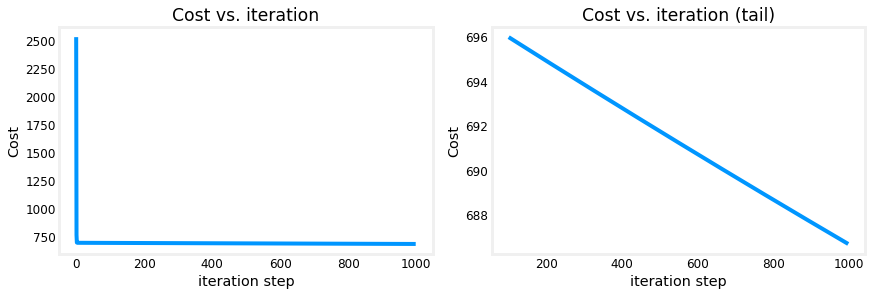

# Optional Lab: Multiple Variable Linear Regression

In this lab, you will extend the data structures and previously developed routines to support multiple features. Several routines are updated making the lab appear lengthy, but it makes minor adjustments to previous routines making it quick to review.
# Outline
- [&nbsp;&nbsp;1.1 Goals](#toc_15456_1.1)
- [&nbsp;&nbsp;1.2 Tools](#toc_15456_1.2)
- [&nbsp;&nbsp;1.3 Notation](#toc_15456_1.3)
- [2 Problem Statement](#toc_15456_2)
- [&nbsp;&nbsp;2.1 Matrix X containing our examples](#toc_15456_2.1)
- [&nbsp;&nbsp;2.2 Parameter vector w, b](#toc_15456_2.2)
- [3 Model Prediction With Multiple Variables](#toc_15456_3)
- [&nbsp;&nbsp;3.1 Single Prediction element by element](#toc_15456_3.1)
- [&nbsp;&nbsp;3.2 Single Prediction, vector](#toc_15456_3.2)
- [4 Compute Cost With Multiple Variables](#toc_15456_4)
- [5 Gradient Descent With Multiple Variables](#toc_15456_5)
- [&nbsp;&nbsp;5.1 Compute Gradient with Multiple Variables](#toc_15456_5.1)
- [&nbsp;&nbsp;5.2 Gradient Descent With Multiple Variables](#toc_15456_5.2)
- [6 Congratulations](#toc_15456_6)


<a name="toc_15456_1.1"></a>
## 1.1 Goals
- Extend our regression model  routines to support multiple features
    - Extend data structures to support multiple features
    - Rewrite prediction, cost and gradient routines to support multiple features
    - Utilize NumPy `np.dot` to vectorize their implementations for speed and simplicity

<a name="toc_15456_1.2"></a>
## 1.2 Tools
In this lab, we will make use of: 
- NumPy, a popular library for scientific computing
- Matplotlib, a popular library for plotting data


```python
import copy, math
import numpy as np
import matplotlib.pyplot as plt
plt.style.use('./deeplearning.mplstyle')
np.set_printoptions(precision=2)  # reduced display precision on numpy arrays
```

<a name="toc_15456_1.3"></a>
## 1.3 Notation
Here is a summary of some of the notation you will encounter, updated for multiple features.  

|General  <br />  Notation   | Description| Python (if applicable) |
|: ------------|: ------------------------------------------------------------||
| $a$ | scalar, non bold                                                      ||
| $\mathbf{a}$ | vector, bold                                                 ||
| $\mathbf{A}$ | matrix, bold capital                                         ||
| **Regression** |         |    |     |
|  $\mathbf{X}$ | training example matrix                  | `X_train` |   
|  $\mathbf{y}$  | training example  targets                | `y_train` 
|  $\mathbf{x}^{(i)}$, $y^{(i)}$ | $i_{th}$Training Example | `X[i]`, `y[i]`|
| m | number of training examples | `m`|
| n | number of features in each example | `n`|
|  $\mathbf{w}$  |  parameter: weight,                       | `w`    |
|  $b$           |  parameter: bias                                           | `b`    |     
| $f_{\mathbf{w},b}(\mathbf{x}^{(i)})$ | The result of the model evaluation at $\mathbf{x^{(i)}}$ parameterized by $\mathbf{w},b$: $f_{\mathbf{w},b}(\mathbf{x}^{(i)}) = \mathbf{w} \cdot \mathbf{x}^{(i)}+b$  | `f_wb` | 


<a name="toc_15456_2"></a>
# 2 Problem Statement

You will use the motivating example of housing price prediction. The training dataset contains three examples with four features (size, bedrooms, floors and, age) shown in the table below.  Note that, unlike the earlier labs, size is in sqft rather than 1000 sqft. This causes an issue, which you will solve in the next lab!

| Size (sqft) | Number of Bedrooms  | Number of floors | Age of  Home | Price (1000s dollars)  |   
| ----------------| ------------------- |----------------- |--------------|-------------- |  
| 2104            | 5                   | 1                | 45           | 460           |  
| 1416            | 3                   | 2                | 40           | 232           |  
| 852             | 2                   | 1                | 35           | 178           |  

You will build a linear regression model using these values so you can then predict the price for other houses. For example, a house with 1200 sqft, 3 bedrooms, 1 floor, 40 years old.  

Please run the following code cell to create your `X_train` and `y_train` variables.


```python
X_train = np.array([[2104, 5, 1, 45], [1416, 3, 2, 40], [852, 2, 1, 35]])
y_train = np.array([460, 232, 178])
```

<a name="toc_15456_2.1"></a>
## 2.1 Matrix X containing our examples
Similar to the table above, examples are stored in a NumPy matrix `X_train`. Each row of the matrix represents one example. When you have $m$ training examples ( $m$ is three in our example), and there are $n$ features (four in our example), $\mathbf{X}$ is a matrix with dimensions ($m$, $n$) (m rows, n columns).


$$\mathbf{X} = 
\begin{pmatrix}
 x^{(0)}_0 & x^{(0)}_1 & \cdots & x^{(0)}_{n-1} \\ 
 x^{(1)}_0 & x^{(1)}_1 & \cdots & x^{(1)}_{n-1} \\
 \cdots \\
 x^{(m-1)}_0 & x^{(m-1)}_1 & \cdots & x^{(m-1)}_{n-1} 
\end{pmatrix}
$$
notation:
- $\mathbf{x}^{(i)}$ is vector containing example i. $\mathbf{x}^{(i)}$ $ = (x^{(i)}_0, x^{(i)}_1, \cdots,x^{(i)}_{n-1})$
- $x^{(i)}_j$ is element j in example i. The superscript in parenthesis indicates the example number while the subscript represents an element.  

Display the input data.


```python
# data is stored in numpy array/matrix
print(f"X Shape: {X_train.shape}, X Type:{type(X_train)})")
print(X_train)
print(f"y Shape: {y_train.shape}, y Type:{type(y_train)})")
print(y_train)
```

    X Shape: (3, 4), X Type:<class 'numpy.ndarray'>)
    [[2104    5    1   45]
     [1416    3    2   40]
     [ 852    2    1   35]]
    y Shape: (3,), y Type:<class 'numpy.ndarray'>)
    [460 232 178]


<a name="toc_15456_2.2"></a>
## 2.2 Parameter vector w, b

* $\mathbf{w}$ is a vector with $n$ elements.
  - Each element contains the parameter associated with one feature.
  - in our dataset, n is 4.
  - notionally, we draw this as a column vector

$$\mathbf{w} = \begin{pmatrix}
w_0 \\ 
w_1 \\
\cdots\\
w_{n-1}
\end{pmatrix}
$$
* $b$ is a scalar parameter.  

For demonstration, $\mathbf{w}$ and $b$ will be loaded with some initial selected values that are near the optimal. $\mathbf{w}$ is a 1-D NumPy vector.


```python
b_init = 785.1811367994083
w_init = np.array([ 0.39133535, 18.75376741, -53.36032453, -26.42131618])
print(f"w_init shape: {w_init.shape}, b_init type: {type(b_init)}")
```

    w_init shape: (4,), b_init type: <class 'float'>


<a name="toc_15456_3"></a>
# 3 Model Prediction With Multiple Variables
The model's prediction with multiple variables is given by the linear model:

$$ f_{\mathbf{w},b}(\mathbf{x}) =  w_0x_0 + w_1x_1 +... + w_{n-1}x_{n-1} + b \tag{1}$$
or in vector notation:
$$ f_{\mathbf{w},b}(\mathbf{x}) = \mathbf{w} \cdot \mathbf{x} + b  \tag{2} $$ 
where $\cdot$ is a vector `dot product`

To demonstrate the dot product, we will implement prediction using (1) and (2).

<a name="toc_15456_3.1"></a>
## 3.1 Single Prediction element by element
Our previous prediction multiplied one feature value by one parameter and added a bias parameter. A direct extension of our previous implementation of prediction to multiple features would be to implement (1) above using loop over each element, performing the multiply with its parameter and then adding the bias parameter at the end.


```python
def predict_single_loop(x, w, b): 
    """
    single predict using linear regression
    
    Args:
      x (ndarray): Shape (n,) example with multiple features
      w (ndarray): Shape (n,) model parameters    
      b (scalar):  model parameter     
      
    Returns:
      p (scalar):  prediction
    """
    n = x.shape[0]
    p = 0
    for i in range(n):
        p_i = x[i] * w[i]  
        p = p + p_i         
    p = p + b                
    return p
```


```python
# get a row from our training data
x_vec = X_train[0,:]
print(f"x_vec shape {x_vec.shape}, x_vec value: {x_vec}")

# make a prediction
f_wb = predict_single_loop(x_vec, w_init, b_init)
print(f"f_wb shape {f_wb.shape}, prediction: {f_wb}")
```

    x_vec shape (4,), x_vec value: [2104    5    1   45]
    f_wb shape (), prediction: 459.9999976194083


Note the shape of `x_vec`. It is a 1-D NumPy vector with 4 elements, (4,). The result, `f_wb` is a scalar.

<a name="toc_15456_3.2"></a>
## 3.2 Single Prediction, vector

Noting that equation (1) above can be implemented using the dot product as in (2) above. We can make use of vector operations to speed up predictions.

Recall from the Python/Numpy lab that NumPy `np.dot()`[[link](https://numpy.org/doc/stable/reference/generated/numpy.dot.html)] can be used to perform a vector dot product. 


```python
def predict(x, w, b): 
    """
    single predict using linear regression
    Args:
      x (ndarray): Shape (n,) example with multiple features
      w (ndarray): Shape (n,) model parameters   
      b (scalar):             model parameter 
      
    Returns:
      p (scalar):  prediction
    """
    p = np.dot(x, w) + b     
    return p    
```


```python
# get a row from our training data
x_vec = X_train[0,:]
print(f"x_vec shape {x_vec.shape}, x_vec value: {x_vec}")

# make a prediction
f_wb = predict(x_vec,w_init, b_init)
print(f"f_wb shape {f_wb.shape}, prediction: {f_wb}")
```

    x_vec shape (4,), x_vec value: [2104    5    1   45]
    f_wb shape (), prediction: 459.99999761940825


The results and shapes are the same as the previous version which used looping. Going forward, `np.dot` will be used for these operations. The prediction is now a single statement. Most routines will implement it directly rather than calling a separate predict routine.

<a name="toc_15456_4"></a>
# 4 Compute Cost With Multiple Variables
The equation for the cost function with multiple variables $J(\mathbf{w},b)$ is:
$$J(\mathbf{w},b) = \frac{1}{2m} \sum\limits_{i = 0}^{m-1} (f_{\mathbf{w},b}(\mathbf{x}^{(i)}) - y^{(i)})^2 \tag{3}$$ 
where:
$$ f_{\mathbf{w},b}(\mathbf{x}^{(i)}) = \mathbf{w} \cdot \mathbf{x}^{(i)} + b  \tag{4} $$ 


In contrast to previous labs, $\mathbf{w}$ and $\mathbf{x}^{(i)}$ are vectors rather than scalars supporting multiple features.

Below is an implementation of equations (3) and (4). Note that this uses a *standard pattern for this course* where a for loop over all `m` examples is used.


```python
def compute_cost(X, y, w, b): 
    """
    compute cost
    Args:
      X (ndarray (m,n)): Data, m examples with n features
      y (ndarray (m,)) : target values
      w (ndarray (n,)) : model parameters  
      b (scalar)       : model parameter
      
    Returns:
      cost (scalar): cost
    """
    m = X.shape[0]
    print(X.shape)
    print(X[0])
    print(w)
    print(y)
    cost = 0.0
    for i in range(m):                                
        f_wb_i = np.dot(X[i], w) + b           #(n,)(n,) = scalar (see np.dot)
        print(f"{i}: {f_wb_i}")
        cost = cost + (f_wb_i - y[i])**2       #scalar
    cost = cost / (2 * m)                      #scalar    
    return cost
```


```python
# Compute and display cost using our pre-chosen optimal parameters. 
cost = compute_cost(X_train, y_train, w_init, b_init)
print(f'Cost at optimal w : {cost}')
```

    (3, 4)
    [2104    5    1   45]
    [  0.39  18.75 -53.36 -26.42]
    [460 232 178]
    0: 459.99999761940825
    1: 231.9999983694081
    2: 177.99999898940814
    Cost at optimal w : 1.5578904880036537e-12


**Expected Result**: Cost at optimal w : 1.5578904045996674e-12

<a name="toc_15456_5"></a>
# 5 Gradient Descent With Multiple Variables
Gradient descent for multiple variables:

$$\begin{align*} \text{repeat}&\text{ until convergence:} \; \lbrace \newline\;
& w_j = w_j -  \alpha \frac{\partial J(\mathbf{w},b)}{\partial w_j} \tag{5}  \; & \text{for j = 0..n-1}\newline
&b\ \ = b -  \alpha \frac{\partial J(\mathbf{w},b)}{\partial b}  \newline \rbrace
\end{align*}$$

where, n is the number of features, parameters $w_j$,  $b$, are updated simultaneously and where  

$$
\begin{align}
\frac{\partial J(\mathbf{w},b)}{\partial w_j}  &= \frac{1}{m} \sum\limits_{i = 0}^{m-1} (f_{\mathbf{w},b}(\mathbf{x}^{(i)}) - y^{(i)})x_{j}^{(i)} \tag{6}  \\
\frac{\partial J(\mathbf{w},b)}{\partial b}  &= \frac{1}{m} \sum\limits_{i = 0}^{m-1} (f_{\mathbf{w},b}(\mathbf{x}^{(i)}) - y^{(i)}) \tag{7}
\end{align}
$$
* m is the number of training examples in the data set

    
*  $f_{\mathbf{w},b}(\mathbf{x}^{(i)})$ is the model's prediction, while $y^{(i)}$ is the target value


<a name="toc_15456_5.1"></a>
## 5.1 Compute Gradient with Multiple Variables
An implementation for calculating the equations (6) and (7) is below. There are many ways to implement this. In this version, there is an
- outer loop over all m examples. 
    - $\frac{\partial J(\mathbf{w},b)}{\partial b}$ for the example can be computed directly and accumulated
    - in a second loop over all n features:
        - $\frac{\partial J(\mathbf{w},b)}{\partial w_j}$ is computed for each $w_j$.
   


```python
def compute_gradient(X, y, w, b): 
    """
    Computes the gradient for linear regression 
    Args:
      X (ndarray (m,n)): Data, m examples with n features
      y (ndarray (m,)) : target values
      w (ndarray (n,)) : model parameters  
      b (scalar)       : model parameter
      
    Returns:
      dj_dw (ndarray (n,)): The gradient of the cost w.r.t. the parameters w. 
      dj_db (scalar):       The gradient of the cost w.r.t. the parameter b. 
    """
    m,n = X.shape           #(number of examples, number of features)
    dj_dw = np.zeros((n,))
    dj_db = 0.

    for i in range(m):                             
        err = (np.dot(X[i], w) + b) - y[i]   
        for j in range(n):                         
            dj_dw[j] = dj_dw[j] + err * X[i, j]    
        dj_db = dj_db + err                        
    dj_dw = dj_dw / m                                
    dj_db = dj_db / m                                
        
    return dj_db, dj_dw
```


```python
#Compute and display gradient 
tmp_dj_db, tmp_dj_dw = compute_gradient(X_train, y_train, w_init, b_init)
print(f'dj_db at initial w,b: {tmp_dj_db}')
print(f'dj_dw at initial w,b: \n {tmp_dj_dw}')
```

    dj_db at initial w,b: -1.673925169143331e-06
    dj_dw at initial w,b: 
     [-2.73e-03 -6.27e-06 -2.22e-06 -6.92e-05]


**Expected Result**:   
dj_db at initial w,b: -1.6739251122999121e-06  
dj_dw at initial w,b:   
 [-2.73e-03 -6.27e-06 -2.22e-06 -6.92e-05]  

<a name="toc_15456_5.2"></a>
## 5.2 Gradient Descent With Multiple Variables
The routine below implements equation (5) above.


```python
def gradient_descent(X, y, w_in, b_in, cost_function, gradient_function, alpha, num_iters): 
    """
    Performs batch gradient descent to learn w and b. Updates w and b by taking 
    num_iters gradient steps with learning rate alpha
    
    Args:
      X (ndarray (m,n))   : Data, m examples with n features
      y (ndarray (m,))    : target values
      w_in (ndarray (n,)) : initial model parameters  
      b_in (scalar)       : initial model parameter
      cost_function       : function to compute cost
      gradient_function   : function to compute the gradient
      alpha (float)       : Learning rate
      num_iters (int)     : number of iterations to run gradient descent
      
    Returns:
      w (ndarray (n,)) : Updated values of parameters 
      b (scalar)       : Updated value of parameter 
      """
    
    # An array to store cost J and w's at each iteration primarily for graphing later
    J_history = []
    w = copy.deepcopy(w_in)  #avoid modifying global w within function
    b = b_in
    
    for i in range(num_iters):

        # Calculate the gradient and update the parameters
        dj_db,dj_dw = gradient_function(X, y, w, b)   ##None

        # Update Parameters using w, b, alpha and gradient
        w = w - alpha * dj_dw               ##None
        b = b - alpha * dj_db               ##None
      
        # Save cost J at each iteration
        if i<100000:      # prevent resource exhaustion 
            J_history.append( cost_function(X, y, w, b))

        # Print cost every at intervals 10 times or as many iterations if < 10
        if i% math.ceil(num_iters / 10) == 0:
            print(f"Iteration {i:4d}: Cost {J_history[-1]:8.2f}   ")
        
    return w, b, J_history #return final w,b and J history for graphing
```

In the next cell you will test the implementation. 


```python
# initialize parameters
initial_w = np.zeros_like(w_init)
initial_b = 0.
# some gradient descent settings
iterations = 1000
alpha = 5.0e-7
# run gradient descent 
w_final, b_final, J_hist = gradient_descent(X_train, y_train, initial_w, initial_b,
                                                    compute_cost, compute_gradient, 
                                                    alpha, iterations)
print(f"b,w found by gradient descent: {b_final:0.2f},{w_final} ")
m,_ = X_train.shape
for i in range(m):
    print(f"prediction: {np.dot(X_train[i], w_final) + b_final:0.2f}, target value: {y_train[i]}")
```

    (3, 4)
    [2104    5    1   45]
    [2.41e-01 5.59e-04 1.84e-04 6.03e-03]
    0: 508.0428356666666
    1: 341.9734763333332
    2: 205.829807
    Iteration    0: Cost  2529.46   
    (3, 4)
    [2104    5    1   45]
    [1.95e-01 4.54e-04 1.34e-04 4.78e-03]
    0: 409.61826419025846
    1: 275.7211279491076
    2: 165.95235435336173
    (3, 4)
    [2104    5    1   45]
    [2.04e-01 4.79e-04 1.30e-04 4.94e-03]
    0: 428.6872001143263
    1: 288.55610299827777
    2: 173.6768130859033
    (3, 4)
    [2104    5    1   45]
    [2.02e-01 4.78e-04 1.17e-04 4.82e-03]
    0: 424.9936196328413
    1: 286.06915488340104
    2: 172.1791513369225
    (3, 4)
    [2104    5    1   45]
    [2.02e-01 4.82e-04 1.06e-04 4.75e-03]
    0: 425.7099181316527
    1: 286.5505880563804
    2: 172.46813022224904
    (3, 4)
    [2104    5    1   45]
    [2.02e-01 4.85e-04 9.45e-05 4.68e-03]
    0: 425.5718720076035
    1: 286.45694412727835
    2: 172.41097567891867
    (3, 4)
    [2104    5    1   45]
    [2.02e-01 4.88e-04 8.30e-05 4.61e-03]
    0: 425.59934166499625
    1: 286.4747123447689
    2: 172.4208790874839
    (3, 4)
    [2104    5    1   45]
    [2.02e-01 4.92e-04 7.15e-05 4.54e-03]
    0: 425.594745214712
    1: 286.4708962300767
    2: 172.41779112629666
    (3, 4)
    [2104    5    1   45]
    [2.02e-01 4.95e-04 6.00e-05 4.46e-03]
    0: 425.59636103558097
    1: 286.471261756085
    2: 172.41722009053632
    (3, 4)
    [2104    5    1   45]
    [2.02e-01 4.98e-04 4.86e-05 4.39e-03]
    0: 425.5967732946435
    1: 286.47081717139696
    2: 172.41616149228665
    (3, 4)
    [2104    5    1   45]
    [2.02e-01 5.01e-04 3.71e-05 4.32e-03]
    0: 425.5974186927274
    1: 286.4705295492179
    2: 172.41519740375432
    (3, 4)
    [2104    5    1   45]
    [2.02e-01 5.05e-04 2.56e-05 4.25e-03]
    0: 425.59801889167863
    1: 286.47021153434616
    2: 172.41421505761534
    (3, 4)
    [2104    5    1   45]
    [2.02e-01 5.08e-04 1.41e-05 4.17e-03]
    0: 425.5986278151317
    1: 286.46989942390036
    2: 172.41323630076027
    (3, 4)
    [2104    5    1   45]
    [2.02e-01 5.11e-04 2.59e-06 4.10e-03]
    0: 425.59923501623365
    1: 286.4695861858849
    2: 172.4122569006958
    (3, 4)
    [2104    5    1   45]
    [ 2.02e-01  5.15e-04 -8.91e-06  4.03e-03]
    0: 425.5998425188985
    1: 286.4692731826371
    2: 172.41127767739843
    (3, 4)
    [2104    5    1   45]
    [ 2.02e-01  5.18e-04 -2.04e-05  3.96e-03]
    0: 425.6004499310267
    1: 286.46896015022503
    2: 172.41029847200846
    (3, 4)
    [2104    5    1   45]
    [ 2.02e-01  5.21e-04 -3.19e-05  3.88e-03]
    0: 425.60105732858256
    1: 286.4686471397807
    2: 172.40931931530014
    (3, 4)
    [2104    5    1   45]
    [ 2.02e-01  5.25e-04 -4.34e-05  3.81e-03]
    0: 425.6016646968507
    1: 286.46833414139724
    2: 172.40834020130896
    (3, 4)
    [2104    5    1   45]
    [ 2.02e-01  5.28e-04 -5.49e-05  3.74e-03]
    0: 425.6022720386833
    1: 286.4680211569933
    2: 172.40736113118825
    (3, 4)
    [2104    5    1   45]
    [ 2.02e-01  5.31e-04 -6.64e-05  3.67e-03]
    0: 425.6028793535295
    1: 286.4677081861964
    2: 172.4063821047123
    (3, 4)
    [2104    5    1   45]
    [ 2.02e-01  5.34e-04 -7.79e-05  3.59e-03]
    0: 425.60348664149706
    1: 286.46739522907797
    2: 172.4054031219224
    (3, 4)
    [2104    5    1   45]
    [ 2.02e-01  5.38e-04 -8.93e-05  3.52e-03]
    0: 425.6040939025669
    1: 286.46708228562346
    2: 172.40442418280833
    (3, 4)
    [2104    5    1   45]
    [ 2.02e-01  5.41e-04 -1.01e-04  3.45e-03]
    0: 425.6047011367438
    1: 286.46676935583486
    2: 172.40344528736958
    (3, 4)
    [2104    5    1   45]
    [ 2.02e-01  5.44e-04 -1.12e-04  3.38e-03]
    0: 425.60530834402863
    1: 286.46645643971135
    2: 172.4024664356042
    (3, 4)
    [2104    5    1   45]
    [ 2.02e-01  5.48e-04 -1.24e-04  3.30e-03]
    0: 425.6059155244223
    1: 286.46614353725204
    2: 172.40148762751008
    (3, 4)
    [2104    5    1   45]
    [ 2.02e-01  5.51e-04 -1.35e-04  3.23e-03]
    0: 425.60652267792625
    1: 286.46583064845663
    2: 172.40050886308535
    (3, 4)
    [2104    5    1   45]
    [ 2.02e-01  5.54e-04 -1.47e-04  3.16e-03]
    0: 425.60712980454167
    1: 286.4655177733242
    2: 172.39953014232802
    (3, 4)
    [2104    5    1   45]
    [ 2.02e-01  5.58e-04 -1.58e-04  3.09e-03]
    0: 425.6077369042697
    1: 286.4652049118544
    2: 172.39855146523618
    (3, 4)
    [2104    5    1   45]
    [ 2.02e-01  5.61e-04 -1.70e-04  3.01e-03]
    0: 425.6083439771115
    1: 286.4648920640465
    2: 172.39757283180788
    (3, 4)
    [2104    5    1   45]
    [ 2.02e-01  5.64e-04 -1.81e-04  2.94e-03]
    0: 425.6089510230683
    1: 286.4645792299
    2: 172.39659424204117
    (3, 4)
    [2104    5    1   45]
    [ 2.02e-01  5.67e-04 -1.93e-04  2.87e-03]
    0: 425.6095580421412
    1: 286.46426640941405
    2: 172.3956156959341
    (3, 4)
    [2104    5    1   45]
    [ 0.2  0.  -0.   0. ]
    0: 425.61016503433166
    1: 286.46395360258845
    2: 172.39463719348484
    (3, 4)
    [2104    5    1   45]
    [ 0.2  0.  -0.   0. ]
    0: 425.6107719996406
    1: 286.4636408094222
    2: 172.39365873469131
    (3, 4)
    [2104    5    1   45]
    [ 0.2  0.  -0.   0. ]
    0: 425.6113789380694
    1: 286.46332802991486
    2: 172.3926803195516
    (3, 4)
    [2104    5    1   45]
    [ 0.2  0.  -0.   0. ]
    0: 425.611985849619
    1: 286.4630152640658
    2: 172.39170194806377
    (3, 4)
    [2104    5    1   45]
    [ 0.2  0.  -0.   0. ]
    0: 425.612592734291
    1: 286.46270251187445
    2: 172.39072362022597
    (3, 4)
    [2104    5    1   45]
    [ 0.2  0.  -0.   0. ]
    0: 425.6131995920861
    1: 286.4623897733401
    2: 172.38974533603607
    (3, 4)
    [2104    5    1   45]
    [ 0.2  0.  -0.   0. ]
    0: 425.613806423006
    1: 286.4620770484622
    2: 172.3887670954923
    (3, 4)
    [2104    5    1   45]
    [ 0.2  0.  -0.   0. ]
    0: 425.61441322705156
    1: 286.4617643372403
    2: 172.3877888985927
    (3, 4)
    [2104    5    1   45]
    [ 0.2  0.  -0.   0. ]
    0: 425.6150200042241
    1: 286.46145163967356
    2: 172.38681074533528
    (3, 4)
    [2104    5    1   45]
    [ 0.2  0.  -0.   0. ]
    0: 425.6156267545248
    1: 286.4611389557615
    2: 172.38583263571806
    (3, 4)
    [2104    5    1   45]
    [ 0.2  0.  -0.   0. ]
    0: 425.6162334779548
    1: 286.4608262855033
    2: 172.38485456973916
    (3, 4)
    [2104    5    1   45]
    [ 0.2  0.  -0.   0. ]
    0: 425.61684017451535
    1: 286.46051362889875
    2: 172.38387654739668
    (3, 4)
    [2104    5    1   45]
    [ 0.2  0.  -0.   0. ]
    0: 425.61744684420756
    1: 286.460200985947
    2: 172.3828985686886
    (3, 4)
    [2104    5    1   45]
    [ 0.2  0.  -0.   0. ]
    0: 425.6180534870328
    1: 286.45988835664735
    2: 172.38192063361305
    (3, 4)
    [2104    5    1   45]
    [ 0.2  0.  -0.   0. ]
    0: 425.618660102992
    1: 286.45957574099936
    2: 172.38094274216792
    (3, 4)
    [2104    5    1   45]
    [ 0.2  0.  -0.   0. ]
    0: 425.6192666920867
    1: 286.45926313900236
    2: 172.37996489435156
    (3, 4)
    [2104    5    1   45]
    [ 0.2  0.  -0.   0. ]
    0: 425.61987325431784
    1: 286.45895055065574
    2: 172.37898709016176
    (3, 4)
    [2104    5    1   45]
    [ 0.2  0.  -0.   0. ]
    0: 425.62047978968667
    1: 286.45863797595894
    2: 172.37800932959675
    (3, 4)
    [2104    5    1   45]
    [ 0.2  0.  -0.   0. ]
    0: 425.6210862981944
    1: 286.4583254149114
    2: 172.3770316126545
    (3, 4)
    [2104    5    1   45]
    [ 0.2  0.  -0.   0. ]
    0: 425.62169277984225
    1: 286.45801286751237
    2: 172.3760539393331
    (3, 4)
    [2104    5    1   45]
    [ 0.2  0.  -0.   0. ]
    0: 425.6222992346313
    1: 286.4577003337612
    2: 172.37507630963057
    (3, 4)
    [2104    5    1   45]
    [ 0.2  0.  -0.   0. ]
    0: 425.62290566256297
    1: 286.4573878136575
    2: 172.3740987235451
    (3, 4)
    [2104    5    1   45]
    [ 0.2  0.  -0.   0. ]
    0: 425.6235120636381
    1: 286.4570753072004
    2: 172.3731211810746
    (3, 4)
    [2104    5    1   45]
    [ 0.2  0.  -0.   0. ]
    0: 425.6241184378584
    1: 286.4567628143897
    2: 172.37214368221728
    (3, 4)
    [2104    5    1   45]
    [ 0.2  0.  -0.   0. ]
    0: 425.6247247852246
    1: 286.45645033522436
    2: 172.37116622697096
    (3, 4)
    [2104    5    1   45]
    [ 0.2  0.  -0.   0. ]
    0: 425.625331105738
    1: 286.45613786970404
    2: 172.37018881533393
    (3, 4)
    [2104    5    1   45]
    [ 0.2  0.  -0.   0. ]
    0: 425.6259373993998
    1: 286.45582541782795
    2: 172.3692114473042
    (3, 4)
    [2104    5    1   45]
    [ 0.2  0.  -0.   0. ]
    0: 425.62654366621143
    1: 286.45551297959554
    2: 172.36823412287973
    (3, 4)
    [2104    5    1   45]
    [ 0.2  0.  -0.   0. ]
    0: 425.62714990617394
    1: 286.4552005550064
    2: 172.36725684205874
    (3, 4)
    [2104    5    1   45]
    [ 0.2  0.  -0.   0. ]
    0: 425.62775611928816
    1: 286.45488814405957
    2: 172.36627960483912
    (3, 4)
    [2104    5    1   45]
    [ 0.2  0.  -0.   0. ]
    0: 425.6283623055559
    1: 286.45457574675487
    2: 172.36530241121915
    (3, 4)
    [2104    5    1   45]
    [ 0.2  0.  -0.   0. ]
    0: 425.628968464978
    1: 286.45426336309134
    2: 172.36432526119665
    (3, 4)
    [2104    5    1   45]
    [ 0.2  0.  -0.   0. ]
    0: 425.6295745975557
    1: 286.45395099306853
    2: 172.3633481547698
    (3, 4)
    [2104    5    1   45]
    [ 0.2  0.  -0.   0. ]
    0: 425.6301807032901
    1: 286.45363863668575
    2: 172.36237109193667
    (3, 4)
    [2104    5    1   45]
    [ 0.2  0.  -0.   0. ]
    0: 425.63078678218267
    1: 286.4533262939425
    2: 172.3613940726953
    (3, 4)
    [2104    5    1   45]
    [ 0.2  0.  -0.   0. ]
    0: 425.6313928342344
    1: 286.4530139648381
    2: 172.3604170970438
    (3, 4)
    [2104    5    1   45]
    [ 2.02e-01  6.89e-04 -6.18e-04  1.89e-04]
    0: 425.63199885944636
    1: 286.4527016493718
    2: 172.3594401649801
    (3, 4)
    [2104    5    1   45]
    [ 2.02e-01  6.93e-04 -6.29e-04  1.16e-04]
    0: 425.63260485782007
    1: 286.4523893475434
    2: 172.3584632765024
    (3, 4)
    [2104    5    1   45]
    [ 2.02e-01  6.96e-04 -6.41e-04  4.39e-05]
    0: 425.6332108293565
    1: 286.4520770593519
    2: 172.3574864316087
    (3, 4)
    [2104    5    1   45]
    [ 2.02e-01  6.99e-04 -6.52e-04 -2.84e-05]
    0: 425.6338167740569
    1: 286.45176478479686
    2: 172.35650963029704
    (3, 4)
    [2104    5    1   45]
    [ 2.02e-01  7.02e-04 -6.64e-04 -1.01e-04]
    0: 425.63442269192245
    1: 286.45145252387766
    2: 172.3555328725656
    (3, 4)
    [2104    5    1   45]
    [ 2.02e-01  7.06e-04 -6.75e-04 -1.73e-04]
    0: 425.63502858295453
    1: 286.4511402765937
    2: 172.3545561584123
    (3, 4)
    [2104    5    1   45]
    [ 0.2  0.  -0.  -0. ]
    0: 425.63563444715385
    1: 286.45082804294435
    2: 172.35357948783522
    (3, 4)
    [2104    5    1   45]
    [ 0.2  0.  -0.  -0. ]
    0: 425.6362402845221
    1: 286.4505158229291
    2: 172.35260286083252
    (3, 4)
    [2104    5    1   45]
    [ 0.2  0.  -0.  -0. ]
    0: 425.63684609506026
    1: 286.4502036165471
    2: 172.35162627740218
    (3, 4)
    [2104    5    1   45]
    [ 0.2  0.  -0.  -0. ]
    0: 425.6374518787694
    1: 286.44989142379796
    2: 172.35064973754228
    (3, 4)
    [2104    5    1   45]
    [ 0.2  0.  -0.  -0. ]
    0: 425.638057635651
    1: 286.4495792446811
    2: 172.34967324125094
    (3, 4)
    [2104    5    1   45]
    [ 0.2  0.  -0.  -0. ]
    0: 425.63866336570635
    1: 286.4492670791958
    2: 172.34869678852615
    (3, 4)
    [2104    5    1   45]
    [ 0.2  0.  -0.  -0. ]
    0: 425.6392690689359
    1: 286.4489549273414
    2: 172.3477203793659
    (3, 4)
    [2104    5    1   45]
    [ 0.2  0.  -0.  -0. ]
    0: 425.6398747453416
    1: 286.44864278911746
    2: 172.34674401376847
    (3, 4)
    [2104    5    1   45]
    [ 0.2  0.  -0.  -0. ]
    0: 425.6404803949245
    1: 286.4483306645233
    2: 172.3457676917318
    (3, 4)
    [2104    5    1   45]
    [ 0.2  0.  -0.  -0. ]
    0: 425.64108601768555
    1: 286.44801855355814
    2: 172.34479141325383
    (3, 4)
    [2104    5    1   45]
    [ 0.2  0.  -0.  -0. ]
    0: 425.6416916136262
    1: 286.4477064562218
    2: 172.3438151783329
    (3, 4)
    [2104    5    1   45]
    [ 0.2  0.  -0.  -0. ]
    0: 425.64229718274737
    1: 286.44739437251326
    2: 172.34283898696677
    (3, 4)
    [2104    5    1   45]
    [ 0.2  0.  -0.  -0. ]
    0: 425.6429027250505
    1: 286.4470823024321
    2: 172.3418628391537
    (3, 4)
    [2104    5    1   45]
    [ 0.2  0.  -0.  -0. ]
    0: 425.6435082405366
    1: 286.44677024597763
    2: 172.3408867348917
    (3, 4)
    [2104    5    1   45]
    [ 0.2  0.  -0.  -0. ]
    0: 425.64411372920705
    1: 286.4464582031493
    2: 172.3399106741789
    (3, 4)
    [2104    5    1   45]
    [ 0.2  0.  -0.  -0. ]
    0: 425.64471919106285
    1: 286.44614617394654
    2: 172.33893465701325
    (3, 4)
    [2104    5    1   45]
    [ 0.2  0.  -0.  -0. ]
    0: 425.6453246261053
    1: 286.4458341583687
    2: 172.3379586833929
    (3, 4)
    [2104    5    1   45]
    [ 0.2  0.  -0.  -0. ]
    0: 425.64593003433566
    1: 286.4455221564152
    2: 172.33698275331588
    (3, 4)
    [2104    5    1   45]
    [ 0.2  0.  -0.  -0. ]
    0: 425.646535415755
    1: 286.4452101680854
    2: 172.33600686678022
    (3, 4)
    [2104    5    1   45]
    [ 0.2  0.  -0.  -0. ]
    0: 425.64714077036444
    1: 286.44489819337866
    2: 172.335031023784
    (3, 4)
    [2104    5    1   45]
    [ 0.2  0.  -0.  -0. ]
    0: 425.64774609816544
    1: 286.44458623229457
    2: 172.3340552243254
    (3, 4)
    [2104    5    1   45]
    [ 0.2  0.  -0.  -0. ]
    0: 425.64835139915886
    1: 286.44427428483215
    2: 172.33307946840227
    (3, 4)
    [2104    5    1   45]
    [ 0.2  0.  -0.  -0. ]
    0: 425.64895667334616
    1: 286.44396235099117
    2: 172.33210375601286
    (3, 4)
    [2104    5    1   45]
    [ 0.2  0.  -0.  -0. ]
    0: 425.6495619207285
    1: 286.4436504307709
    2: 172.33112808715512
    (3, 4)
    [2104    5    1   45]
    [ 0.2  0.  -0.  -0. ]
    0: 425.6501671413069
    1: 286.44333852417066
    2: 172.3301524618272
    (3, 4)
    [2104    5    1   45]
    [ 0.2  0.  -0.  -0. ]
    0: 425.6507723350827
    1: 286.4430266311898
    2: 172.3291768800271
    (3, 4)
    [2104    5    1   45]
    [ 0.2  0.  -0.  -0. ]
    0: 425.65137750205696
    1: 286.44271475182785
    2: 172.3282013417529
    (3, 4)
    [2104    5    1   45]
    [ 0.2  0.  -0.  -0. ]
    0: 425.6519826422312
    1: 286.44240288608427
    2: 172.32722584700272
    Iteration  100: Cost   695.99   
    (3, 4)
    [2104    5    1   45]
    [ 0.2  0.  -0.  -0. ]
    0: 425.65258775560625
    1: 286.4420910339583
    2: 172.32625039577448
    (3, 4)
    [2104    5    1   45]
    [ 0.2  0.  -0.  -0. ]
    0: 425.6531928421832
    1: 286.44177919544927
    2: 172.32527498806638
    (3, 4)
    [2104    5    1   45]
    [ 0.2  0.  -0.  -0. ]
    0: 425.6537979019639
    1: 286.4414673705569
    2: 172.3242996238765
    (3, 4)
    [2104    5    1   45]
    [ 0.2  0.  -0.  -0. ]
    0: 425.65440293494873
    1: 286.44115555928016
    2: 172.32332430320278
    (3, 4)
    [2104    5    1   45]
    [ 0.2  0.  -0.  -0. ]
    0: 425.65500794113956
    1: 286.4408437616188
    2: 172.32234902604344
    (3, 4)
    [2104    5    1   45]
    [ 0.2  0.  -0.  -0. ]
    0: 425.655612920537
    1: 286.4405319775719
    2: 172.32137379239634
    (3, 4)
    [2104    5    1   45]
    [ 0.2  0.  -0.  -0. ]
    0: 425.65621787314285
    1: 286.4402202071392
    2: 172.32039860225984
    (3, 4)
    [2104    5    1   45]
    [ 0.2  0.  -0.  -0. ]
    0: 425.6568227989577
    1: 286.43990845031976
    2: 172.3194234556316
    (3, 4)
    [2104    5    1   45]
    [ 0.2  0.  -0.  -0. ]
    0: 425.6574276979831
    1: 286.4395967071132
    2: 172.3184483525101
    (3, 4)
    [2104    5    1   45]
    [ 0.2  0.  -0.  -0. ]
    0: 425.65803257022014
    1: 286.43928497751887
    2: 172.31747329289317
    (3, 4)
    [2104    5    1   45]
    [ 0.2  0.  -0.  -0. ]
    0: 425.6586374156702
    1: 286.4389732615362
    2: 172.31649827677893
    (3, 4)
    [2104    5    1   45]
    [ 0.2  0.  -0.  -0. ]
    0: 425.65924223433404
    1: 286.43866155916436
    2: 172.3155233041654
    (3, 4)
    [2104    5    1   45]
    [ 0.2  0.  -0.  -0. ]
    0: 425.6598470262133
    1: 286.43834987040304
    2: 172.31454837505075
    (3, 4)
    [2104    5    1   45]
    [ 0.2  0.  -0.  -0. ]
    0: 425.66045179130896
    1: 286.4380381952515
    2: 172.3135734894329
    (3, 4)
    [2104    5    1   45]
    [ 0.2  0.  -0.  -0. ]
    0: 425.66105652962216
    1: 286.4377265337091
    2: 172.3125986473101
    (3, 4)
    [2104    5    1   45]
    [ 0.2  0.  -0.  -0. ]
    0: 425.6616612411542
    1: 286.4374148857753
    2: 172.31162384868026
    (3, 4)
    [2104    5    1   45]
    [ 0.2  0.  -0.  -0. ]
    0: 425.6622659259062
    1: 286.43710325144946
    2: 172.31064909354149
    (3, 4)
    [2104    5    1   45]
    [ 0.2  0.  -0.  -0. ]
    0: 425.6628705838794
    1: 286.436791630731
    2: 172.30967438189188
    (3, 4)
    [2104    5    1   45]
    [ 0.2  0.  -0.  -0. ]
    0: 425.66347521507504
    1: 286.43648002361937
    2: 172.30869971372954
    (3, 4)
    [2104    5    1   45]
    [ 0.2  0.  -0.  -0. ]
    0: 425.66407981949425
    1: 286.4361684301138
    2: 172.30772508905238
    (3, 4)
    [2104    5    1   45]
    [ 0.2  0.  -0.  -0. ]
    0: 425.6646843971381
    1: 286.4358568502137
    2: 172.30675050785865
    (3, 4)
    [2104    5    1   45]
    [ 0.2  0.  -0.  -0. ]
    0: 425.66528894800797
    1: 286.43554528391877
    2: 172.3057759701463
    (3, 4)
    [2104    5    1   45]
    [ 0.2  0.  -0.  -0. ]
    0: 425.665893472105
    1: 286.43523373122804
    2: 172.3048014759134
    (3, 4)
    [2104    5    1   45]
    [ 0.2  0.  -0.  -0. ]
    0: 425.66649796943045
    1: 286.43492219214113
    2: 172.3038270251581
    (3, 4)
    [2104    5    1   45]
    [ 0.2  0.  -0.  -0. ]
    0: 425.6671024399852
    1: 286.43461066665714
    2: 172.30285261787836
    (3, 4)
    [2104    5    1   45]
    [ 0.2  0.  -0.  -0. ]
    0: 425.66770688377085
    1: 286.43429915477594
    2: 172.3018782540724
    (3, 4)
    [2104    5    1   45]
    [ 0.2  0.  -0.  -0. ]
    0: 425.66831130078816
    1: 286.43398765649647
    2: 172.30090393373803
    (3, 4)
    [2104    5    1   45]
    [ 0.2  0.  -0.  -0. ]
    0: 425.6689156910389
    1: 286.43367617181843
    2: 172.29992965687362
    (3, 4)
    [2104    5    1   45]
    [ 0.2  0.  -0.  -0. ]
    0: 425.6695200545236
    1: 286.4333647007411
    2: 172.298955423477
    (3, 4)
    [2104    5    1   45]
    [ 0.2  0.  -0.  -0. ]
    0: 425.670124391244
    1: 286.4330532432638
    2: 172.2979812335464
    (3, 4)
    [2104    5    1   45]
    [ 0.2  0.  -0.  -0. ]
    0: 425.67072870120097
    1: 286.43274179938606
    2: 172.29700708707975
    (3, 4)
    [2104    5    1   45]
    [ 0.2  0.  -0.  -0. ]
    0: 425.6713329843958
    1: 286.4324303691072
    2: 172.29603298407523
    (3, 4)
    [2104    5    1   45]
    [ 0.2  0.  -0.  -0. ]
    0: 425.67193724082966
    1: 286.4321189524267
    2: 172.29505892453085
    (3, 4)
    [2104    5    1   45]
    [ 0.2  0.  -0.  -0. ]
    0: 425.67254147050375
    1: 286.43180754934383
    2: 172.29408490844463
    (3, 4)
    [2104    5    1   45]
    [ 0.2  0.  -0.  -0. ]
    0: 425.6731456734193
    1: 286.431496159858
    2: 172.29311093581472
    (3, 4)
    [2104    5    1   45]
    [ 0.2  0.  -0.  -0. ]
    0: 425.67374984957735
    1: 286.43118478396866
    2: 172.29213700663917
    (3, 4)
    [2104    5    1   45]
    [ 0.2  0.  -0.  -0. ]
    0: 425.67435399897937
    1: 286.4308734216753
    2: 172.29116312091608
    (3, 4)
    [2104    5    1   45]
    [ 0.2  0.  -0.  -0. ]
    0: 425.6749581216264
    1: 286.43056207297724
    2: 172.29018927864345
    (3, 4)
    [2104    5    1   45]
    [ 0.2   0.   -0.   -0.01]
    0: 425.6755622175193
    1: 286.43025073787356
    2: 172.28921547981932
    (3, 4)
    [2104    5    1   45]
    [ 0.2   0.   -0.   -0.01]
    0: 425.6761662866599
    1: 286.4299394163642
    2: 172.28824172444195
    (3, 4)
    [2104    5    1   45]
    [ 0.2   0.   -0.   -0.01]
    0: 425.676770329049
    1: 286.4296281084482
    2: 172.28726801250917
    (3, 4)
    [2104    5    1   45]
    [ 0.2   0.   -0.   -0.01]
    0: 425.6773743446878
    1: 286.42931681412506
    2: 172.28629434401913
    (3, 4)
    [2104    5    1   45]
    [ 0.2   0.   -0.   -0.01]
    0: 425.67797833357747
    1: 286.42900553339416
    2: 172.28532071896993
    (3, 4)
    [2104    5    1   45]
    [ 0.2   0.   -0.   -0.01]
    0: 425.6785822957194
    1: 286.42869426625504
    2: 172.28434713735967
    (3, 4)
    [2104    5    1   45]
    [ 0.2   0.   -0.   -0.01]
    0: 425.6791862311145
    1: 286.4283830127068
    2: 172.28337359918632
    (3, 4)
    [2104    5    1   45]
    [ 0.2   0.   -0.   -0.01]
    0: 425.6797901397642
    1: 286.428071772749
    2: 172.2824001044481
    (3, 4)
    [2104    5    1   45]
    [ 0.2   0.   -0.   -0.01]
    0: 425.6803940216696
    1: 286.42776054638114
    2: 172.28142665314292
    (3, 4)
    [2104    5    1   45]
    [ 0.2   0.   -0.   -0.01]
    0: 425.6809978768319
    1: 286.4274493336024
    2: 172.2804532452689
    (3, 4)
    [2104    5    1   45]
    [ 0.2   0.   -0.   -0.01]
    0: 425.6816017052522
    1: 286.42713813441225
    2: 172.27947988082408
    (3, 4)
    [2104    5    1   45]
    [ 0.2   0.   -0.   -0.01]
    0: 425.6822055069319
    1: 286.4268269488103
    2: 172.2785065598067
    (3, 4)
    [2104    5    1   45]
    [ 0.2   0.   -0.   -0.01]
    0: 425.6828092818718
    1: 286.4265157767956
    2: 172.2775332822146
    (3, 4)
    [2104    5    1   45]
    [ 0.2   0.   -0.   -0.01]
    0: 425.6834130300736
    1: 286.4262046183678
    2: 172.27656004804595
    (3, 4)
    [2104    5    1   45]
    [ 0.2   0.   -0.   -0.01]
    0: 425.68401675153814
    1: 286.4258934735261
    2: 172.27558685729883
    (3, 4)
    [2104    5    1   45]
    [ 0.2   0.   -0.   -0.01]
    0: 425.68462044626665
    1: 286.42558234227016
    2: 172.27461370997133
    (3, 4)
    [2104    5    1   45]
    [ 0.2   0.   -0.   -0.01]
    0: 425.6852241142604
    1: 286.4252712245991
    2: 172.27364060606138
    (3, 4)
    [2104    5    1   45]
    [ 0.2   0.   -0.   -0.01]
    0: 425.68582775552056
    1: 286.42496012051254
    2: 172.2726675455673
    (3, 4)
    [2104    5    1   45]
    [ 0.2   0.   -0.   -0.01]
    0: 425.68643137004835
    1: 286.42464903000973
    2: 172.27169452848688
    (3, 4)
    [2104    5    1   45]
    [ 0.2   0.   -0.   -0.01]
    0: 425.6870349578449
    1: 286.42433795309
    2: 172.27072155481838
    (3, 4)
    [2104    5    1   45]
    [ 0.2   0.   -0.   -0.01]
    0: 425.6876385189112
    1: 286.4240268897529
    2: 172.26974862455975
    (3, 4)
    [2104    5    1   45]
    [ 0.2   0.   -0.   -0.01]
    0: 425.6882420532489
    1: 286.42371583999784
    2: 172.2687757377092
    (3, 4)
    [2104    5    1   45]
    [ 0.2   0.   -0.   -0.01]
    0: 425.6888455608591
    1: 286.42340480382416
    2: 172.26780289426478
    (3, 4)
    [2104    5    1   45]
    [ 0.2   0.   -0.   -0.01]
    0: 425.6894490417423
    1: 286.4230937812311
    2: 172.26683009422436
    (3, 4)
    [2104    5    1   45]
    [ 0.2   0.   -0.   -0.01]
    0: 425.6900524959007
    1: 286.4227827722183
    2: 172.26585733758623
    (3, 4)
    [2104    5    1   45]
    [ 0.2   0.   -0.   -0.01]
    0: 425.69065592333476
    1: 286.42247177678513
    2: 172.26488462434838
    (3, 4)
    [2104    5    1   45]
    [ 0.2   0.   -0.   -0.01]
    0: 425.69125932404603
    1: 286.42216079493085
    2: 172.26391195450884
    (3, 4)
    [2104    5    1   45]
    [ 0.2   0.   -0.   -0.01]
    0: 425.6918626980355
    1: 286.4218498266549
    2: 172.26293932806576
    (3, 4)
    [2104    5    1   45]
    [ 0.2   0.   -0.   -0.01]
    0: 425.69246604530446
    1: 286.4215388719567
    2: 172.2619667450171
    (3, 4)
    [2104    5    1   45]
    [ 0.2   0.   -0.   -0.01]
    0: 425.6930693658541
    1: 286.4212279308357
    2: 172.26099420536113
    (3, 4)
    [2104    5    1   45]
    [ 0.2   0.   -0.   -0.01]
    0: 425.6936726596857
    1: 286.4209170032913
    2: 172.26002170909572
    (3, 4)
    [2104    5    1   45]
    [ 0.2   0.   -0.   -0.01]
    0: 425.6942759268002
    1: 286.42060608932275
    2: 172.25904925621896
    (3, 4)
    [2104    5    1   45]
    [ 0.2   0.   -0.   -0.01]
    0: 425.6948791671988
    1: 286.42029518892946
    2: 172.258076846729
    (3, 4)
    [2104    5    1   45]
    [ 0.2   0.   -0.   -0.01]
    0: 425.695482380883
    1: 286.419984302111
    2: 172.25710448062398
    (3, 4)
    [2104    5    1   45]
    [ 0.2   0.   -0.   -0.01]
    0: 425.6960855678538
    1: 286.41967342886676
    2: 172.25613215790182
    (3, 4)
    [2104    5    1   45]
    [ 0.2   0.   -0.   -0.01]
    0: 425.69668872811224
    1: 286.41936256919587
    2: 172.2551598785606
    (3, 4)
    [2104    5    1   45]
    [ 0.2   0.   -0.   -0.01]
    0: 425.6972918616598
    1: 286.41905172309816
    2: 172.25418764259854
    (3, 4)
    [2104    5    1   45]
    [ 0.2   0.   -0.   -0.01]
    0: 425.6978949684974
    1: 286.41874089057245
    2: 172.25321545001344
    (3, 4)
    [2104    5    1   45]
    [ 0.2   0.   -0.   -0.01]
    0: 425.6984980486265
    1: 286.4184300716186
    2: 172.2522433008037
    (3, 4)
    [2104    5    1   45]
    [ 0.2   0.   -0.   -0.01]
    0: 425.6991011020481
    1: 286.4181192662359
    2: 172.2512711949672
    (3, 4)
    [2104    5    1   45]
    [ 0.2   0.   -0.   -0.01]
    0: 425.69970412876324
    1: 286.4178084744236
    2: 172.25029913250197
    (3, 4)
    [2104    5    1   45]
    [ 0.2   0.   -0.   -0.01]
    0: 425.7003071287735
    1: 286.4174976961813
    2: 172.2493271134062
    (3, 4)
    [2104    5    1   45]
    [ 0.2   0.   -0.   -0.01]
    0: 425.7009101020798
    1: 286.4171869315083
    2: 172.24835513767795
    (3, 4)
    [2104    5    1   45]
    [ 0.2   0.   -0.   -0.01]
    0: 425.7015130486834
    1: 286.41687618040385
    2: 172.24738320531517
    (3, 4)
    [2104    5    1   45]
    [ 0.2   0.   -0.   -0.01]
    0: 425.7021159685855
    1: 286.4165654428677
    2: 172.24641131631606
    (3, 4)
    [2104    5    1   45]
    [ 0.2   0.   -0.   -0.01]
    0: 425.7027188617871
    1: 286.4162547188989
    2: 172.2454394706787
    (3, 4)
    [2104    5    1   45]
    [ 0.2   0.   -0.   -0.01]
    0: 425.7033217282898
    1: 286.41594400849715
    2: 172.24446766840111
    (3, 4)
    [2104    5    1   45]
    [ 0.2   0.   -0.   -0.01]
    0: 425.7039245680943
    1: 286.4156333116615
    2: 172.24349590948123
    (3, 4)
    [2104    5    1   45]
    [ 0.2   0.   -0.   -0.01]
    0: 425.7045273812021
    1: 286.41532262839166
    2: 172.2425241939174
    (3, 4)
    [2104    5    1   45]
    [ 0.2   0.   -0.   -0.01]
    0: 425.70513016761436
    1: 286.41501195868676
    2: 172.24155252170752
    (3, 4)
    [2104    5    1   45]
    [ 0.2   0.   -0.   -0.01]
    0: 425.7057329273323
    1: 286.4147013025466
    2: 172.24058089284972
    (3, 4)
    [2104    5    1   45]
    [ 0.2   0.   -0.   -0.01]
    0: 425.7063356603568
    1: 286.41439065997
    2: 172.239609307342
    (3, 4)
    [2104    5    1   45]
    [ 0.2   0.   -0.   -0.01]
    0: 425.7069383666894
    1: 286.4140800309568
    2: 172.23863776518252
    (3, 4)
    [2104    5    1   45]
    [ 0.2   0.   -0.   -0.01]
    0: 425.70754104633113
    1: 286.41376941550624
    2: 172.2376662663693
    (3, 4)
    [2104    5    1   45]
    [ 0.2   0.   -0.   -0.01]
    0: 425.7081436992833
    1: 286.4134588136178
    2: 172.23669481090047
    (3, 4)
    [2104    5    1   45]
    [ 0.2   0.   -0.   -0.01]
    0: 425.7087463255469
    1: 286.41314822529074
    2: 172.23572339877404
    (3, 4)
    [2104    5    1   45]
    [ 0.2   0.   -0.   -0.01]
    0: 425.7093489251232
    1: 286.4128376505247
    2: 172.23475202998816
    (3, 4)
    [2104    5    1   45]
    [ 0.2   0.   -0.   -0.01]
    0: 425.70995149801354
    1: 286.4125270893188
    2: 172.23378070454075
    (3, 4)
    [2104    5    1   45]
    [ 0.2   0.   -0.   -0.01]
    0: 425.7105540442188
    1: 286.41221654167254
    2: 172.23280942243
    (3, 4)
    [2104    5    1   45]
    [ 0.2   0.   -0.   -0.01]
    0: 425.7111565637404
    1: 286.4119060075853
    2: 172.23183818365396
    (3, 4)
    [2104    5    1   45]
    [ 0.2   0.   -0.   -0.01]
    0: 425.71175905657947
    1: 286.4115954870566
    2: 172.23086698821078
    (3, 4)
    [2104    5    1   45]
    [ 0.2   0.   -0.   -0.01]
    0: 425.7123615227373
    1: 286.41128498008567
    2: 172.2298958360984
    Iteration  200: Cost   694.92   
    (3, 4)
    [2104    5    1   45]
    [ 0.2   0.   -0.   -0.01]
    0: 425.7129639622148
    1: 286.410974486672
    2: 172.22892472731496
    (3, 4)
    [2104    5    1   45]
    [ 0.2   0.   -0.   -0.01]
    0: 425.71356637501333
    1: 286.41066400681495
    2: 172.2279536618585
    (3, 4)
    [2104    5    1   45]
    [ 0.2   0.   -0.   -0.01]
    0: 425.71416876113426
    1: 286.410353540514
    2: 172.22698263972717
    (3, 4)
    [2104    5    1   45]
    [ 0.2   0.   -0.   -0.01]
    0: 425.7147711205784
    1: 286.4100430877683
    2: 172.22601166091894
    (3, 4)
    [2104    5    1   45]
    [ 0.2   0.   -0.   -0.01]
    0: 425.7153734533473
    1: 286.4097326485777
    2: 172.22504072543205
    (3, 4)
    [2104    5    1   45]
    [ 0.2   0.   -0.   -0.01]
    0: 425.71597575944173
    1: 286.4094222229411
    2: 172.22406983326434
    (3, 4)
    [2104    5    1   45]
    [ 0.2   0.   -0.   -0.01]
    0: 425.71657803886336
    1: 286.4091118108583
    2: 172.2230989844141
    (3, 4)
    [2104    5    1   45]
    [ 0.2   0.   -0.   -0.01]
    0: 425.71718029161286
    1: 286.4088014123284
    2: 172.2221281788792
    (3, 4)
    [2104    5    1   45]
    [ 0.2   0.   -0.   -0.01]
    0: 425.7177825176919
    1: 286.408491027351
    2: 172.2211574166579
    (3, 4)
    [2104    5    1   45]
    [ 0.2   0.   -0.   -0.01]
    0: 425.71838471710146
    1: 286.40818065592526
    2: 172.22018669774815
    (3, 4)
    [2104    5    1   45]
    [ 0.2   0.   -0.   -0.01]
    0: 425.7189868898426
    1: 286.4078702980509
    2: 172.2192160221481
    (3, 4)
    [2104    5    1   45]
    [ 0.2   0.   -0.   -0.01]
    0: 425.71958903591667
    1: 286.40755995372706
    2: 172.2182453898558
    (3, 4)
    [2104    5    1   45]
    [ 0.2   0.   -0.   -0.01]
    0: 425.72019115532487
    1: 286.40724962295326
    2: 172.21727480086935
    (3, 4)
    [2104    5    1   45]
    [ 0.2   0.   -0.   -0.01]
    0: 425.7207932480683
    1: 286.4069393057288
    2: 172.21630425518669
    (3, 4)
    [2104    5    1   45]
    [ 0.2   0.   -0.   -0.01]
    0: 425.72139531414797
    1: 286.40662900205325
    2: 172.2153337528061
    (3, 4)
    [2104    5    1   45]
    [ 0.2   0.   -0.   -0.01]
    0: 425.7219973535656
    1: 286.4063187119259
    2: 172.2143632937255
    (3, 4)
    [2104    5    1   45]
    [ 0.2   0.   -0.   -0.01]
    0: 425.72259936632173
    1: 286.406008435346
    2: 172.213392877943
    (3, 4)
    [2104    5    1   45]
    [ 0.2   0.   -0.   -0.01]
    0: 425.72320135241813
    1: 286.4056981723133
    2: 172.21242250545671
    (3, 4)
    [2104    5    1   45]
    [ 0.2   0.   -0.   -0.01]
    0: 425.72380331185565
    1: 286.40538792282683
    2: 172.21145217626471
    (3, 4)
    [2104    5    1   45]
    [ 0.2   0.   -0.   -0.01]
    0: 425.7244052446354
    1: 286.40507768688616
    2: 172.210481890365
    (3, 4)
    [2104    5    1   45]
    [ 0.2   0.   -0.   -0.01]
    0: 425.7250071507588
    1: 286.40476746449076
    2: 172.2095116477558
    (3, 4)
    [2104    5    1   45]
    [ 0.2   0.   -0.   -0.01]
    0: 425.725609030227
    1: 286.4044572556399
    2: 172.20854144843497
    (3, 4)
    [2104    5    1   45]
    [ 0.2   0.   -0.   -0.01]
    0: 425.72621088304106
    1: 286.40414706033306
    2: 172.2075712924008
    (3, 4)
    [2104    5    1   45]
    [ 0.2   0.   -0.   -0.01]
    0: 425.72681270920225
    1: 286.4038368785696
    2: 172.20660117965124
    (3, 4)
    [2104    5    1   45]
    [ 0.2   0.   -0.   -0.01]
    0: 425.7274145087116
    1: 286.40352671034884
    2: 172.20563111018436
    (3, 4)
    [2104    5    1   45]
    [ 0.2   0.   -0.   -0.01]
    0: 425.7280162815706
    1: 286.40321655567027
    2: 172.2046610839983
    (3, 4)
    [2104    5    1   45]
    [ 0.2   0.   -0.   -0.01]
    0: 425.7286180277802
    1: 286.40290641453333
    2: 172.20369110109118
    (3, 4)
    [2104    5    1   45]
    [ 0.2   0.   -0.   -0.01]
    0: 425.72921974734174
    1: 286.40259628693747
    2: 172.20272116146091
    (3, 4)
    [2104    5    1   45]
    [ 0.2   0.   -0.   -0.01]
    0: 425.7298214402562
    1: 286.40228617288176
    2: 172.20175126510566
    (3, 4)
    [2104    5    1   45]
    [ 0.2   0.   -0.   -0.01]
    0: 425.73042310652494
    1: 286.40197607236604
    2: 172.20078141202353
    (3, 4)
    [2104    5    1   45]
    [ 0.2   0.   -0.   -0.01]
    0: 425.73102474614905
    1: 286.4016659853893
    2: 172.19981160221258
    (3, 4)
    [2104    5    1   45]
    [ 0.2   0.   -0.   -0.01]
    0: 425.73162635912985
    1: 286.4013559119512
    2: 172.1988418356708
    (3, 4)
    [2104    5    1   45]
    [ 0.2   0.   -0.   -0.01]
    0: 425.7322279454682
    1: 286.40104585205097
    2: 172.19787211239642
    (3, 4)
    [2104    5    1   45]
    [ 0.2   0.   -0.   -0.01]
    0: 425.73282950516574
    1: 286.40073580568827
    2: 172.19690243238745
    (3, 4)
    [2104    5    1   45]
    [ 0.2   0.   -0.   -0.01]
    0: 425.73343103822333
    1: 286.4004257728622
    2: 172.1959327956419
    (3, 4)
    [2104    5    1   45]
    [ 0.2   0.   -0.   -0.01]
    0: 425.7340325446422
    1: 286.4001157535724
    2: 172.19496320215794
    (3, 4)
    [2104    5    1   45]
    [ 0.2   0.   -0.   -0.01]
    0: 425.7346340244236
    1: 286.399805747818
    2: 172.1939936519336
    (3, 4)
    [2104    5    1   45]
    [ 0.2   0.   -0.   -0.01]
    0: 425.7352354775689
    1: 286.39949575559865
    2: 172.19302414496696
    (3, 4)
    [2104    5    1   45]
    [ 0.2   0.   -0.   -0.01]
    0: 425.7358369040788
    1: 286.39918577691367
    2: 172.19205468125608
    (3, 4)
    [2104    5    1   45]
    [ 0.2   0.   -0.   -0.01]
    0: 425.736438303955
    1: 286.39887581176237
    2: 172.1910852607991
    (3, 4)
    [2104    5    1   45]
    [ 0.2   0.   -0.   -0.01]
    0: 425.7370396771983
    1: 286.39856586014434
    2: 172.190115883594
    (3, 4)
    [2104    5    1   45]
    [ 0.2   0.   -0.   -0.01]
    0: 425.73764102380994
    1: 286.39825592205864
    2: 172.18914654963885
    (3, 4)
    [2104    5    1   45]
    [ 0.2   0.   -0.   -0.01]
    0: 425.73824234379157
    1: 286.3979459975052
    2: 172.188177258932
    (3, 4)
    [2104    5    1   45]
    [ 0.2   0.   -0.   -0.01]
    0: 425.7388436371436
    1: 286.39763608648286
    2: 172.18720801147109
    (3, 4)
    [2104    5    1   45]
    [ 0.2   0.   -0.   -0.01]
    0: 425.73944490386776
    1: 286.3973261889912
    2: 172.18623880725454
    (3, 4)
    [2104    5    1   45]
    [ 0.2   0.   -0.   -0.01]
    0: 425.74004614396523
    1: 286.39701630502987
    2: 172.18526964628023
    (3, 4)
    [2104    5    1   45]
    [ 0.2   0.   -0.   -0.01]
    0: 425.7406473574369
    1: 286.39670643459806
    2: 172.1843005285464
    (3, 4)
    [2104    5    1   45]
    [ 0.2   0.   -0.   -0.01]
    0: 425.7412485442842
    1: 286.3963965776952
    2: 172.18333145405103
    (3, 4)
    [2104    5    1   45]
    [ 0.2   0.   -0.   -0.01]
    0: 425.74184970450807
    1: 286.39608673432053
    2: 172.1823624227921
    (3, 4)
    [2104    5    1   45]
    [ 0.2   0.   -0.   -0.01]
    0: 425.74245083811
    1: 286.3957769044737
    2: 172.18139343476795
    (3, 4)
    [2104    5    1   45]
    [ 0.2   0.   -0.   -0.01]
    0: 425.74305194509094
    1: 286.39546708815396
    2: 172.1804244899764
    (3, 4)
    [2104    5    1   45]
    [ 0.2   0.   -0.   -0.01]
    0: 425.74365302545215
    1: 286.39515728536077
    2: 172.17945558841566
    (3, 4)
    [2104    5    1   45]
    [ 0.2   0.   -0.   -0.01]
    0: 425.74425407919495
    1: 286.3948474960935
    2: 172.1784867300838
    (3, 4)
    [2104    5    1   45]
    [ 0.2   0.   -0.   -0.01]
    0: 425.7448551063203
    1: 286.39453772035154
    2: 172.17751791497884
    (3, 4)
    [2104    5    1   45]
    [ 0.2   0.   -0.   -0.01]
    0: 425.7454561068294
    1: 286.39422795813437
    2: 172.17654914309892
    (3, 4)
    [2104    5    1   45]
    [ 0.2   0.   -0.   -0.01]
    0: 425.7460570807236
    1: 286.3939182094412
    2: 172.17558041444207
    (3, 4)
    [2104    5    1   45]
    [ 0.2   0.   -0.   -0.01]
    0: 425.74665802800405
    1: 286.39360847427173
    2: 172.17461172900641
    (3, 4)
    [2104    5    1   45]
    [ 0.2   0.   -0.   -0.01]
    0: 425.74725894867174
    1: 286.393298752625
    2: 172.17364308678998
    (3, 4)
    [2104    5    1   45]
    [ 0.2   0.   -0.   -0.01]
    0: 425.74785984272813
    1: 286.3929890445008
    2: 172.1726744877909
    (3, 4)
    [2104    5    1   45]
    [ 0.2   0.   -0.   -0.01]
    0: 425.748460710174
    1: 286.3926793498981
    2: 172.17170593200717
    (3, 4)
    [2104    5    1   45]
    [ 0.2   0.   -0.   -0.01]
    0: 425.7490615510111
    1: 286.39236966881674
    2: 172.17073741943705
    (3, 4)
    [2104    5    1   45]
    [ 0.2   0.   -0.   -0.01]
    0: 425.7496623652401
    1: 286.39206000125563
    2: 172.16976895007835
    (3, 4)
    [2104    5    1   45]
    [ 0.2   0.   -0.   -0.01]
    0: 425.7502631528626
    1: 286.39175034721467
    2: 172.16880052392938
    (3, 4)
    [2104    5    1   45]
    [ 0.2   0.   -0.   -0.01]
    0: 425.7508639138794
    1: 286.3914407066929
    2: 172.16783214098805
    (3, 4)
    [2104    5    1   45]
    [ 0.2   0.   -0.   -0.01]
    0: 425.75146464829186
    1: 286.3911310796899
    2: 172.16686380125262
    (3, 4)
    [2104    5    1   45]
    [ 0.2   0.   -0.   -0.01]
    0: 425.75206535610135
    1: 286.390821466205
    2: 172.165895504721
    (3, 4)
    [2104    5    1   45]
    [ 0.2   0.   -0.   -0.01]
    0: 425.7526660373086
    1: 286.3905118662375
    2: 172.1649272513913
    (3, 4)
    [2104    5    1   45]
    [ 0.2   0.   -0.   -0.01]
    0: 425.75326669191526
    1: 286.3902022797871
    2: 172.16395904126173
    (3, 4)
    [2104    5    1   45]
    [ 0.2   0.   -0.   -0.01]
    0: 425.7538673199223
    1: 286.38989270685295
    2: 172.1629908743302
    (3, 4)
    [2104    5    1   45]
    [ 0.2   0.   -0.   -0.01]
    0: 425.75446792133073
    1: 286.3895831474345
    2: 172.16202275059487
    (3, 4)
    [2104    5    1   45]
    [ 0.2   0.   -0.   -0.01]
    0: 425.7550684961421
    1: 286.3892736015311
    2: 172.16105467005383
    (3, 4)
    [2104    5    1   45]
    [ 0.2   0.   -0.   -0.01]
    0: 425.7556690443574
    1: 286.3889640691423
    2: 172.16008663270512
    (3, 4)
    [2104    5    1   45]
    [ 0.2   0.   -0.   -0.01]
    0: 425.7562695659777
    1: 286.38865455026723
    2: 172.15911863854686
    (3, 4)
    [2104    5    1   45]
    [ 0.2   0.   -0.   -0.01]
    0: 425.7568700610044
    1: 286.3883450449057
    2: 172.15815068757715
    (3, 4)
    [2104    5    1   45]
    [ 0.2   0.   -0.   -0.01]
    0: 425.7574705294385
    1: 286.3880355530567
    2: 172.15718277979394
    (3, 4)
    [2104    5    1   45]
    [ 0.2   0.   -0.   -0.01]
    0: 425.75807097128137
    1: 286.3877260747199
    2: 172.15621491519542
    (3, 4)
    [2104    5    1   45]
    [ 0.2   0.   -0.   -0.01]
    0: 425.75867138653393
    1: 286.38741660989456
    2: 172.1552470937797
    (3, 4)
    [2104    5    1   45]
    [ 0.2   0.   -0.   -0.02]
    0: 425.75927177519765
    1: 286.3871071585801
    2: 172.15427931554478
    (3, 4)
    [2104    5    1   45]
    [ 0.2   0.   -0.   -0.02]
    0: 425.75987213727365
    1: 286.38679772077603
    2: 172.1533115804888
    (3, 4)
    [2104    5    1   45]
    [ 0.2   0.   -0.   -0.02]
    0: 425.7604724727629
    1: 286.3864882964815
    2: 172.15234388860975
    (3, 4)
    [2104    5    1   45]
    [ 0.2   0.   -0.   -0.02]
    0: 425.76107278166677
    1: 286.3861788856962
    2: 172.1513762399058
    (3, 4)
    [2104    5    1   45]
    [ 0.2   0.   -0.   -0.02]
    0: 425.7616730639866
    1: 286.3858694884194
    2: 172.15040863437505
    (3, 4)
    [2104    5    1   45]
    [ 0.2   0.   -0.   -0.02]
    0: 425.7622733197231
    1: 286.3855601046505
    2: 172.14944107201543
    (3, 4)
    [2104    5    1   45]
    [ 0.2   0.   -0.   -0.02]
    0: 425.7628735488778
    1: 286.3852507343887
    2: 172.14847355282518
    (3, 4)
    [2104    5    1   45]
    [ 0.2   0.   -0.   -0.02]
    0: 425.7634737514519
    1: 286.3849413776339
    2: 172.14750607680233
    (3, 4)
    [2104    5    1   45]
    [ 0.2   0.   -0.   -0.02]
    0: 425.7640739274463
    1: 286.384632034385
    2: 172.14653864394487
    (3, 4)
    [2104    5    1   45]
    [ 0.2   0.   -0.   -0.02]
    0: 425.7646740768626
    1: 286.38432270464176
    2: 172.14557125425105
    (3, 4)
    [2104    5    1   45]
    [ 0.2   0.   -0.   -0.02]
    0: 425.7652741997016
    1: 286.38401338840316
    2: 172.14460390771882
    (3, 4)
    [2104    5    1   45]
    [ 0.2   0.   -0.   -0.02]
    0: 425.76587429596475
    1: 286.3837040856691
    2: 172.1436366043463
    (3, 4)
    [2104    5    1   45]
    [ 0.2   0.   -0.   -0.02]
    0: 425.766474365653
    1: 286.38339479643855
    2: 172.14266934413158
    (3, 4)
    [2104    5    1   45]
    [ 0.2   0.   -0.   -0.02]
    0: 425.76707440876777
    1: 286.3830855207113
    2: 172.14170212707276
    (3, 4)
    [2104    5    1   45]
    [ 0.2   0.   -0.   -0.02]
    0: 425.76767442530996
    1: 286.3827762584862
    2: 172.1407349531678
    (3, 4)
    [2104    5    1   45]
    [ 0.2   0.   -0.   -0.02]
    0: 425.76827441528116
    1: 286.3824670097634
    2: 172.139767822415
    (3, 4)
    [2104    5    1   45]
    [ 0.2   0.   -0.   -0.02]
    0: 425.76887437868197
    1: 286.3821577745416
    2: 172.1388007348122
    (3, 4)
    [2104    5    1   45]
    [ 0.2   0.   -0.   -0.02]
    0: 425.7694743155142
    1: 286.3818485528206
    2: 172.1378336903577
    (3, 4)
    [2104    5    1   45]
    [ 0.2   0.   -0.   -0.02]
    0: 425.7700742257786
    1: 286.3815393445998
    2: 172.13686668904944
    (3, 4)
    [2104    5    1   45]
    [ 0.2   0.   -0.   -0.02]
    0: 425.7706741094764
    1: 286.3812301498782
    2: 172.1358997308855
    (3, 4)
    [2104    5    1   45]
    [ 0.2   0.   -0.   -0.02]
    0: 425.77127396660916
    1: 286.38092096865586
    2: 172.13493281586412
    (3, 4)
    [2104    5    1   45]
    [ 0.2   0.   -0.   -0.02]
    0: 425.7718737971775
    1: 286.3806118009316
    2: 172.13396594398313
    (3, 4)
    [2104    5    1   45]
    [ 0.2   0.   -0.   -0.02]
    0: 425.7724736011829
    1: 286.380302646705
    2: 172.13299911524078
    Iteration  300: Cost   693.86   
    (3, 4)
    [2104    5    1   45]
    [ 0.2   0.   -0.   -0.02]
    0: 425.7730733786266
    1: 286.3799935059755
    2: 172.13203232963517
    (3, 4)
    [2104    5    1   45]
    [ 0.2   0.   -0.   -0.02]
    0: 425.77367312950963
    1: 286.3796843787425
    2: 172.1310655871643
    (3, 4)
    [2104    5    1   45]
    [ 0.2   0.   -0.   -0.02]
    0: 425.7742728538334
    1: 286.37937526500554
    2: 172.13009888782628
    (3, 4)
    [2104    5    1   45]
    [ 0.2   0.   -0.   -0.02]
    0: 425.7748725515987
    1: 286.3790661647637
    2: 172.12913223161914
    (3, 4)
    [2104    5    1   45]
    [ 0.2   0.   -0.   -0.02]
    0: 425.775472222807
    1: 286.37875707801663
    2: 172.12816561854112
    (3, 4)
    [2104    5    1   45]
    [ 0.2   0.   -0.   -0.02]
    0: 425.77607186745945
    1: 286.3784480047636
    2: 172.12719904859014
    (3, 4)
    [2104    5    1   45]
    [ 0.2   0.   -0.   -0.02]
    0: 425.77667148555736
    1: 286.3781389450042
    2: 172.12623252176436
    (3, 4)
    [2104    5    1   45]
    [ 0.2   0.   -0.   -0.02]
    0: 425.7772710771014
    1: 286.37782989873756
    2: 172.1252660380618
    (3, 4)
    [2104    5    1   45]
    [ 0.2   0.   -0.   -0.02]
    0: 425.7778706420934
    1: 286.37752086596316
    2: 172.1242995974806
    (3, 4)
    [2104    5    1   45]
    [ 0.2   0.   -0.   -0.02]
    0: 425.7784701805341
    1: 286.37721184668055
    2: 172.12333320001883
    (3, 4)
    [2104    5    1   45]
    [ 0.2   0.   -0.   -0.02]
    0: 425.77906969242486
    1: 286.376902840889
    2: 172.1223668456746
    (3, 4)
    [2104    5    1   45]
    [ 0.2   0.   -0.   -0.02]
    0: 425.77966917776683
    1: 286.37659384858796
    2: 172.12140053444594
    (3, 4)
    [2104    5    1   45]
    [ 0.2   0.   -0.   -0.02]
    0: 425.780268636561
    1: 286.37628486977667
    2: 172.12043426633093
    (3, 4)
    [2104    5    1   45]
    [ 0.2   0.   -0.   -0.02]
    0: 425.780868068809
    1: 286.37597590445495
    2: 172.11946804132774
    (3, 4)
    [2104    5    1   45]
    [ 0.2   0.   -0.   -0.02]
    0: 425.7814674745116
    1: 286.37566695262177
    2: 172.11850185943436
    (3, 4)
    [2104    5    1   45]
    [ 0.2   0.   -0.   -0.02]
    0: 425.7820668536702
    1: 286.3753580142766
    2: 172.1175357206489
    (3, 4)
    [2104    5    1   45]
    [ 0.2   0.   -0.   -0.02]
    0: 425.78266620628585
    1: 286.37504908941906
    2: 172.1165696249694
    (3, 4)
    [2104    5    1   45]
    [ 0.2   0.   -0.   -0.02]
    0: 425.7832655323597
    1: 286.37474017804834
    2: 172.115603572394
    (3, 4)
    [2104    5    1   45]
    [ 0.2   0.   -0.   -0.02]
    0: 425.78386483189325
    1: 286.37443128016395
    2: 172.11463756292088
    (3, 4)
    [2104    5    1   45]
    [ 0.2   0.   -0.   -0.02]
    0: 425.7844641048873
    1: 286.3741223957652
    2: 172.11367159654793
    (3, 4)
    [2104    5    1   45]
    [ 0.2   0.   -0.   -0.02]
    0: 425.7850633513431
    1: 286.3738135248515
    2: 172.11270567327335
    (3, 4)
    [2104    5    1   45]
    [ 0.2   0.   -0.   -0.02]
    0: 425.7856625712621
    1: 286.3735046674225
    2: 172.11173979309518
    (3, 4)
    [2104    5    1   45]
    [ 0.2   0.   -0.   -0.02]
    0: 425.786261764645
    1: 286.37319582347715
    2: 172.11077395601154
    (3, 4)
    [2104    5    1   45]
    [ 0.2   0.   -0.   -0.02]
    0: 425.7868609314936
    1: 286.37288699301524
    2: 172.1098081620205
    (3, 4)
    [2104    5    1   45]
    [ 0.2   0.   -0.   -0.02]
    0: 425.7874600718086
    1: 286.37257817603603
    2: 172.1088424111201
    (3, 4)
    [2104    5    1   45]
    [ 0.2   0.   -0.   -0.02]
    0: 425.78805918559107
    1: 286.3722693725388
    2: 172.10787670330845
    (3, 4)
    [2104    5    1   45]
    [ 0.2   0.   -0.   -0.02]
    0: 425.78865827284284
    1: 286.37196058252323
    2: 172.1069110385837
    (3, 4)
    [2104    5    1   45]
    [ 0.2   0.   -0.   -0.02]
    0: 425.7892573335645
    1: 286.37165180598845
    2: 172.1059454169438
    (3, 4)
    [2104    5    1   45]
    [ 0.2   0.   -0.   -0.02]
    0: 425.7898563677575
    1: 286.371343042934
    2: 172.10497983838698
    (3, 4)
    [2104    5    1   45]
    [ 0.2   0.   -0.   -0.02]
    0: 425.7904553754229
    1: 286.37103429335923
    2: 172.10401430291122
    (3, 4)
    [2104    5    1   45]
    [ 0.2   0.   -0.   -0.02]
    0: 425.7910543565618
    1: 286.3707255572635
    2: 172.10304881051465
    (3, 4)
    [2104    5    1   45]
    [ 0.2   0.   -0.   -0.02]
    0: 425.79165331117576
    1: 286.37041683464633
    2: 172.10208336119533
    (3, 4)
    [2104    5    1   45]
    [ 0.2   0.   -0.   -0.02]
    0: 425.79225223926545
    1: 286.3701081255071
    2: 172.1011179549514
    (3, 4)
    [2104    5    1   45]
    [ 0.2   0.   -0.   -0.02]
    0: 425.79285114083245
    1: 286.3697994298452
    2: 172.10015259178087
    (3, 4)
    [2104    5    1   45]
    [ 0.2   0.   -0.   -0.02]
    0: 425.7934500158778
    1: 286.3694907476599
    2: 172.0991872716818
    (3, 4)
    [2104    5    1   45]
    [ 0.2   0.   -0.   -0.02]
    0: 425.79404886440255
    1: 286.36918207895064
    2: 172.09822199465242
    (3, 4)
    [2104    5    1   45]
    [ 0.2   0.   -0.   -0.02]
    0: 425.79464768640815
    1: 286.36887342371716
    2: 172.09725676069075
    (3, 4)
    [2104    5    1   45]
    [ 0.2   0.   -0.   -0.02]
    0: 425.79524648189545
    1: 286.36856478195824
    2: 172.09629156979477
    (3, 4)
    [2104    5    1   45]
    [ 0.2   0.   -0.   -0.02]
    0: 425.7958452508659
    1: 286.3682561536737
    2: 172.09532642196268
    (3, 4)
    [2104    5    1   45]
    [ 0.2   0.   -0.   -0.02]
    0: 425.7964439933208
    1: 286.3679475388632
    2: 172.0943613171926
    (3, 4)
    [2104    5    1   45]
    [ 0.2   0.   -0.   -0.02]
    0: 425.79704270926067
    1: 286.3676389375254
    2: 172.09339625548245
    (3, 4)
    [2104    5    1   45]
    [ 0.2   0.   -0.   -0.02]
    0: 425.7976413986875
    1: 286.36733034966034
    2: 172.0924312368305
    (3, 4)
    [2104    5    1   45]
    [ 0.2   0.   -0.   -0.02]
    0: 425.7982400616019
    1: 286.367021775267
    2: 172.09146626123461
    (3, 4)
    [2104    5    1   45]
    [ 0.2   0.   -0.   -0.02]
    0: 425.79883869800534
    1: 286.3667132143451
    2: 172.0905013286931
    (3, 4)
    [2104    5    1   45]
    [ 0.2   0.   -0.   -0.02]
    0: 425.799437307899
    1: 286.3664046668939
    2: 172.089536439204
    (3, 4)
    [2104    5    1   45]
    [ 0.2   0.   -0.   -0.02]
    0: 425.80003589128376
    1: 286.36609613291284
    2: 172.0885715927653
    (3, 4)
    [2104    5    1   45]
    [ 0.2   0.   -0.   -0.02]
    0: 425.80063444816113
    1: 286.3657876124012
    2: 172.08760678937517
    (3, 4)
    [2104    5    1   45]
    [ 0.2   0.   -0.   -0.02]
    0: 425.8012329785322
    1: 286.36547910535865
    2: 172.08664202903165
    (3, 4)
    [2104    5    1   45]
    [ 0.2   0.   -0.   -0.02]
    0: 425.801831482398
    1: 286.36517061178427
    2: 172.0856773117328
    (3, 4)
    [2104    5    1   45]
    [ 0.2   0.   -0.   -0.02]
    0: 425.80242995976
    1: 286.3648621316776
    2: 172.08471263747683
    (3, 4)
    [2104    5    1   45]
    [ 0.2   0.   -0.   -0.02]
    0: 425.80302841061894
    1: 286.36455366503804
    2: 172.0837480062617
    (3, 4)
    [2104    5    1   45]
    [ 0.2   0.   -0.   -0.02]
    0: 425.80362683497646
    1: 286.364245211865
    2: 172.08278341808554
    (3, 4)
    [2104    5    1   45]
    [ 0.2   0.   -0.   -0.02]
    0: 425.8042252328336
    1: 286.36393677215796
    2: 172.08181887294646
    (3, 4)
    [2104    5    1   45]
    [ 0.2   0.   -0.   -0.02]
    0: 425.8048236041914
    1: 286.3636283459162
    2: 172.0808543708425
    (3, 4)
    [2104    5    1   45]
    [ 0.2   0.   -0.   -0.02]
    0: 425.805421949051
    1: 286.3633199331391
    2: 172.07988991177172
    (3, 4)
    [2104    5    1   45]
    [ 0.2   0.   -0.   -0.02]
    0: 425.80602026741377
    1: 286.36301153382624
    2: 172.07892549573234
    (3, 4)
    [2104    5    1   45]
    [ 0.2   0.   -0.   -0.02]
    0: 425.8066185592809
    1: 286.36270314797684
    2: 172.07796112272237
    (3, 4)
    [2104    5    1   45]
    [ 0.2   0.   -0.   -0.02]
    0: 425.8072168246534
    1: 286.36239477559036
    2: 172.07699679273986
    (3, 4)
    [2104    5    1   45]
    [ 0.2   0.   -0.   -0.02]
    0: 425.8078150635324
    1: 286.3620864166662
    2: 172.0760325057829
    (3, 4)
    [2104    5    1   45]
    [ 0.2   0.   -0.   -0.02]
    0: 425.80841327591946
    1: 286.36177807120384
    2: 172.07506826184965
    (3, 4)
    [2104    5    1   45]
    [ 0.2   0.   -0.   -0.02]
    0: 425.8090114618153
    1: 286.3614697392025
    2: 172.07410406093805
    (3, 4)
    [2104    5    1   45]
    [ 0.2   0.   -0.   -0.02]
    0: 425.80960962122157
    1: 286.3611614206618
    2: 172.0731399030464
    (3, 4)
    [2104    5    1   45]
    [ 0.2   0.   -0.   -0.02]
    0: 425.8102077541388
    1: 286.3608531155809
    2: 172.0721757881726
    (3, 4)
    [2104    5    1   45]
    [ 0.2   0.   -0.   -0.02]
    0: 425.81080586056885
    1: 286.3605448239594
    2: 172.07121171631488
    (3, 4)
    [2104    5    1   45]
    [ 0.2   0.   -0.   -0.02]
    0: 425.8114039405126
    1: 286.3602365457968
    2: 172.07024768747124
    (3, 4)
    [2104    5    1   45]
    [ 0.2   0.   -0.   -0.02]
    0: 425.8120019939709
    1: 286.3599282810921
    2: 172.0692837016397
    (3, 4)
    [2104    5    1   45]
    [ 0.2   0.   -0.   -0.02]
    0: 425.8126000209455
    1: 286.359620029845
    2: 172.06831975881855
    (3, 4)
    [2104    5    1   45]
    [ 0.2   0.   -0.   -0.02]
    0: 425.8131980214374
    1: 286.359311792055
    2: 172.06735585900572
    (3, 4)
    [2104    5    1   45]
    [ 0.2   0.   -0.   -0.02]
    0: 425.81379599544755
    1: 286.3590035677211
    2: 172.0663920021993
    (3, 4)
    [2104    5    1   45]
    [ 0.2   0.   -0.   -0.02]
    0: 425.81439394297746
    1: 286.35869535684304
    2: 172.06542818839745
    (3, 4)
    [2104    5    1   45]
    [ 0.2   0.   -0.   -0.02]
    0: 425.8149918640279
    1: 286.3583871594201
    2: 172.0644644175982
    (3, 4)
    [2104    5    1   45]
    [ 0.2   0.   -0.   -0.02]
    0: 425.8155897586005
    1: 286.3580789754518
    2: 172.06350068979972
    (3, 4)
    [2104    5    1   45]
    [ 0.2   0.   -0.   -0.02]
    0: 425.81618762669615
    1: 286.35777080493745
    2: 172.0625370049999
    (3, 4)
    [2104    5    1   45]
    [ 0.2   0.   -0.   -0.02]
    0: 425.81678546831597
    1: 286.35746264787633
    2: 172.0615733631971
    (3, 4)
    [2104    5    1   45]
    [ 0.2   0.   -0.   -0.02]
    0: 425.8173832834614
    1: 286.35715450426807
    2: 172.06060976438923
    (3, 4)
    [2104    5    1   45]
    [ 0.2   0.   -0.   -0.02]
    0: 425.8179810721334
    1: 286.3568463741119
    2: 172.05964620857446
    (3, 4)
    [2104    5    1   45]
    [ 0.2   0.   -0.   -0.02]
    0: 425.81857883433315
    1: 286.35653825740724
    2: 172.05868269575078
    (3, 4)
    [2104    5    1   45]
    [ 0.2   0.   -0.   -0.02]
    0: 425.81917657006215
    1: 286.3562301541537
    2: 172.0577192259164
    (3, 4)
    [2104    5    1   45]
    [ 0.2   0.   -0.   -0.02]
    0: 425.8197742793211
    1: 286.3559220643504
    2: 172.05675579906935
    (3, 4)
    [2104    5    1   45]
    [ 0.2   0.   -0.   -0.02]
    0: 425.8203719621116
    1: 286.35561398799695
    2: 172.05579241520772
    (3, 4)
    [2104    5    1   45]
    [ 0.2   0.   -0.   -0.02]
    0: 425.8209696184344
    1: 286.3553059250926
    2: 172.05482907432946
    (3, 4)
    [2104    5    1   45]
    [ 0.2   0.   -0.   -0.02]
    0: 425.8215672482912
    1: 286.35499787563685
    2: 172.05386577643299
    (3, 4)
    [2104    5    1   45]
    [ 0.2   0.   -0.   -0.02]
    0: 425.8221648516826
    1: 286.3546898396289
    2: 172.05290252151607
    (3, 4)
    [2104    5    1   45]
    [ 0.2   0.   -0.   -0.02]
    0: 425.82276242861036
    1: 286.3543818170686
    2: 172.05193930957697
    (3, 4)
    [2104    5    1   45]
    [ 0.2   0.   -0.   -0.02]
    0: 425.823359979075
    1: 286.3540738079549
    2: 172.0509761406137
    (3, 4)
    [2104    5    1   45]
    [ 0.2   0.   -0.   -0.02]
    0: 425.8239575030784
    1: 286.3537658122874
    2: 172.0500130146244
    (3, 4)
    [2104    5    1   45]
    [ 0.2   0.   -0.   -0.02]
    0: 425.8245550006212
    1: 286.35345783006557
    2: 172.04904993160713
    (3, 4)
    [2104    5    1   45]
    [ 0.2   0.   -0.   -0.02]
    0: 425.8251524717047
    1: 286.3531498612885
    2: 172.04808689156
    (3, 4)
    [2104    5    1   45]
    [ 0.2   0.   -0.   -0.02]
    0: 425.8257499163304
    1: 286.3528419059561
    2: 172.0471238944811
    (3, 4)
    [2104    5    1   45]
    [ 0.2   0.   -0.   -0.02]
    0: 425.8263473344991
    1: 286.3525339640673
    2: 172.04616094036848
    (3, 4)
    [2104    5    1   45]
    [ 0.2   0.   -0.   -0.02]
    0: 425.82694472621205
    1: 286.35222603562164
    2: 172.04519802922022
    (3, 4)
    [2104    5    1   45]
    [ 0.2   0.   -0.   -0.02]
    0: 425.8275420914704
    1: 286.3519181206186
    2: 172.0442351610345
    (3, 4)
    [2104    5    1   45]
    [ 0.2   0.   -0.   -0.02]
    0: 425.8281394302757
    1: 286.35161021905765
    2: 172.0432723358094
    (3, 4)
    [2104    5    1   45]
    [ 0.2   0.   -0.   -0.02]
    0: 425.82873674262856
    1: 286.351302330938
    2: 172.04230955354288
    (3, 4)
    [2104    5    1   45]
    [ 0.2   0.   -0.   -0.02]
    0: 425.8293340285306
    1: 286.35099445625923
    2: 172.04134681423315
    (3, 4)
    [2104    5    1   45]
    [ 0.2   0.   -0.   -0.02]
    0: 425.8299312879827
    1: 286.35068659502065
    2: 172.04038411787826
    (3, 4)
    [2104    5    1   45]
    [ 0.2   0.   -0.   -0.02]
    0: 425.8305285209861
    1: 286.3503787472215
    2: 172.03942146447628
    (3, 4)
    [2104    5    1   45]
    [ 0.2   0.   -0.   -0.02]
    0: 425.8311257275423
    1: 286.35007091286155
    2: 172.03845885402535
    (3, 4)
    [2104    5    1   45]
    [ 0.2   0.   -0.   -0.02]
    0: 425.83172290765197
    1: 286.3497630919399
    2: 172.03749628652352
    (3, 4)
    [2104    5    1   45]
    [ 0.2   0.   -0.   -0.02]
    0: 425.8323200613165
    1: 286.3494552844561
    2: 172.03653376196894
    Iteration  400: Cost   692.81   
    (3, 4)
    [2104    5    1   45]
    [ 0.2   0.   -0.   -0.02]
    0: 425.8329171885373
    1: 286.34914749040956
    2: 172.0355712803596
    (3, 4)
    [2104    5    1   45]
    [ 0.2   0.   -0.   -0.02]
    0: 425.8335142893152
    1: 286.34883970979956
    2: 172.03460884169365
    (3, 4)
    [2104    5    1   45]
    [ 0.2   0.   -0.   -0.02]
    0: 425.8341113636515
    1: 286.3485319426256
    2: 172.03364644596923
    (3, 4)
    [2104    5    1   45]
    [ 0.2   0.   -0.   -0.02]
    0: 425.8347084115474
    1: 286.34822418888695
    2: 172.0326840931843
    (3, 4)
    [2104    5    1   45]
    [ 0.2   0.   -0.   -0.02]
    0: 425.83530543300424
    1: 286.34791644858325
    2: 172.03172178333705
    (3, 4)
    [2104    5    1   45]
    [ 0.2   0.   -0.   -0.02]
    0: 425.8359024280228
    1: 286.34760872171375
    2: 172.03075951642555
    (3, 4)
    [2104    5    1   45]
    [ 0.2   0.   -0.   -0.02]
    0: 425.8364993966046
    1: 286.34730100827784
    2: 172.0297972924479
    (3, 4)
    [2104    5    1   45]
    [ 0.2   0.   -0.   -0.02]
    0: 425.83709633875054
    1: 286.3469933082749
    2: 172.02883511140217
    (3, 4)
    [2104    5    1   45]
    [ 0.2   0.   -0.   -0.02]
    0: 425.8376932544621
    1: 286.3466856217046
    2: 172.02787297328652
    (3, 4)
    [2104    5    1   45]
    [ 0.2   0.   -0.   -0.02]
    0: 425.83829014374027
    1: 286.346377948566
    2: 172.0269108780989
    (3, 4)
    [2104    5    1   45]
    [ 0.2   0.   -0.   -0.02]
    0: 425.8388870065862
    1: 286.34607028885864
    2: 172.0259488258375
    (3, 4)
    [2104    5    1   45]
    [ 0.2   0.   -0.   -0.02]
    0: 425.8394838430012
    1: 286.3457626425819
    2: 172.02498681650042
    (3, 4)
    [2104    5    1   45]
    [ 0.2   0.   -0.   -0.02]
    0: 425.8400806529862
    1: 286.34545500973513
    2: 172.02402485008565
    (3, 4)
    [2104    5    1   45]
    [ 0.2   0.   -0.   -0.02]
    0: 425.8406774365429
    1: 286.345147390318
    2: 172.0230629265915
    (3, 4)
    [2104    5    1   45]
    [ 0.2   0.   -0.   -0.02]
    0: 425.8412741936718
    1: 286.3448397843295
    2: 172.02210104601576
    (3, 4)
    [2104    5    1   45]
    [ 0.2   0.   -0.   -0.02]
    0: 425.84187092437446
    1: 286.34453219176936
    2: 172.0211392083568
    (3, 4)
    [2104    5    1   45]
    [ 0.2   0.   -0.   -0.02]
    0: 425.8424676286521
    1: 286.344224612637
    2: 172.02017741361254
    (3, 4)
    [2104    5    1   45]
    [ 0.2   0.   -0.   -0.03]
    0: 425.8430643065056
    1: 286.3439170469314
    2: 172.0192156617811
    (3, 4)
    [2104    5    1   45]
    [ 0.2   0.   -0.   -0.03]
    0: 425.8436609579365
    1: 286.3436094946525
    2: 172.01825395286065
    (3, 4)
    [2104    5    1   45]
    [ 0.2   0.   -0.   -0.03]
    0: 425.84425758294566
    1: 286.3433019557994
    2: 172.01729228684917
    (3, 4)
    [2104    5    1   45]
    [ 0.2   0.   -0.   -0.03]
    0: 425.8448541815345
    1: 286.34299443037156
    2: 172.01633066374487
    (3, 4)
    [2104    5    1   45]
    [ 0.2   0.   -0.   -0.03]
    0: 425.8454507537041
    1: 286.3426869183684
    2: 172.01536908354572
    (3, 4)
    [2104    5    1   45]
    [ 0.2   0.   -0.   -0.03]
    0: 425.8460472994555
    1: 286.3423794197892
    2: 172.0144075462499
    (3, 4)
    [2104    5    1   45]
    [ 0.2   0.   -0.   -0.03]
    0: 425.84664381879
    1: 286.3420719346336
    2: 172.01344605185542
    (3, 4)
    [2104    5    1   45]
    [ 0.2   0.   -0.   -0.03]
    0: 425.8472403117088
    1: 286.34176446290087
    2: 172.01248460036052
    (3, 4)
    [2104    5    1   45]
    [ 0.2   0.   -0.   -0.03]
    0: 425.84783677821304
    1: 286.3414570045904
    2: 172.01152319176313
    (3, 4)
    [2104    5    1   45]
    [ 0.2   0.   -0.   -0.03]
    0: 425.84843321830397
    1: 286.34114955970165
    2: 172.01056182606146
    (3, 4)
    [2104    5    1   45]
    [ 0.2   0.   -0.   -0.03]
    0: 425.8490296319826
    1: 286.3408421282338
    2: 172.0096005032535
    (3, 4)
    [2104    5    1   45]
    [ 0.2   0.   -0.   -0.03]
    0: 425.8496260192503
    1: 286.3405347101867
    2: 172.00863922333744
    (3, 4)
    [2104    5    1   45]
    [ 0.2   0.   -0.   -0.03]
    0: 425.85022238010794
    1: 286.34022730555927
    2: 172.00767798631134
    (3, 4)
    [2104    5    1   45]
    [ 0.2   0.   -0.   -0.03]
    0: 425.85081871455714
    1: 286.3399199143513
    2: 172.00671679217328
    (3, 4)
    [2104    5    1   45]
    [ 0.2   0.   -0.   -0.03]
    0: 425.8514150225987
    1: 286.339612536562
    2: 172.00575564092134
    (3, 4)
    [2104    5    1   45]
    [ 0.2   0.   -0.   -0.03]
    0: 425.8520113042338
    1: 286.33930517219073
    2: 172.00479453255355
    (3, 4)
    [2104    5    1   45]
    [ 0.2   0.   -0.   -0.03]
    0: 425.852607559464
    1: 286.33899782123706
    2: 172.0038334670682
    (3, 4)
    [2104    5    1   45]
    [ 0.2   0.   -0.   -0.03]
    0: 425.8532037882901
    1: 286.3386904837002
    2: 172.0028724444632
    (3, 4)
    [2104    5    1   45]
    [ 0.2   0.   -0.   -0.03]
    0: 425.85379999071336
    1: 286.3383831595798
    2: 172.00191146473674
    (3, 4)
    [2104    5    1   45]
    [ 0.2   0.   -0.   -0.03]
    0: 425.8543961667349
    1: 286.33807584887495
    2: 172.00095052788689
    (3, 4)
    [2104    5    1   45]
    [ 0.2   0.   -0.   -0.03]
    0: 425.8549923163561
    1: 286.3377685515853
    2: 171.9999896339117
    (3, 4)
    [2104    5    1   45]
    [ 0.2   0.   -0.   -0.03]
    0: 425.85558843957796
    1: 286.3374612677101
    2: 171.9990287828093
    (3, 4)
    [2104    5    1   45]
    [ 0.2   0.   -0.   -0.03]
    0: 425.85618453640177
    1: 286.33715399724895
    2: 171.99806797457782
    (3, 4)
    [2104    5    1   45]
    [ 0.2   0.   -0.   -0.03]
    0: 425.8567806068285
    1: 286.3368467402011
    2: 171.99710720921527
    (3, 4)
    [2104    5    1   45]
    [ 0.2   0.   -0.   -0.03]
    0: 425.8573766508596
    1: 286.336539496566
    2: 171.9961464867198
    (3, 4)
    [2104    5    1   45]
    [ 0.2   0.   -0.   -0.03]
    0: 425.8579726684961
    1: 286.336232266343
    2: 171.99518580708957
    (3, 4)
    [2104    5    1   45]
    [ 0.2   0.   -0.   -0.03]
    0: 425.858568659739
    1: 286.3359250495315
    2: 171.99422517032247
    (3, 4)
    [2104    5    1   45]
    [ 0.2   0.   -0.   -0.03]
    0: 425.8591646245899
    1: 286.335617846131
    2: 171.99326457641678
    (3, 4)
    [2104    5    1   45]
    [ 0.2   0.   -0.   -0.03]
    0: 425.85976056304946
    1: 286.33531065614085
    2: 171.99230402537054
    (3, 4)
    [2104    5    1   45]
    [ 0.2   0.   -0.   -0.03]
    0: 425.8603564751193
    1: 286.3350034795604
    2: 171.99134351718183
    (3, 4)
    [2104    5    1   45]
    [ 0.2   0.   -0.   -0.03]
    0: 425.8609523608003
    1: 286.3346963163891
    2: 171.99038305184877
    (3, 4)
    [2104    5    1   45]
    [ 0.2   0.   -0.   -0.03]
    0: 425.8615482200939
    1: 286.3343891666265
    2: 171.98942262936944
    (3, 4)
    [2104    5    1   45]
    [ 0.2   0.   -0.01 -0.03]
    0: 425.86214405300103
    1: 286.3340820302717
    2: 171.98846224974193
    (3, 4)
    [2104    5    1   45]
    [ 0.2   0.   -0.01 -0.03]
    0: 425.8627398595229
    1: 286.3337749073244
    2: 171.98750191296432
    (3, 4)
    [2104    5    1   45]
    [ 0.2   0.   -0.01 -0.03]
    0: 425.86333563966076
    1: 286.3334677977837
    2: 171.98654161903474
    (3, 4)
    [2104    5    1   45]
    [ 0.2   0.   -0.01 -0.03]
    0: 425.8639313934157
    1: 286.3331607016494
    2: 171.9855813679512
    (3, 4)
    [2104    5    1   45]
    [ 0.2   0.   -0.01 -0.03]
    0: 425.8645271207891
    1: 286.3328536189206
    2: 171.98462115971196
    (3, 4)
    [2104    5    1   45]
    [ 0.2   0.   -0.01 -0.03]
    0: 425.8651228217818
    1: 286.3325465495967
    2: 171.98366099431496
    (3, 4)
    [2104    5    1   45]
    [ 0.2   0.   -0.01 -0.03]
    0: 425.86571849639535
    1: 286.33223949367726
    2: 171.98270087175837
    (3, 4)
    [2104    5    1   45]
    [ 0.2   0.   -0.01 -0.03]
    0: 425.8663141446306
    1: 286.33193245116155
    2: 171.98174079204026
    (3, 4)
    [2104    5    1   45]
    [ 0.2   0.   -0.01 -0.03]
    0: 425.8669097664889
    1: 286.33162542204906
    2: 171.98078075515872
    (3, 4)
    [2104    5    1   45]
    [ 0.2   0.   -0.01 -0.03]
    0: 425.8675053619714
    1: 286.3313184063392
    2: 171.9798207611119
    (3, 4)
    [2104    5    1   45]
    [ 0.2   0.   -0.01 -0.03]
    0: 425.86810093107925
    1: 286.33101140403136
    2: 171.97886080989778
    (3, 4)
    [2104    5    1   45]
    [ 0.2   0.   -0.01 -0.03]
    0: 425.86869647381354
    1: 286.33070441512484
    2: 171.97790090151454
    (3, 4)
    [2104    5    1   45]
    [ 0.2   0.   -0.01 -0.03]
    0: 425.86929199017544
    1: 286.3303974396192
    2: 171.97694103596027
    (3, 4)
    [2104    5    1   45]
    [ 0.2   0.   -0.01 -0.03]
    0: 425.86988748016654
    1: 286.33009047751386
    2: 171.97598121323313
    (3, 4)
    [2104    5    1   45]
    [ 0.2   0.   -0.01 -0.03]
    0: 425.8704829437873
    1: 286.32978352880804
    2: 171.97502143333105
    (3, 4)
    [2104    5    1   45]
    [ 0.2   0.   -0.01 -0.03]
    0: 425.8710783810396
    1: 286.3294765935012
    2: 171.9740616962523
    (3, 4)
    [2104    5    1   45]
    [ 0.2   0.   -0.01 -0.03]
    0: 425.871673791924
    1: 286.3291696715928
    2: 171.97310200199482
    (3, 4)
    [2104    5    1   45]
    [ 0.2   0.   -0.01 -0.03]
    0: 425.87226917644216
    1: 286.3288627630823
    2: 171.97214235055688
    (3, 4)
    [2104    5    1   45]
    [ 0.2   0.   -0.01 -0.03]
    0: 425.87286453459495
    1: 286.328555867969
    2: 171.97118274193633
    (3, 4)
    [2104    5    1   45]
    [ 0.2   0.   -0.01 -0.03]
    0: 425.8734598663836
    1: 286.3282489862524
    2: 171.97022317613153
    (3, 4)
    [2104    5    1   45]
    [ 0.2   0.   -0.01 -0.03]
    0: 425.8740551718095
    1: 286.3279421179318
    2: 171.96926365314042
    (3, 4)
    [2104    5    1   45]
    [ 0.2   0.   -0.01 -0.03]
    0: 425.87465045087345
    1: 286.32763526300664
    2: 171.96830417296113
    (3, 4)
    [2104    5    1   45]
    [ 0.2   0.   -0.01 -0.03]
    0: 425.87524570357687
    1: 286.3273284214763
    2: 171.96734473559175
    (3, 4)
    [2104    5    1   45]
    [ 0.2   0.   -0.01 -0.03]
    0: 425.87584092992097
    1: 286.3270215933403
    2: 171.96638534103045
    (3, 4)
    [2104    5    1   45]
    [ 0.2   0.   -0.01 -0.03]
    0: 425.8764361299067
    1: 286.32671477859793
    2: 171.96542598927522
    (3, 4)
    [2104    5    1   45]
    [ 0.2   0.   -0.01 -0.03]
    0: 425.87703130353543
    1: 286.3264079772485
    2: 171.96446668032416
    (3, 4)
    [2104    5    1   45]
    [ 0.2   0.   -0.01 -0.03]
    0: 425.87762645080846
    1: 286.3261011892918
    2: 171.96350741417547
    (3, 4)
    [2104    5    1   45]
    [ 0.2   0.   -0.01 -0.03]
    0: 425.87822157172627
    1: 286.3257944147267
    2: 171.96254819082708
    (3, 4)
    [2104    5    1   45]
    [ 0.2   0.   -0.01 -0.03]
    0: 425.8788166662911
    1: 286.3254876535532
    2: 171.96158901027738
    (3, 4)
    [2104    5    1   45]
    [ 0.2   0.   -0.01 -0.03]
    0: 425.87941173450315
    1: 286.32518090577014
    2: 171.96062987252418
    (3, 4)
    [2104    5    1   45]
    [ 0.2   0.   -0.01 -0.03]
    0: 425.88000677636416
    1: 286.32487417137725
    2: 171.95967077756566
    (3, 4)
    [2104    5    1   45]
    [ 0.2   0.   -0.01 -0.03]
    0: 425.88060179187505
    1: 286.3245674503739
    2: 171.95871172539992
    (3, 4)
    [2104    5    1   45]
    [ 0.2   0.   -0.01 -0.03]
    0: 425.88119678103715
    1: 286.3242607427593
    2: 171.95775271602506
    (3, 4)
    [2104    5    1   45]
    [ 0.2   0.   -0.01 -0.03]
    0: 425.8817917438515
    1: 286.3239540485332
    2: 171.95679374943924
    (3, 4)
    [2104    5    1   45]
    [ 0.2   0.   -0.01 -0.03]
    0: 425.8823866803195
    1: 286.32364736769466
    2: 171.9558348256405
    (3, 4)
    [2104    5    1   45]
    [ 0.2   0.   -0.01 -0.03]
    0: 425.8829815904419
    1: 286.32334070024325
    2: 171.9548759446269
    (3, 4)
    [2104    5    1   45]
    [ 0.2   0.   -0.01 -0.03]
    0: 425.8835764742204
    1: 286.3230340461784
    2: 171.9539171063966
    (3, 4)
    [2104    5    1   45]
    [ 0.2   0.   -0.01 -0.03]
    0: 425.8841713316556
    1: 286.32272740549945
    2: 171.95295831094765
    (3, 4)
    [2104    5    1   45]
    [ 0.2   0.   -0.01 -0.03]
    0: 425.8847661627492
    1: 286.32242077820587
    2: 171.95199955827823
    (3, 4)
    [2104    5    1   45]
    [ 0.2   0.   -0.01 -0.03]
    0: 425.8853609675019
    1: 286.322114164297
    2: 171.95104084838633
    (3, 4)
    [2104    5    1   45]
    [ 0.2   0.   -0.01 -0.03]
    0: 425.88595574591534
    1: 286.32180756377227
    2: 171.95008218127015
    (3, 4)
    [2104    5    1   45]
    [ 0.2   0.   -0.01 -0.03]
    0: 425.88655049799036
    1: 286.32150097663106
    2: 171.94912355692765
    (3, 4)
    [2104    5    1   45]
    [ 0.2   0.   -0.01 -0.03]
    0: 425.8871452237283
    1: 286.32119440287283
    2: 171.94816497535712
    (3, 4)
    [2104    5    1   45]
    [ 0.2   0.   -0.01 -0.03]
    0: 425.88773992313014
    1: 286.320887842497
    2: 171.94720643655648
    (3, 4)
    [2104    5    1   45]
    [ 0.2   0.   -0.01 -0.03]
    0: 425.88833459619724
    1: 286.3205812955028
    2: 171.94624794052393
    (3, 4)
    [2104    5    1   45]
    [ 0.2   0.   -0.01 -0.03]
    0: 425.8889292429307
    1: 286.3202747618899
    2: 171.94528948725753
    (3, 4)
    [2104    5    1   45]
    [ 0.2   0.   -0.01 -0.03]
    0: 425.88952386333165
    1: 286.3199682416574
    2: 171.94433107675536
    (3, 4)
    [2104    5    1   45]
    [ 0.2   0.   -0.01 -0.03]
    0: 425.89011845740134
    1: 286.31966173480504
    2: 171.94337270901562
    (3, 4)
    [2104    5    1   45]
    [ 0.2   0.   -0.01 -0.03]
    0: 425.89071302514094
    1: 286.3193552413319
    2: 171.94241438403628
    (3, 4)
    [2104    5    1   45]
    [ 0.2   0.   -0.01 -0.03]
    0: 425.8913075665516
    1: 286.3190487612377
    2: 171.94145610181553
    (3, 4)
    [2104    5    1   45]
    [ 0.2   0.   -0.01 -0.03]
    0: 425.8919020816344
    1: 286.3187422945216
    2: 171.9404978623514
    Iteration  500: Cost   691.77   
    (3, 4)
    [2104    5    1   45]
    [ 0.2   0.   -0.01 -0.03]
    0: 425.89249657039056
    1: 286.3184358411831
    2: 171.93953966564206
    (3, 4)
    [2104    5    1   45]
    [ 0.2   0.   -0.01 -0.03]
    0: 425.8930910328214
    1: 286.31812940122165
    2: 171.93858151168556
    (3, 4)
    [2104    5    1   45]
    [ 0.2   0.   -0.01 -0.03]
    0: 425.89368546892797
    1: 286.3178229746366
    2: 171.93762340047996
    (3, 4)
    [2104    5    1   45]
    [ 0.2   0.   -0.01 -0.03]
    0: 425.8942798787113
    1: 286.3175165614273
    2: 171.9366653320234
    (3, 4)
    [2104    5    1   45]
    [ 0.2   0.   -0.01 -0.03]
    0: 425.89487426217283
    1: 286.31721016159327
    2: 171.93570730631407
    (3, 4)
    [2104    5    1   45]
    [ 0.2   0.   -0.01 -0.03]
    0: 425.89546861931353
    1: 286.3169037751338
    2: 171.93474932334993
    (3, 4)
    [2104    5    1   45]
    [ 0.2   0.   -0.01 -0.03]
    0: 425.89606295013465
    1: 286.3165974020484
    2: 171.93379138312915
    (3, 4)
    [2104    5    1   45]
    [ 0.2   0.   -0.01 -0.03]
    0: 425.8966572546374
    1: 286.31629104233645
    2: 171.93283348564984
    (3, 4)
    [2104    5    1   45]
    [ 0.2   0.   -0.01 -0.03]
    0: 425.8972515328229
    1: 286.31598469599726
    2: 171.93187563091
    (3, 4)
    [2104    5    1   45]
    [ 0.2   0.   -0.01 -0.03]
    0: 425.89784578469227
    1: 286.3156783630303
    2: 171.93091781890786
    (3, 4)
    [2104    5    1   45]
    [ 0.2   0.   -0.01 -0.03]
    0: 425.8984400102468
    1: 286.3153720434351
    2: 171.92996004964147
    (3, 4)
    [2104    5    1   45]
    [ 0.2   0.   -0.01 -0.03]
    0: 425.8990342094875
    1: 286.31506573721083
    2: 171.92900232310885
    (3, 4)
    [2104    5    1   45]
    [ 0.2   0.   -0.01 -0.03]
    0: 425.89962838241576
    1: 286.3147594443571
    2: 171.9280446393083
    (3, 4)
    [2104    5    1   45]
    [ 0.2   0.   -0.01 -0.03]
    0: 425.9002225290325
    1: 286.31445316487316
    2: 171.92708699823768
    (3, 4)
    [2104    5    1   45]
    [ 0.2   0.   -0.01 -0.03]
    0: 425.90081664933905
    1: 286.31414689875857
    2: 171.92612939989525
    (3, 4)
    [2104    5    1   45]
    [ 0.2   0.   -0.01 -0.03]
    0: 425.90141074333656
    1: 286.31384064601264
    2: 171.92517184427908
    (3, 4)
    [2104    5    1   45]
    [ 0.2   0.   -0.01 -0.03]
    0: 425.9020048110262
    1: 286.3135344066348
    2: 171.9242143313872
    (3, 4)
    [2104    5    1   45]
    [ 0.2   0.   -0.01 -0.03]
    0: 425.90259885240897
    1: 286.3132281806244
    2: 171.92325686121782
    (3, 4)
    [2104    5    1   45]
    [ 0.2   0.   -0.01 -0.03]
    0: 425.9031928674864
    1: 286.3129219679809
    2: 171.92229943376893
    (3, 4)
    [2104    5    1   45]
    [ 0.2   0.   -0.01 -0.03]
    0: 425.9037868562594
    1: 286.3126157687037
    2: 171.9213420490387
    (3, 4)
    [2104    5    1   45]
    [ 0.2   0.   -0.01 -0.03]
    0: 425.9043808187291
    1: 286.31230958279224
    2: 171.92038470702522
    (3, 4)
    [2104    5    1   45]
    [ 0.2   0.   -0.01 -0.03]
    0: 425.90497475489684
    1: 286.3120034102458
    2: 171.91942740772657
    (3, 4)
    [2104    5    1   45]
    [ 0.2   0.   -0.01 -0.03]
    0: 425.9055686647637
    1: 286.31169725106395
    2: 171.91847015114092
    (3, 4)
    [2104    5    1   45]
    [ 0.2   0.   -0.01 -0.03]
    0: 425.9061625483309
    1: 286.311391105246
    2: 171.91751293726628
    (3, 4)
    [2104    5    1   45]
    [ 0.2   0.   -0.01 -0.03]
    0: 425.9067564055995
    1: 286.3110849727914
    2: 171.9165557661008
    (3, 4)
    [2104    5    1   45]
    [ 0.2   0.   -0.01 -0.03]
    0: 425.90735023657066
    1: 286.31077885369945
    2: 171.91559863764252
    (3, 4)
    [2104    5    1   45]
    [ 0.2   0.   -0.01 -0.03]
    0: 425.9079440412457
    1: 286.31047274796964
    2: 171.91464155188964
    (3, 4)
    [2104    5    1   45]
    [ 0.2   0.   -0.01 -0.03]
    0: 425.90853781962585
    1: 286.3101666556015
    2: 171.9136845088402
    (3, 4)
    [2104    5    1   45]
    [ 0.2   0.   -0.01 -0.03]
    0: 425.90913157171207
    1: 286.30986057659413
    2: 171.91272750849228
    (3, 4)
    [2104    5    1   45]
    [ 0.2   0.   -0.01 -0.03]
    0: 425.90972529750553
    1: 286.3095545109473
    2: 171.91177055084404
    (3, 4)
    [2104    5    1   45]
    [ 0.2   0.   -0.01 -0.03]
    0: 425.9103189970075
    1: 286.30924845866014
    2: 171.91081363589353
    (3, 4)
    [2104    5    1   45]
    [ 0.2   0.   -0.01 -0.03]
    0: 425.9109126702192
    1: 286.3089424197321
    2: 171.9098567636389
    (3, 4)
    [2104    5    1   45]
    [ 0.2   0.   -0.01 -0.03]
    0: 425.91150631714163
    1: 286.3086363941627
    2: 171.90889993407822
    (3, 4)
    [2104    5    1   45]
    [ 0.2   0.   -0.01 -0.03]
    0: 425.9120999377761
    1: 286.30833038195124
    2: 171.9079431472096
    (3, 4)
    [2104    5    1   45]
    [ 0.2   0.   -0.01 -0.03]
    0: 425.91269353212374
    1: 286.30802438309723
    2: 171.90698640303114
    (3, 4)
    [2104    5    1   45]
    [ 0.2   0.   -0.01 -0.03]
    0: 425.9132871001857
    1: 286.30771839759996
    2: 171.90602970154094
    (3, 4)
    [2104    5    1   45]
    [ 0.2   0.   -0.01 -0.03]
    0: 425.9138806419631
    1: 286.3074124254588
    2: 171.90507304273703
    (3, 4)
    [2104    5    1   45]
    [ 0.2   0.   -0.01 -0.03]
    0: 425.9144741574573
    1: 286.30710646667336
    2: 171.90411642661766
    (3, 4)
    [2104    5    1   45]
    [ 0.2   0.   -0.01 -0.03]
    0: 425.91506764666923
    1: 286.3068005212429
    2: 171.90315985318088
    (3, 4)
    [2104    5    1   45]
    [ 0.2   0.   -0.01 -0.03]
    0: 425.91566110960014
    1: 286.3064945891668
    2: 171.90220332242473
    (3, 4)
    [2104    5    1   45]
    [ 0.2   0.   -0.01 -0.03]
    0: 425.91625454625137
    1: 286.3061886704447
    2: 171.90124683434738
    (3, 4)
    [2104    5    1   45]
    [ 0.2   0.   -0.01 -0.03]
    0: 425.9168479566237
    1: 286.3058827650756
    2: 171.90029038894681
    (3, 4)
    [2104    5    1   45]
    [ 0.2   0.   -0.01 -0.03]
    0: 425.91744134071877
    1: 286.30557687305935
    2: 171.89933398622134
    (3, 4)
    [2104    5    1   45]
    [ 0.2   0.   -0.01 -0.03]
    0: 425.9180346985375
    1: 286.305270994395
    2: 171.8983776261689
    (3, 4)
    [2104    5    1   45]
    [ 0.2   0.   -0.01 -0.03]
    0: 425.91862803008087
    1: 286.30496512908206
    2: 171.89742130878753
    (3, 4)
    [2104    5    1   45]
    [ 0.2   0.   -0.01 -0.03]
    0: 425.91922133535036
    1: 286.30465927712
    2: 171.89646503407556
    (3, 4)
    [2104    5    1   45]
    [ 0.2   0.   -0.01 -0.03]
    0: 425.9198146143472
    1: 286.3043534385083
    2: 171.895508802031
    (3, 4)
    [2104    5    1   45]
    [ 0.2   0.   -0.01 -0.03]
    0: 425.92040786707224
    1: 286.3040476132462
    2: 171.8945526126519
    (3, 4)
    [2104    5    1   45]
    [ 0.2   0.   -0.01 -0.03]
    0: 425.92100109352674
    1: 286.3037418013331
    2: 171.89359646593633
    (3, 4)
    [2104    5    1   45]
    [ 0.2   0.   -0.01 -0.03]
    0: 425.921594293712
    1: 286.3034360027686
    2: 171.8926403618825
    (3, 4)
    [2104    5    1   45]
    [ 0.2   0.   -0.01 -0.03]
    0: 425.9221874676292
    1: 286.30313021755194
    2: 171.89168430048852
    (3, 4)
    [2104    5    1   45]
    [ 0.2   0.   -0.01 -0.03]
    0: 425.92278061527935
    1: 286.3028244456826
    2: 171.89072828175236
    (3, 4)
    [2104    5    1   45]
    [ 0.2   0.   -0.01 -0.03]
    0: 425.92337373666373
    1: 286.30251868716
    2: 171.8897723056722
    (3, 4)
    [2104    5    1   45]
    [ 0.2   0.   -0.01 -0.03]
    0: 425.9239668317833
    1: 286.30221294198327
    2: 171.88881637224614
    (3, 4)
    [2104    5    1   45]
    [ 0.2   0.   -0.01 -0.03]
    0: 425.9245599006397
    1: 286.30190721015236
    2: 171.8878604814724
    (3, 4)
    [2104    5    1   45]
    [ 0.2   0.   -0.01 -0.03]
    0: 425.9251529432335
    1: 286.30160149166613
    2: 171.88690463334885
    (3, 4)
    [2104    5    1   45]
    [ 0.2   0.   -0.01 -0.03]
    0: 425.9257459595663
    1: 286.3012957865243
    2: 171.88594882787376
    (3, 4)
    [2104    5    1   45]
    [ 0.2   0.   -0.01 -0.03]
    0: 425.9263389496392
    1: 286.3009900947262
    2: 171.8849930650452
    (3, 4)
    [2104    5    1   45]
    [ 0.2   0.   -0.01 -0.04]
    0: 425.92693191345313
    1: 286.3006844162713
    2: 171.8840373448612
    (3, 4)
    [2104    5    1   45]
    [ 0.2   0.   -0.01 -0.04]
    0: 425.9275248510095
    1: 286.30037875115886
    2: 171.88308166732003
    (3, 4)
    [2104    5    1   45]
    [ 0.2   0.   -0.01 -0.04]
    0: 425.9281177623095
    1: 286.30007309938844
    2: 171.88212603241968
    (3, 4)
    [2104    5    1   45]
    [ 0.2   0.   -0.01 -0.04]
    0: 425.9287106473541
    1: 286.2997674609593
    2: 171.8811704401582
    (3, 4)
    [2104    5    1   45]
    [ 0.2   0.   -0.01 -0.04]
    0: 425.92930350614455
    1: 286.2994618358709
    2: 171.88021489053378
    (3, 4)
    [2104    5    1   45]
    [ 0.2   0.   -0.01 -0.04]
    0: 425.9298963386822
    1: 286.2991562241229
    2: 171.87925938354456
    (3, 4)
    [2104    5    1   45]
    [ 0.2   0.   -0.01 -0.04]
    0: 425.93048914496785
    1: 286.2988506257142
    2: 171.87830391918845
    (3, 4)
    [2104    5    1   45]
    [ 0.2   0.   -0.01 -0.04]
    0: 425.93108192500307
    1: 286.2985450406446
    2: 171.8773484974638
    (3, 4)
    [2104    5    1   45]
    [ 0.2   0.   -0.01 -0.04]
    0: 425.9316746787886
    1: 286.2982394689135
    2: 171.87639311836858
    (3, 4)
    [2104    5    1   45]
    [ 0.2   0.   -0.01 -0.04]
    0: 425.93226740632593
    1: 286.29793391052
    2: 171.87543778190093
    (3, 4)
    [2104    5    1   45]
    [ 0.2   0.   -0.01 -0.04]
    0: 425.93286010761625
    1: 286.29762836546377
    2: 171.87448248805896
    (3, 4)
    [2104    5    1   45]
    [ 0.2   0.   -0.01 -0.04]
    0: 425.9334527826604
    1: 286.2973228337442
    2: 171.87352723684074
    (3, 4)
    [2104    5    1   45]
    [ 0.2   0.   -0.01 -0.04]
    0: 425.93404543145994
    1: 286.2970173153606
    2: 171.87257202824438
    (3, 4)
    [2104    5    1   45]
    [ 0.2   0.   -0.01 -0.04]
    0: 425.9346380540158
    1: 286.2967118103125
    2: 171.87161686226796
    (3, 4)
    [2104    5    1   45]
    [ 0.2   0.   -0.01 -0.04]
    0: 425.9352306503291
    1: 286.2964063185991
    2: 171.87066173890972
    (3, 4)
    [2104    5    1   45]
    [ 0.2   0.   -0.01 -0.04]
    0: 425.9358232204013
    1: 286.29610084022016
    2: 171.86970665816762
    (3, 4)
    [2104    5    1   45]
    [ 0.2   0.   -0.01 -0.04]
    0: 425.9364157642333
    1: 286.2957953751747
    2: 171.86875162003977
    (3, 4)
    [2104    5    1   45]
    [ 0.2   0.   -0.01 -0.04]
    0: 425.93700828182625
    1: 286.29548992346236
    2: 171.86779662452437
    (3, 4)
    [2104    5    1   45]
    [ 0.2   0.   -0.01 -0.04]
    0: 425.93760077318143
    1: 286.2951844850824
    2: 171.86684167161948
    (3, 4)
    [2104    5    1   45]
    [ 0.2   0.   -0.01 -0.04]
    0: 425.9381932383
    1: 286.29487906003436
    2: 171.86588676132317
    (3, 4)
    [2104    5    1   45]
    [ 0.2   0.   -0.01 -0.04]
    0: 425.9387856771832
    1: 286.29457364831757
    2: 171.8649318936336
    (3, 4)
    [2104    5    1   45]
    [ 0.2   0.   -0.01 -0.04]
    0: 425.9393780898321
    1: 286.2942682499315
    2: 171.86397706854885
    (3, 4)
    [2104    5    1   45]
    [ 0.2   0.   -0.01 -0.04]
    0: 425.93997047624777
    1: 286.2939628648755
    2: 171.863022286067
    (3, 4)
    [2104    5    1   45]
    [ 0.2   0.   -0.01 -0.04]
    0: 425.9405628364315
    1: 286.29365749314906
    2: 171.8620675461862
    (3, 4)
    [2104    5    1   45]
    [ 0.2   0.   -0.01 -0.04]
    0: 425.9411551703845
    1: 286.29335213475144
    2: 171.86111284890453
    (3, 4)
    [2104    5    1   45]
    [ 0.2   0.   -0.01 -0.04]
    0: 425.9417474781079
    1: 286.29304678968225
    2: 171.8601581942201
    (3, 4)
    [2104    5    1   45]
    [ 0.2   0.   -0.01 -0.04]
    0: 425.94233975960276
    1: 286.2927414579406
    2: 171.85920358213102
    (3, 4)
    [2104    5    1   45]
    [ 0.2   0.   -0.01 -0.04]
    0: 425.94293201487034
    1: 286.2924361395262
    2: 171.8582490126354
    (3, 4)
    [2104    5    1   45]
    [ 0.2   0.   -0.01 -0.04]
    0: 425.94352424391184
    1: 286.29213083443835
    2: 171.8572944857313
    (3, 4)
    [2104    5    1   45]
    [ 0.2   0.   -0.01 -0.04]
    0: 425.9441164467283
    1: 286.2918255426764
    2: 171.8563400014169
    (3, 4)
    [2104    5    1   45]
    [ 0.2   0.   -0.01 -0.04]
    0: 425.94470862332093
    1: 286.2915202642398
    2: 171.85538555969026
    (3, 4)
    [2104    5    1   45]
    [ 0.2   0.   -0.01 -0.04]
    0: 425.9453007736911
    1: 286.29121499912793
    2: 171.85443116054955
    (3, 4)
    [2104    5    1   45]
    [ 0.2   0.   -0.01 -0.04]
    0: 425.94589289783977
    1: 286.2909097473403
    2: 171.85347680399278
    (3, 4)
    [2104    5    1   45]
    [ 0.2   0.   -0.01 -0.04]
    0: 425.94648499576806
    1: 286.2906045088762
    2: 171.85252249001812
    (3, 4)
    [2104    5    1   45]
    [ 0.2   0.   -0.01 -0.04]
    0: 425.9470770674772
    1: 286.29029928373507
    2: 171.8515682186236
    (3, 4)
    [2104    5    1   45]
    [ 0.2   0.   -0.01 -0.04]
    0: 425.9476691129684
    1: 286.28999407191634
    2: 171.85061398980744
    (3, 4)
    [2104    5    1   45]
    [ 0.2   0.   -0.01 -0.04]
    0: 425.9482611322429
    1: 286.28968887341944
    2: 171.84965980356768
    (3, 4)
    [2104    5    1   45]
    [ 0.2   0.   -0.01 -0.04]
    0: 425.9488531253017
    1: 286.28938368824373
    2: 171.84870565990244
    (3, 4)
    [2104    5    1   45]
    [ 0.2   0.   -0.01 -0.04]
    0: 425.94944509214594
    1: 286.2890785163886
    2: 171.8477515588098
    (3, 4)
    [2104    5    1   45]
    [ 0.2   0.   -0.01 -0.04]
    0: 425.95003703277695
    1: 286.2887733578534
    2: 171.84679750028792
    (3, 4)
    [2104    5    1   45]
    [ 0.2   0.   -0.01 -0.04]
    0: 425.95062894719587
    1: 286.2884682126378
    2: 171.8458434843349
    (3, 4)
    [2104    5    1   45]
    [ 0.2   0.   -0.01 -0.04]
    0: 425.95122083540383
    1: 286.288163080741
    2: 171.84488951094883
    Iteration  600: Cost   690.73   
    (3, 4)
    [2104    5    1   45]
    [ 0.2   0.   -0.01 -0.04]
    0: 425.951812697402
    1: 286.28785796216243
    2: 171.84393558012775
    (3, 4)
    [2104    5    1   45]
    [ 0.2   0.   -0.01 -0.04]
    0: 425.9524045331913
    1: 286.2875528569014
    2: 171.84298169186985
    (3, 4)
    [2104    5    1   45]
    [ 0.2   0.   -0.01 -0.04]
    0: 425.9529963427734
    1: 286.2872477649575
    2: 171.84202784617318
    (3, 4)
    [2104    5    1   45]
    [ 0.2   0.   -0.01 -0.04]
    0: 425.953588126149
    1: 286.28694268633006
    2: 171.84107404303592
    (3, 4)
    [2104    5    1   45]
    [ 0.2   0.   -0.01 -0.04]
    0: 425.95417988331974
    1: 286.28663762101866
    2: 171.84012028245624
    (3, 4)
    [2104    5    1   45]
    [ 0.2   0.   -0.01 -0.04]
    0: 425.9547716142861
    1: 286.2863325690222
    2: 171.83916656443196
    (3, 4)
    [2104    5    1   45]
    [ 0.2   0.   -0.01 -0.04]
    0: 425.9553633190499
    1: 286.2860275303407
    2: 171.83821288896152
    (3, 4)
    [2104    5    1   45]
    [ 0.2   0.   -0.01 -0.04]
    0: 425.955954997612
    1: 286.2857225049732
    2: 171.8372592560429
    (3, 4)
    [2104    5    1   45]
    [ 0.2   0.   -0.01 -0.04]
    0: 425.9565466499737
    1: 286.2854174929193
    2: 171.83630566567408
    (3, 4)
    [2104    5    1   45]
    [ 0.2   0.   -0.01 -0.04]
    0: 425.957138276136
    1: 286.2851124941781
    2: 171.83535211785335
    (3, 4)
    [2104    5    1   45]
    [ 0.2   0.   -0.01 -0.04]
    0: 425.9577298761
    1: 286.28480750874934
    2: 171.83439861257875
    (3, 4)
    [2104    5    1   45]
    [ 0.2   0.   -0.01 -0.04]
    0: 425.9583214498674
    1: 286.28450253663243
    2: 171.83344514984842
    (3, 4)
    [2104    5    1   45]
    [ 0.2   0.   -0.01 -0.04]
    0: 425.9589129974386
    1: 286.2841975778265
    2: 171.83249172966032
    (3, 4)
    [2104    5    1   45]
    [ 0.2   0.   -0.01 -0.04]
    0: 425.95950451881527
    1: 286.2838926323312
    2: 171.83153835201276
    (3, 4)
    [2104    5    1   45]
    [ 0.2   0.   -0.01 -0.04]
    0: 425.9600960139984
    1: 286.2835877001458
    2: 171.83058501690377
    (3, 4)
    [2104    5    1   45]
    [ 0.2   0.   -0.01 -0.04]
    0: 425.96068748298933
    1: 286.2832827812698
    2: 171.82963172433145
    (3, 4)
    [2104    5    1   45]
    [ 0.2   0.   -0.01 -0.04]
    0: 425.961278925789
    1: 286.2829778757025
    2: 171.82867847429387
    (3, 4)
    [2104    5    1   45]
    [ 0.2   0.   -0.01 -0.04]
    0: 425.96187034239875
    1: 286.28267298344343
    2: 171.8277252667892
    (3, 4)
    [2104    5    1   45]
    [ 0.2   0.   -0.01 -0.04]
    0: 425.9624617328194
    1: 286.282368104492
    2: 171.8267721018155
    (3, 4)
    [2104    5    1   45]
    [ 0.2   0.   -0.01 -0.04]
    0: 425.9630530970527
    1: 286.2820632388475
    2: 171.82581897937095
    (3, 4)
    [2104    5    1   45]
    [ 0.2   0.   -0.01 -0.04]
    0: 425.9636444350994
    1: 286.2817583865094
    2: 171.8248658994536
    (3, 4)
    [2104    5    1   45]
    [ 0.2   0.   -0.01 -0.04]
    0: 425.9642357469607
    1: 286.2814535474771
    2: 171.82391286206155
    (3, 4)
    [2104    5    1   45]
    [ 0.2   0.   -0.01 -0.04]
    0: 425.96482703263786
    1: 286.28114872175007
    2: 171.82295986719296
    (3, 4)
    [2104    5    1   45]
    [ 0.2   0.   -0.01 -0.04]
    0: 425.9654182921319
    1: 286.2808439093277
    2: 171.82200691484587
    (3, 4)
    [2104    5    1   45]
    [ 0.2   0.   -0.01 -0.04]
    0: 425.9660095254443
    1: 286.28053911020925
    2: 171.82105400501848
    (3, 4)
    [2104    5    1   45]
    [ 0.2   0.   -0.01 -0.04]
    0: 425.9666007325759
    1: 286.2802343243943
    2: 171.82010113770883
    (3, 4)
    [2104    5    1   45]
    [ 0.2   0.   -0.01 -0.04]
    0: 425.96719191352787
    1: 286.2799295518823
    2: 171.81914831291505
    (3, 4)
    [2104    5    1   45]
    [ 0.2   0.   -0.01 -0.04]
    0: 425.9677830683018
    1: 286.2796247926725
    2: 171.81819553063528
    (3, 4)
    [2104    5    1   45]
    [ 0.2   0.   -0.01 -0.04]
    0: 425.96837419689814
    1: 286.27932004676427
    2: 171.81724279086754
    (3, 4)
    [2104    5    1   45]
    [ 0.2   0.   -0.01 -0.04]
    0: 425.9689652993188
    1: 286.2790153141572
    2: 171.81629009361004
    (3, 4)
    [2104    5    1   45]
    [ 0.2   0.   -0.01 -0.04]
    0: 425.9695563755643
    1: 286.27871059485057
    2: 171.81533743886084
    (3, 4)
    [2104    5    1   45]
    [ 0.2   0.   -0.01 -0.04]
    0: 425.9701474256363
    1: 286.2784058888439
    2: 171.81438482661807
    (3, 4)
    [2104    5    1   45]
    [ 0.2   0.   -0.01 -0.04]
    0: 425.9707384495357
    1: 286.2781011961366
    2: 171.8134322568798
    (3, 4)
    [2104    5    1   45]
    [ 0.2   0.   -0.01 -0.04]
    0: 425.9713294472637
    1: 286.2777965167279
    2: 171.81247972964417
    (3, 4)
    [2104    5    1   45]
    [ 0.2   0.   -0.01 -0.04]
    0: 425.9719204188215
    1: 286.27749185061725
    2: 171.81152724490929
    (3, 4)
    [2104    5    1   45]
    [ 0.2   0.   -0.01 -0.04]
    0: 425.9725113642104
    1: 286.2771871978043
    2: 171.81057480267327
    (3, 4)
    [2104    5    1   45]
    [ 0.2   0.   -0.01 -0.04]
    0: 425.97310228343116
    1: 286.27688255828815
    2: 171.80962240293425
    (3, 4)
    [2104    5    1   45]
    [ 0.2   0.   -0.01 -0.04]
    0: 425.9736931764854
    1: 286.27657793206856
    2: 171.80867004569026
    (3, 4)
    [2104    5    1   45]
    [ 0.2   0.   -0.01 -0.04]
    0: 425.974284043374
    1: 286.2762733191444
    2: 171.80771773093943
    (3, 4)
    [2104    5    1   45]
    [ 0.2   0.   -0.01 -0.04]
    0: 425.97487488409826
    1: 286.27596871951573
    2: 171.80676545867996
    (3, 4)
    [2104    5    1   45]
    [ 0.2   0.   -0.01 -0.04]
    0: 425.9754656986592
    1: 286.27566413318146
    2: 171.8058132289099
    (3, 4)
    [2104    5    1   45]
    [ 0.2   0.   -0.01 -0.04]
    0: 425.9760564870582
    1: 286.2753595601412
    2: 171.80486104162733
    (3, 4)
    [2104    5    1   45]
    [ 0.2   0.   -0.01 -0.04]
    0: 425.97664724929626
    1: 286.2750550003944
    2: 171.80390889683042
    (3, 4)
    [2104    5    1   45]
    [ 0.2   0.   -0.01 -0.04]
    0: 425.9772379853744
    1: 286.27475045394027
    2: 171.8029567945172
    (3, 4)
    [2104    5    1   45]
    [ 0.2   0.   -0.01 -0.04]
    0: 425.9778286952942
    1: 286.27444592077853
    2: 171.8020047346859
    (3, 4)
    [2104    5    1   45]
    [ 0.2   0.   -0.01 -0.04]
    0: 425.97841937905656
    1: 286.2741414009082
    2: 171.80105271733453
    (3, 4)
    [2104    5    1   45]
    [ 0.2   0.   -0.01 -0.04]
    0: 425.9790100366626
    1: 286.27383689432907
    2: 171.8001007424612
    (3, 4)
    [2104    5    1   45]
    [ 0.2   0.   -0.01 -0.04]
    0: 425.97960066811356
    1: 286.27353240104026
    2: 171.79914881006414
    (3, 4)
    [2104    5    1   45]
    [ 0.2   0.   -0.01 -0.04]
    0: 425.9801912734106
    1: 286.2732279210414
    2: 171.7981969201413
    (3, 4)
    [2104    5    1   45]
    [ 0.2   0.   -0.01 -0.04]
    0: 425.98078185255497
    1: 286.2729234543318
    2: 171.7972450726909
    (3, 4)
    [2104    5    1   45]
    [ 0.2   0.   -0.01 -0.04]
    0: 425.9813724055476
    1: 286.2726190009107
    2: 171.79629326771098
    (3, 4)
    [2104    5    1   45]
    [ 0.2   0.   -0.01 -0.04]
    0: 425.9819629323898
    1: 286.27231456077783
    2: 171.79534150519973
    (3, 4)
    [2104    5    1   45]
    [ 0.2   0.   -0.01 -0.04]
    0: 425.98255343308284
    1: 286.27201013393244
    2: 171.79438978515526
    (3, 4)
    [2104    5    1   45]
    [ 0.2   0.   -0.01 -0.04]
    0: 425.98314390762766
    1: 286.27170572037386
    2: 171.79343810757555
    (3, 4)
    [2104    5    1   45]
    [ 0.2   0.   -0.01 -0.04]
    0: 425.9837343560256
    1: 286.2714013201016
    2: 171.7924864724589
    (3, 4)
    [2104    5    1   45]
    [ 0.2   0.   -0.01 -0.04]
    0: 425.98432477827777
    1: 286.27109693311513
    2: 171.7915348798033
    (3, 4)
    [2104    5    1   45]
    [ 0.2   0.   -0.01 -0.04]
    0: 425.9849151743853
    1: 286.2707925594137
    2: 171.79058332960687
    (3, 4)
    [2104    5    1   45]
    [ 0.2   0.   -0.01 -0.04]
    0: 425.9855055443494
    1: 286.27048819899676
    2: 171.78963182186772
    (3, 4)
    [2104    5    1   45]
    [ 0.2   0.   -0.01 -0.04]
    0: 425.9860958881712
    1: 286.27018385186386
    2: 171.78868035658402
    (3, 4)
    [2104    5    1   45]
    [ 0.2   0.   -0.01 -0.04]
    0: 425.9866862058518
    1: 286.26987951801425
    2: 171.78772893375387
    (3, 4)
    [2104    5    1   45]
    [ 0.2   0.   -0.01 -0.04]
    0: 425.98727649739243
    1: 286.2695751974474
    2: 171.78677755337532
    (3, 4)
    [2104    5    1   45]
    [ 0.2   0.   -0.01 -0.04]
    0: 425.9878667627944
    1: 286.2692708901628
    2: 171.78582621544655
    (3, 4)
    [2104    5    1   45]
    [ 0.2   0.   -0.01 -0.04]
    0: 425.9884570020585
    1: 286.26896659615977
    2: 171.78487491996557
    (3, 4)
    [2104    5    1   45]
    [ 0.2   0.   -0.01 -0.04]
    0: 425.98904721518625
    1: 286.26866231543755
    2: 171.78392366693066
    (3, 4)
    [2104    5    1   45]
    [ 0.2   0.   -0.01 -0.04]
    0: 425.98963740217863
    1: 286.2683580479959
    2: 171.78297245633976
    (3, 4)
    [2104    5    1   45]
    [ 0.2   0.   -0.01 -0.04]
    0: 425.99022756303697
    1: 286.268053793834
    2: 171.7820212881911
    (3, 4)
    [2104    5    1   45]
    [ 0.2   0.   -0.01 -0.04]
    0: 425.99081769776217
    1: 286.26774955295133
    2: 171.7810701624828
    (3, 4)
    [2104    5    1   45]
    [ 0.2   0.   -0.01 -0.04]
    0: 425.9914078063556
    1: 286.2674453253473
    2: 171.78011907921282
    (3, 4)
    [2104    5    1   45]
    [ 0.2   0.   -0.01 -0.04]
    0: 425.9919978888184
    1: 286.26714111102115
    2: 171.77916803837945
    (3, 4)
    [2104    5    1   45]
    [ 0.2   0.   -0.01 -0.04]
    0: 425.99258794515157
    1: 286.26683690997254
    2: 171.7782170399807
    (3, 4)
    [2104    5    1   45]
    [ 0.2   0.   -0.01 -0.04]
    0: 425.99317797535645
    1: 286.26653272220085
    2: 171.77726608401474
    (3, 4)
    [2104    5    1   45]
    [ 0.2   0.   -0.01 -0.04]
    0: 425.9937679794342
    1: 286.2662285477054
    2: 171.77631517047965
    (3, 4)
    [2104    5    1   45]
    [ 0.2   0.   -0.01 -0.04]
    0: 425.9943579573858
    1: 286.26592438648555
    2: 171.77536429937354
    (3, 4)
    [2104    5    1   45]
    [ 0.2   0.   -0.01 -0.04]
    0: 425.9949479092126
    1: 286.2656202385409
    2: 171.77441347069453
    (3, 4)
    [2104    5    1   45]
    [ 0.2   0.   -0.01 -0.04]
    0: 425.9955378349158
    1: 286.26531610387065
    2: 171.77346268444077
    (3, 4)
    [2104    5    1   45]
    [ 0.2   0.   -0.01 -0.04]
    0: 425.99612773449627
    1: 286.26501198247433
    2: 171.7725119406103
    (3, 4)
    [2104    5    1   45]
    [ 0.2   0.   -0.01 -0.04]
    0: 425.9967176079554
    1: 286.26470787435125
    2: 171.77156123920128
    (3, 4)
    [2104    5    1   45]
    [ 0.2   0.   -0.01 -0.04]
    0: 425.9973074552945
    1: 286.2644037795011
    2: 171.7706105802119
    (3, 4)
    [2104    5    1   45]
    [ 0.2   0.   -0.01 -0.04]
    0: 425.99789727651427
    1: 286.2640996979228
    2: 171.76965996364007
    (3, 4)
    [2104    5    1   45]
    [ 0.2   0.   -0.01 -0.04]
    0: 425.9984870716164
    1: 286.26379562961625
    2: 171.76870938948412
    (3, 4)
    [2104    5    1   45]
    [ 0.2   0.   -0.01 -0.04]
    0: 425.9990768406015
    1: 286.26349157458054
    2: 171.767758857742
    (3, 4)
    [2104    5    1   45]
    [ 0.2   0.   -0.01 -0.04]
    0: 425.9996665834713
    1: 286.26318753281527
    2: 171.76680836841197
    (3, 4)
    [2104    5    1   45]
    [ 0.2   0.   -0.01 -0.04]
    0: 426.0002563002266
    1: 286.2628835043197
    2: 171.76585792149206
    (3, 4)
    [2104    5    1   45]
    [ 0.2   0.   -0.01 -0.04]
    0: 426.0008459908687
    1: 286.2625794890933
    2: 171.76490751698032
    (3, 4)
    [2104    5    1   45]
    [ 0.2   0.   -0.01 -0.04]
    0: 426.00143565539855
    1: 286.2622754871356
    2: 171.76395715487502
    (3, 4)
    [2104    5    1   45]
    [ 0.2   0.   -0.01 -0.04]
    0: 426.00202529381755
    1: 286.26197149844575
    2: 171.7630068351741
    (3, 4)
    [2104    5    1   45]
    [ 0.2   0.   -0.01 -0.04]
    0: 426.00261490612695
    1: 286.2616675230234
    2: 171.76205655787584
    (3, 4)
    [2104    5    1   45]
    [ 0.2   0.   -0.01 -0.04]
    0: 426.00320449232754
    1: 286.2613635608679
    2: 171.76110632297824
    (3, 4)
    [2104    5    1   45]
    [ 0.2   0.   -0.01 -0.04]
    0: 426.0037940524207
    1: 286.2610596119785
    2: 171.76015613047952
    (3, 4)
    [2104    5    1   45]
    [ 0.2   0.   -0.01 -0.04]
    0: 426.00438358640776
    1: 286.26075567635496
    2: 171.75920598037766
    (3, 4)
    [2104    5    1   45]
    [ 0.2   0.   -0.01 -0.04]
    0: 426.0049730942894
    1: 286.26045175399634
    2: 171.75825587267084
    (3, 4)
    [2104    5    1   45]
    [ 0.2   0.   -0.01 -0.04]
    0: 426.00556257606723
    1: 286.260147844902
    2: 171.7573058073572
    (3, 4)
    [2104    5    1   45]
    [ 0.2   0.   -0.01 -0.04]
    0: 426.0061520317424
    1: 286.2598439490718
    2: 171.75635578443485
    (3, 4)
    [2104    5    1   45]
    [ 0.2   0.   -0.01 -0.04]
    0: 426.0067414613157
    1: 286.25954006650477
    2: 171.7554058039019
    (3, 4)
    [2104    5    1   45]
    [ 0.2   0.   -0.01 -0.04]
    0: 426.0073308647886
    1: 286.2592361972005
    2: 171.75445586575643
    (3, 4)
    [2104    5    1   45]
    [ 0.2   0.   -0.01 -0.04]
    0: 426.0079202421623
    1: 286.25893234115836
    2: 171.75350596999658
    (3, 4)
    [2104    5    1   45]
    [ 0.2   0.   -0.01 -0.04]
    0: 426.00850959343757
    1: 286.25862849837756
    2: 171.75255611662044
    (3, 4)
    [2104    5    1   45]
    [ 0.2   0.   -0.01 -0.04]
    0: 426.0090989186162
    1: 286.2583246688578
    2: 171.7516063056262
    (3, 4)
    [2104    5    1   45]
    [ 0.2   0.   -0.01 -0.04]
    0: 426.0096882176987
    1: 286.25802085259835
    2: 171.75065653701188
    (3, 4)
    [2104    5    1   45]
    [ 0.2   0.   -0.01 -0.04]
    0: 426.0102774906866
    1: 286.2577170495986
    2: 171.74970681077565
    Iteration  700: Cost   689.71   
    (3, 4)
    [2104    5    1   45]
    [ 0.2   0.   -0.01 -0.05]
    0: 426.01086673758107
    1: 286.25741325985814
    2: 171.74875712691562
    (3, 4)
    [2104    5    1   45]
    [ 0.2   0.   -0.01 -0.05]
    0: 426.0114559583831
    1: 286.25710948337615
    2: 171.74780748542992
    (3, 4)
    [2104    5    1   45]
    [ 0.2   0.   -0.01 -0.05]
    0: 426.0120451530939
    1: 286.25680572015204
    2: 171.7468578863166
    (3, 4)
    [2104    5    1   45]
    [ 0.2   0.   -0.01 -0.05]
    0: 426.01263432171476
    1: 286.2565019701856
    2: 171.74590832957392
    (3, 4)
    [2104    5    1   45]
    [ 0.2   0.   -0.01 -0.05]
    0: 426.01322346424655
    1: 286.2561982334757
    2: 171.74495881519982
    (3, 4)
    [2104    5    1   45]
    [ 0.2   0.   -0.01 -0.05]
    0: 426.01381258069085
    1: 286.255894510022
    2: 171.74400934319254
    (3, 4)
    [2104    5    1   45]
    [ 0.2   0.   -0.01 -0.05]
    0: 426.0144016710485
    1: 286.25559079982406
    2: 171.74305991355013
    (3, 4)
    [2104    5    1   45]
    [ 0.2   0.   -0.01 -0.05]
    0: 426.0149907353208
    1: 286.255287102881
    2: 171.7421105262707
    (3, 4)
    [2104    5    1   45]
    [ 0.2   0.   -0.01 -0.05]
    0: 426.0155797735088
    1: 286.25498341919257
    2: 171.7411611813524
    (3, 4)
    [2104    5    1   45]
    [ 0.2   0.   -0.01 -0.05]
    0: 426.01616878561373
    1: 286.2546797487579
    2: 171.74021187879333
    (3, 4)
    [2104    5    1   45]
    [ 0.2   0.   -0.01 -0.05]
    0: 426.01675777163683
    1: 286.2543760915764
    2: 171.73926261859168
    (3, 4)
    [2104    5    1   45]
    [ 0.2   0.   -0.01 -0.05]
    0: 426.0173467315791
    1: 286.2540724476476
    2: 171.73831340074545
    (3, 4)
    [2104    5    1   45]
    [ 0.2   0.   -0.01 -0.05]
    0: 426.01793566544177
    1: 286.25376881697093
    2: 171.73736422525283
    (3, 4)
    [2104    5    1   45]
    [ 0.2   0.   -0.01 -0.05]
    0: 426.0185245732259
    1: 286.25346519954576
    2: 171.7364150921119
    (3, 4)
    [2104    5    1   45]
    [ 0.2   0.   -0.01 -0.05]
    0: 426.01911345493306
    1: 286.2531615953715
    2: 171.73546600132087
    (3, 4)
    [2104    5    1   45]
    [ 0.2   0.   -0.01 -0.05]
    0: 426.0197023105638
    1: 286.25285800444743
    2: 171.73451695287767
    (3, 4)
    [2104    5    1   45]
    [ 0.2   0.   -0.01 -0.05]
    0: 426.02029114011964
    1: 286.25255442677326
    2: 171.7335679467806
    (3, 4)
    [2104    5    1   45]
    [ 0.2   0.   -0.01 -0.05]
    0: 426.0208799436017
    1: 286.25225086234815
    2: 171.7326189830277
    (3, 4)
    [2104    5    1   45]
    [ 0.2   0.   -0.01 -0.05]
    0: 426.0214687210112
    1: 286.2519473111716
    2: 171.73167006161705
    (3, 4)
    [2104    5    1   45]
    [ 0.2   0.   -0.01 -0.05]
    0: 426.0220574723491
    1: 286.25164377324296
    2: 171.73072118254683
    (3, 4)
    [2104    5    1   45]
    [ 0.2   0.   -0.01 -0.05]
    0: 426.0226461976168
    1: 286.25134024856175
    2: 171.72977234581512
    (3, 4)
    [2104    5    1   45]
    [ 0.2   0.   -0.01 -0.05]
    0: 426.02323489681515
    1: 286.25103673712727
    2: 171.72882355142005
    (3, 4)
    [2104    5    1   45]
    [ 0.2   0.   -0.01 -0.05]
    0: 426.0238235699457
    1: 286.250733238939
    2: 171.72787479935977
    (3, 4)
    [2104    5    1   45]
    [ 0.2   0.   -0.01 -0.05]
    0: 426.02441221700934
    1: 286.2504297539963
    2: 171.72692608963237
    (3, 4)
    [2104    5    1   45]
    [ 0.2   0.   -0.01 -0.05]
    0: 426.02500083800726
    1: 286.25012628229865
    2: 171.72597742223596
    (3, 4)
    [2104    5    1   45]
    [ 0.2   0.   -0.01 -0.05]
    0: 426.0255894329407
    1: 286.2498228238454
    2: 171.72502879716868
    (3, 4)
    [2104    5    1   45]
    [ 0.2   0.   -0.01 -0.05]
    0: 426.02617800181065
    1: 286.24951937863597
    2: 171.72408021442857
    (3, 4)
    [2104    5    1   45]
    [ 0.2   0.   -0.01 -0.05]
    0: 426.02676654461857
    1: 286.2492159466699
    2: 171.72313167401384
    (3, 4)
    [2104    5    1   45]
    [ 0.2   0.   -0.01 -0.05]
    0: 426.02735506136526
    1: 286.2489125279463
    2: 171.7221831759226
    (3, 4)
    [2104    5    1   45]
    [ 0.2   0.   -0.01 -0.05]
    0: 426.02794355205214
    1: 286.24860912246487
    2: 171.7212347201529
    (3, 4)
    [2104    5    1   45]
    [ 0.2   0.   -0.01 -0.05]
    0: 426.0285320166805
    1: 286.24830573022496
    2: 171.72028630670295
    (3, 4)
    [2104    5    1   45]
    [ 0.2   0.   -0.01 -0.05]
    0: 426.02912045525085
    1: 286.2480023512258
    2: 171.71933793557076
    (3, 4)
    [2104    5    1   45]
    [ 0.2   0.   -0.01 -0.05]
    0: 426.0297088677652
    1: 286.2476989854671
    2: 171.71838960675458
    (3, 4)
    [2104    5    1   45]
    [ 0.2   0.   -0.01 -0.05]
    0: 426.030297254224
    1: 286.247395632948
    2: 171.71744132025242
    (3, 4)
    [2104    5    1   45]
    [ 0.2   0.   -0.01 -0.05]
    0: 426.03088561462886
    1: 286.2470922936681
    2: 171.71649307606245
    (3, 4)
    [2104    5    1   45]
    [ 0.2   0.   -0.01 -0.05]
    0: 426.03147394898076
    1: 286.2467889676267
    2: 171.7155448741828
    (3, 4)
    [2104    5    1   45]
    [ 0.2   0.   -0.01 -0.05]
    0: 426.03206225728087
    1: 286.2464856548233
    2: 171.7145967146115
    (3, 4)
    [2104    5    1   45]
    [ 0.2   0.   -0.01 -0.05]
    0: 426.0326505395302
    1: 286.24618235525713
    2: 171.71364859734675
    (3, 4)
    [2104    5    1   45]
    [ 0.2   0.   -0.01 -0.05]
    0: 426.0332387957304
    1: 286.24587906892793
    2: 171.71270052238668
    (3, 4)
    [2104    5    1   45]
    [ 0.2   0.   -0.01 -0.05]
    0: 426.033827025882
    1: 286.24557579583467
    2: 171.71175248972932
    (3, 4)
    [2104    5    1   45]
    [ 0.2   0.   -0.01 -0.05]
    0: 426.0344152299867
    1: 286.24527253597716
    2: 171.71080449937295
    (3, 4)
    [2104    5    1   45]
    [ 0.2   0.   -0.01 -0.05]
    0: 426.03500340804516
    1: 286.2449692893546
    2: 171.70985655131548
    (3, 4)
    [2104    5    1   45]
    [ 0.2   0.   -0.01 -0.05]
    0: 426.03559156005895
    1: 286.2446660559665
    2: 171.70890864555523
    (3, 4)
    [2104    5    1   45]
    [ 0.2   0.   -0.01 -0.05]
    0: 426.036179686029
    1: 286.2443628358122
    2: 171.70796078209017
    (3, 4)
    [2104    5    1   45]
    [ 0.2   0.   -0.01 -0.05]
    0: 426.0367677859565
    1: 286.244059628891
    2: 171.70701296091843
    (3, 4)
    [2104    5    1   45]
    [ 0.2   0.   -0.01 -0.05]
    0: 426.0373558598428
    1: 286.24375643520267
    2: 171.70606518203826
    (3, 4)
    [2104    5    1   45]
    [ 0.2   0.   -0.01 -0.05]
    0: 426.0379439076887
    1: 286.24345325474627
    2: 171.70511744544766
    (3, 4)
    [2104    5    1   45]
    [ 0.2   0.   -0.01 -0.05]
    0: 426.0385319294957
    1: 286.2431500875215
    2: 171.70416975114483
    (3, 4)
    [2104    5    1   45]
    [ 0.2   0.   -0.01 -0.05]
    0: 426.0391199252648
    1: 286.24284693352746
    2: 171.70322209912774
    (3, 4)
    [2104    5    1   45]
    [ 0.2   0.   -0.01 -0.05]
    0: 426.03970789499704
    1: 286.2425437927636
    2: 171.7022744893947
    (3, 4)
    [2104    5    1   45]
    [ 0.2   0.   -0.01 -0.05]
    0: 426.040295838694
    1: 286.24224066522976
    2: 171.7013269219437
    (3, 4)
    [2104    5    1   45]
    [ 0.2   0.   -0.01 -0.05]
    0: 426.04088375635627
    1: 286.2419375509249
    2: 171.70037939677295
    (3, 4)
    [2104    5    1   45]
    [ 0.2   0.   -0.01 -0.05]
    0: 426.04147164798536
    1: 286.24163444984845
    2: 171.6994319138805
    (3, 4)
    [2104    5    1   45]
    [ 0.2   0.   -0.01 -0.05]
    0: 426.04205951358244
    1: 286.2413313620001
    2: 171.69848447326447
    (3, 4)
    [2104    5    1   45]
    [ 0.2   0.   -0.01 -0.05]
    0: 426.04264735314854
    1: 286.241028287379
    2: 171.69753707492302
    (3, 4)
    [2104    5    1   45]
    [ 0.2   0.   -0.01 -0.05]
    0: 426.0432351666849
    1: 286.2407252259848
    2: 171.69658971885426
    (3, 4)
    [2104    5    1   45]
    [ 0.2   0.   -0.01 -0.05]
    0: 426.0438229541925
    1: 286.24042217781664
    2: 171.69564240505625
    (3, 4)
    [2104    5    1   45]
    [ 0.2   0.   -0.01 -0.05]
    0: 426.0444107156727
    1: 286.2401191428741
    2: 171.69469513352723
    (3, 4)
    [2104    5    1   45]
    [ 0.2   0.   -0.01 -0.05]
    0: 426.0449984511266
    1: 286.23981612115665
    2: 171.69374790426522
    (3, 4)
    [2104    5    1   45]
    [ 0.2   0.   -0.01 -0.05]
    0: 426.04558616055544
    1: 286.2395131126636
    2: 171.69280071726843
    (3, 4)
    [2104    5    1   45]
    [ 0.2   0.   -0.01 -0.05]
    0: 426.0461738439602
    1: 286.23921011739435
    2: 171.69185357253485
    (3, 4)
    [2104    5    1   45]
    [ 0.2   0.   -0.01 -0.05]
    0: 426.0467615013421
    1: 286.2389071353482
    2: 171.69090647006263
    (3, 4)
    [2104    5    1   45]
    [ 0.2   0.   -0.01 -0.05]
    0: 426.0473491327025
    1: 286.23860416652496
    2: 171.68995940985008
    (3, 4)
    [2104    5    1   45]
    [ 0.2   0.   -0.01 -0.05]
    0: 426.04793673804204
    1: 286.23830121092357
    2: 171.68901239189503
    (3, 4)
    [2104    5    1   45]
    [ 0.2   0.   -0.01 -0.05]
    0: 426.0485243173625
    1: 286.2379982685438
    2: 171.68806541619588
    (3, 4)
    [2104    5    1   45]
    [ 0.2   0.   -0.01 -0.05]
    0: 426.04911187066466
    1: 286.23769533938486
    2: 171.68711848275058
    (3, 4)
    [2104    5    1   45]
    [ 0.2   0.   -0.01 -0.05]
    0: 426.0496993979497
    1: 286.23739242344607
    2: 171.6861715915572
    (3, 4)
    [2104    5    1   45]
    [ 0.2   0.   -0.01 -0.05]
    0: 426.05028689921915
    1: 286.2370895207272
    2: 171.68522474261408
    (3, 4)
    [2104    5    1   45]
    [ 0.2   0.   -0.01 -0.05]
    0: 426.05087437447344
    1: 286.23678663122735
    2: 171.6842779359191
    (3, 4)
    [2104    5    1   45]
    [ 0.2   0.   -0.01 -0.05]
    0: 426.05146182371436
    1: 286.2364837549461
    2: 171.6833311714706
    (3, 4)
    [2104    5    1   45]
    [ 0.2   0.   -0.01 -0.05]
    0: 426.05204924694294
    1: 286.23618089188284
    2: 171.68238444926655
    (3, 4)
    [2104    5    1   45]
    [ 0.2   0.   -0.01 -0.05]
    0: 426.05263664416
    1: 286.23587804203675
    2: 171.68143776930506
    (3, 4)
    [2104    5    1   45]
    [ 0.2   0.   -0.01 -0.05]
    0: 426.0532240153671
    1: 286.2355752054076
    2: 171.6804911315844
    (3, 4)
    [2104    5    1   45]
    [ 0.2   0.   -0.01 -0.05]
    0: 426.05381136056536
    1: 286.23527238199455
    2: 171.67954453610255
    (3, 4)
    [2104    5    1   45]
    [ 0.2   0.   -0.01 -0.05]
    0: 426.05439867975565
    1: 286.2349695717972
    2: 171.6785979828577
    (3, 4)
    [2104    5    1   45]
    [ 0.2   0.   -0.01 -0.05]
    0: 426.05498597293945
    1: 286.2346667748148
    2: 171.67765147184798
    (3, 4)
    [2104    5    1   45]
    [ 0.2   0.   -0.01 -0.05]
    0: 426.0555732401176
    1: 286.2343639910468
    2: 171.67670500307142
    (3, 4)
    [2104    5    1   45]
    [ 0.2   0.   -0.01 -0.05]
    0: 426.05616048129144
    1: 286.2340612204926
    2: 171.67575857652625
    (3, 4)
    [2104    5    1   45]
    [ 0.2   0.   -0.01 -0.05]
    0: 426.0567476964622
    1: 286.2337584631518
    2: 171.6748121922105
    (3, 4)
    [2104    5    1   45]
    [ 0.2   0.   -0.01 -0.05]
    0: 426.05733488563095
    1: 286.2334557190235
    2: 171.6738658501224
    (3, 4)
    [2104    5    1   45]
    [ 0.2   0.   -0.01 -0.05]
    0: 426.0579220487988
    1: 286.2331529881073
    2: 171.67291955026002
    (3, 4)
    [2104    5    1   45]
    [ 0.2   0.   -0.01 -0.05]
    0: 426.0585091859669
    1: 286.2328502704026
    2: 171.67197329262143
    (3, 4)
    [2104    5    1   45]
    [ 0.2   0.   -0.01 -0.05]
    0: 426.05909629713665
    1: 286.2325475659089
    2: 171.67102707720485
    (3, 4)
    [2104    5    1   45]
    [ 0.2   0.   -0.01 -0.05]
    0: 426.05968338230866
    1: 286.23224487462534
    2: 171.67008090400833
    (3, 4)
    [2104    5    1   45]
    [ 0.2   0.   -0.01 -0.05]
    0: 426.06027044148476
    1: 286.23194219655164
    2: 171.66913477303004
    (3, 4)
    [2104    5    1   45]
    [ 0.2   0.   -0.01 -0.05]
    0: 426.06085747466557
    1: 286.231639531687
    2: 171.66818868426805
    (3, 4)
    [2104    5    1   45]
    [ 0.2   0.   -0.01 -0.05]
    0: 426.06144448185256
    1: 286.23133688003094
    2: 171.66724263772045
    (3, 4)
    [2104    5    1   45]
    [ 0.2   0.   -0.01 -0.05]
    0: 426.0620314630469
    1: 286.2310342415829
    2: 171.66629663338554
    (3, 4)
    [2104    5    1   45]
    [ 0.2   0.   -0.01 -0.05]
    0: 426.0626184182494
    1: 286.230731616342
    2: 171.66535067126117
    (3, 4)
    [2104    5    1   45]
    [ 0.2   0.   -0.01 -0.05]
    0: 426.06320534746146
    1: 286.2304290043081
    2: 171.66440475134576
    (3, 4)
    [2104    5    1   45]
    [ 0.2   0.   -0.01 -0.05]
    0: 426.0637922506844
    1: 286.2301264054804
    2: 171.6634588736373
    (3, 4)
    [2104    5    1   45]
    [ 0.2   0.   -0.01 -0.05]
    0: 426.064379127919
    1: 286.22982381985815
    2: 171.66251303813377
    (3, 4)
    [2104    5    1   45]
    [ 0.2   0.   -0.01 -0.05]
    0: 426.06496597916686
    1: 286.2295212474411
    2: 171.66156724483358
    (3, 4)
    [2104    5    1   45]
    [ 0.2   0.   -0.01 -0.05]
    0: 426.0655528044287
    1: 286.2292186882284
    2: 171.6606214937346
    (3, 4)
    [2104    5    1   45]
    [ 0.2   0.   -0.01 -0.05]
    0: 426.0661396037059
    1: 286.2289161422196
    2: 171.65967578483506
    (3, 4)
    [2104    5    1   45]
    [ 0.2   0.   -0.01 -0.05]
    0: 426.0667263769995
    1: 286.2286136094141
    2: 171.65873011813315
    (3, 4)
    [2104    5    1   45]
    [ 0.2   0.   -0.01 -0.05]
    0: 426.06731312431083
    1: 286.2283110898111
    2: 171.65778449362685
    (3, 4)
    [2104    5    1   45]
    [ 0.2   0.   -0.01 -0.05]
    0: 426.0678998456409
    1: 286.2280085834103
    2: 171.65683891131442
    (3, 4)
    [2104    5    1   45]
    [ 0.2   0.   -0.01 -0.05]
    0: 426.068486540991
    1: 286.22770609021103
    2: 171.65589337119386
    (3, 4)
    [2104    5    1   45]
    [ 0.2   0.   -0.01 -0.05]
    0: 426.06907321036203
    1: 286.2274036102126
    2: 171.65494787326338
    Iteration  800: Cost   688.70   
    (3, 4)
    [2104    5    1   45]
    [ 0.2   0.   -0.01 -0.05]
    0: 426.06965985375564
    1: 286.22710114341464
    2: 171.65400241752113
    (3, 4)
    [2104    5    1   45]
    [ 0.2   0.   -0.01 -0.05]
    0: 426.07024647117225
    1: 286.2267986898162
    2: 171.65305700396505
    (3, 4)
    [2104    5    1   45]
    [ 0.2   0.   -0.01 -0.05]
    0: 426.07083306261364
    1: 286.22649624941704
    2: 171.6521116325935
    (3, 4)
    [2104    5    1   45]
    [ 0.2   0.   -0.01 -0.05]
    0: 426.07141962808083
    1: 286.22619382221654
    2: 171.65116630340447
    (3, 4)
    [2104    5    1   45]
    [ 0.2   0.   -0.01 -0.05]
    0: 426.07200616757456
    1: 286.2258914082138
    2: 171.6502210163961
    (3, 4)
    [2104    5    1   45]
    [ 0.2   0.   -0.01 -0.05]
    0: 426.07259268109675
    1: 286.22558900740864
    2: 171.64927577156658
    (3, 4)
    [2104    5    1   45]
    [ 0.2   0.   -0.01 -0.05]
    0: 426.07317916864787
    1: 286.22528661980016
    2: 171.64833056891393
    (3, 4)
    [2104    5    1   45]
    [ 0.2   0.   -0.01 -0.05]
    0: 426.07376563022945
    1: 286.22498424538804
    2: 171.64738540843635
    (3, 4)
    [2104    5    1   45]
    [ 0.2   0.   -0.01 -0.05]
    0: 426.07435206584233
    1: 286.22468188417145
    2: 171.6464402901319
    (3, 4)
    [2104    5    1   45]
    [ 0.2   0.   -0.01 -0.05]
    0: 426.0749384754881
    1: 286.22437953614997
    2: 171.64549521399886
    (3, 4)
    [2104    5    1   45]
    [ 0.2   0.   -0.01 -0.05]
    0: 426.07552485916744
    1: 286.22407720132287
    2: 171.6445501800351
    (3, 4)
    [2104    5    1   45]
    [ 0.2   0.   -0.01 -0.05]
    0: 426.0761112168819
    1: 286.22377487968964
    2: 171.64360518823895
    (3, 4)
    [2104    5    1   45]
    [ 0.2   0.   -0.01 -0.05]
    0: 426.07669754863247
    1: 286.22347257124983
    2: 171.64266023860847
    (3, 4)
    [2104    5    1   45]
    [ 0.2   0.   -0.01 -0.05]
    0: 426.0772838544202
    1: 286.2231702760026
    2: 171.64171533114182
    (3, 4)
    [2104    5    1   45]
    [ 0.2   0.   -0.01 -0.05]
    0: 426.07787013424644
    1: 286.22286799394755
    2: 171.64077046583705
    (3, 4)
    [2104    5    1   45]
    [ 0.2   0.   -0.01 -0.05]
    0: 426.07845638811216
    1: 286.222565725084
    2: 171.63982564269236
    (3, 4)
    [2104    5    1   45]
    [ 0.2   0.   -0.01 -0.05]
    0: 426.0790426160187
    1: 286.2222634694113
    2: 171.63888086170584
    (3, 4)
    [2104    5    1   45]
    [ 0.2   0.   -0.01 -0.05]
    0: 426.0796288179672
    1: 286.22196122692907
    2: 171.6379361228756
    (3, 4)
    [2104    5    1   45]
    [ 0.2   0.   -0.01 -0.05]
    0: 426.0802149939585
    1: 286.2216589976365
    2: 171.63699142619973
    (3, 4)
    [2104    5    1   45]
    [ 0.2   0.   -0.01 -0.05]
    0: 426.0808011439942
    1: 286.2213567815332
    2: 171.6360467716765
    (3, 4)
    [2104    5    1   45]
    [ 0.2   0.   -0.01 -0.05]
    0: 426.0813872680753
    1: 286.2210545786185
    2: 171.63510215930393
    (3, 4)
    [2104    5    1   45]
    [ 0.2   0.   -0.01 -0.05]
    0: 426.0819733662026
    1: 286.2207523888918
    2: 171.6341575890801
    (3, 4)
    [2104    5    1   45]
    [ 0.2   0.   -0.01 -0.05]
    0: 426.08255943837787
    1: 286.2204502123525
    2: 171.63321306100323
    (3, 4)
    [2104    5    1   45]
    [ 0.2   0.   -0.01 -0.05]
    0: 426.08314548460174
    1: 286.22014804900004
    2: 171.6322685750714
    (3, 4)
    [2104    5    1   45]
    [ 0.2   0.   -0.01 -0.05]
    0: 426.0837315048756
    1: 286.2198458988338
    2: 171.63132413128275
    (3, 4)
    [2104    5    1   45]
    [ 0.2   0.   -0.01 -0.05]
    0: 426.0843174992007
    1: 286.2195437618533
    2: 171.63037972963548
    (3, 4)
    [2104    5    1   45]
    [ 0.2   0.   -0.01 -0.05]
    0: 426.0849034675779
    1: 286.2192416380578
    2: 171.62943537012754
    (3, 4)
    [2104    5    1   45]
    [ 0.2   0.   -0.01 -0.05]
    0: 426.08548941000873
    1: 286.2189395274468
    2: 171.62849105275723
    (3, 4)
    [2104    5    1   45]
    [ 0.2   0.   -0.01 -0.05]
    0: 426.0860753264939
    1: 286.2186374300198
    2: 171.62754677752253
    (3, 4)
    [2104    5    1   45]
    [ 0.2   0.   -0.01 -0.05]
    0: 426.08666121703504
    1: 286.2183353457759
    2: 171.62660254442167
    (3, 4)
    [2104    5    1   45]
    [ 0.2   0.   -0.01 -0.05]
    0: 426.0872470816329
    1: 286.21803327471486
    2: 171.6256583534527
    (3, 4)
    [2104    5    1   45]
    [ 0.2   0.   -0.01 -0.05]
    0: 426.0878329202889
    1: 286.21773121683606
    2: 171.6247142046139
    (3, 4)
    [2104    5    1   45]
    [ 0.2   0.   -0.01 -0.05]
    0: 426.08841873300406
    1: 286.2174291721388
    2: 171.6237700979032
    (3, 4)
    [2104    5    1   45]
    [ 0.2   0.   -0.01 -0.05]
    0: 426.0890045197795
    1: 286.2171271406223
    2: 171.62282603331883
    (3, 4)
    [2104    5    1   45]
    [ 0.2   0.   -0.01 -0.05]
    0: 426.0895902806165
    1: 286.21682512228637
    2: 171.62188201085894
    (3, 4)
    [2104    5    1   45]
    [ 0.2   0.   -0.01 -0.05]
    0: 426.0901760155162
    1: 286.2165231171302
    2: 171.62093803052156
    (3, 4)
    [2104    5    1   45]
    [ 0.2   0.   -0.01 -0.05]
    0: 426.0907617244796
    1: 286.2162211251532
    2: 171.6199940923049
    (3, 4)
    [2104    5    1   45]
    [ 0.2   0.   -0.01 -0.05]
    0: 426.09134740750795
    1: 286.21591914635485
    2: 171.61905019620704
    (3, 4)
    [2104    5    1   45]
    [ 0.2   0.   -0.01 -0.05]
    0: 426.0919330646026
    1: 286.2156171807347
    2: 171.61810634222616
    (3, 4)
    [2104    5    1   45]
    [ 0.2   0.   -0.01 -0.05]
    0: 426.0925186957643
    1: 286.2153152282918
    2: 171.61716253036033
    (3, 4)
    [2104    5    1   45]
    [ 0.2   0.   -0.01 -0.05]
    0: 426.09310430099447
    1: 286.2150132890257
    2: 171.61621876060775
    (3, 4)
    [2104    5    1   45]
    [ 0.2   0.   -0.01 -0.05]
    0: 426.0936898802944
    1: 286.21471136293627
    2: 171.61527503296657
    (3, 4)
    [2104    5    1   45]
    [ 0.2   0.   -0.01 -0.05]
    0: 426.0942754336648
    1: 286.2144094500221
    2: 171.6143313474347
    (3, 4)
    [2104    5    1   45]
    [ 0.2   0.   -0.01 -0.06]
    0: 426.09486096110714
    1: 286.21410755028325
    2: 171.61338770401045
    (3, 4)
    [2104    5    1   45]
    [ 0.2   0.   -0.01 -0.06]
    0: 426.0954464626227
    1: 286.21380566371903
    2: 171.61244410269197
    (3, 4)
    [2104    5    1   45]
    [ 0.2   0.   -0.01 -0.06]
    0: 426.0960319382121
    1: 286.21350379032856
    2: 171.6115005434773
    (3, 4)
    [2104    5    1   45]
    [ 0.2   0.   -0.01 -0.06]
    0: 426.09661738787713
    1: 286.2132019301115
    2: 171.61055702636457
    (3, 4)
    [2104    5    1   45]
    [ 0.2   0.   -0.01 -0.06]
    0: 426.0972028116185
    1: 286.2129000830672
    2: 171.60961355135194
    (3, 4)
    [2104    5    1   45]
    [ 0.2   0.   -0.01 -0.06]
    0: 426.0977882094376
    1: 286.2125982491952
    2: 171.6086701184376
    (3, 4)
    [2104    5    1   45]
    [ 0.2   0.   -0.01 -0.06]
    0: 426.0983735813355
    1: 286.21229642849477
    2: 171.60772672761956
    (3, 4)
    [2104    5    1   45]
    [ 0.2   0.   -0.01 -0.06]
    0: 426.0989589273132
    1: 286.21199462096524
    2: 171.606783378896
    (3, 4)
    [2104    5    1   45]
    [ 0.2   0.   -0.01 -0.06]
    0: 426.0995442473722
    1: 286.2116928266063
    2: 171.6058400722651
    (3, 4)
    [2104    5    1   45]
    [ 0.2   0.   -0.01 -0.06]
    0: 426.1001295415132
    1: 286.211391045417
    2: 171.60489680772486
    (3, 4)
    [2104    5    1   45]
    [ 0.2   0.   -0.01 -0.06]
    0: 426.10071480973784
    1: 286.211089277397
    2: 171.60395358527353
    (3, 4)
    [2104    5    1   45]
    [ 0.2   0.   -0.01 -0.06]
    0: 426.1013000520469
    1: 286.2107875225458
    2: 171.6030104049092
    (3, 4)
    [2104    5    1   45]
    [ 0.2   0.   -0.01 -0.06]
    0: 426.101885268442
    1: 286.21048578086265
    2: 171.60206726663003
    (3, 4)
    [2104    5    1   45]
    [ 0.2   0.   -0.01 -0.06]
    0: 426.1024704589234
    1: 286.21018405234685
    2: 171.60112417043402
    (3, 4)
    [2104    5    1   45]
    [ 0.2   0.   -0.01 -0.06]
    0: 426.1030556234932
    1: 286.20988233699813
    2: 171.60018111631945
    (3, 4)
    [2104    5    1   45]
    [ 0.2   0.   -0.01 -0.06]
    0: 426.10364076215205
    1: 286.2095806348156
    2: 171.59923810428432
    (3, 4)
    [2104    5    1   45]
    [ 0.2   0.   -0.01 -0.06]
    0: 426.1042258749012
    1: 286.209278945799
    2: 171.598295134327
    (3, 4)
    [2104    5    1   45]
    [ 0.2   0.   -0.01 -0.06]
    0: 426.1048109617419
    1: 286.20897726994735
    2: 171.59735220644527
    (3, 4)
    [2104    5    1   45]
    [ 0.2   0.   -0.01 -0.06]
    0: 426.1053960226751
    1: 286.2086756072604
    2: 171.5964093206375
    (3, 4)
    [2104    5    1   45]
    [ 0.2   0.   -0.01 -0.06]
    0: 426.1059810577023
    1: 286.2083739577375
    2: 171.5954664769018
    (3, 4)
    [2104    5    1   45]
    [ 0.2   0.   -0.01 -0.06]
    0: 426.1065660668242
    1: 286.2080723213778
    2: 171.5945236752362
    (3, 4)
    [2104    5    1   45]
    [ 0.2   0.   -0.01 -0.06]
    0: 426.1071510500424
    1: 286.2077706981811
    2: 171.59358091563885
    (3, 4)
    [2104    5    1   45]
    [ 0.2   0.   -0.01 -0.06]
    0: 426.1077360073576
    1: 286.20746908814647
    2: 171.59263819810798
    (3, 4)
    [2104    5    1   45]
    [ 0.2   0.   -0.01 -0.06]
    0: 426.10832093877127
    1: 286.2071674912736
    2: 171.59169552264163
    (3, 4)
    [2104    5    1   45]
    [ 0.2   0.   -0.01 -0.06]
    0: 426.1089058442843
    1: 286.20686590756173
    2: 171.5907528892379
    (3, 4)
    [2104    5    1   45]
    [ 0.2   0.   -0.01 -0.06]
    0: 426.1094907238984
    1: 286.2065643370105
    2: 171.58981029789507
    (3, 4)
    [2104    5    1   45]
    [ 0.2   0.   -0.01 -0.06]
    0: 426.110075577614
    1: 286.20626277961895
    2: 171.5888677486111
    (3, 4)
    [2104    5    1   45]
    [ 0.2   0.   -0.01 -0.06]
    0: 426.1106604054328
    1: 286.2059612353867
    2: 171.58792524138423
    (3, 4)
    [2104    5    1   45]
    [ 0.2   0.   -0.01 -0.06]
    0: 426.11124520735564
    1: 286.2056597043133
    2: 171.58698277621252
    (3, 4)
    [2104    5    1   45]
    [ 0.2   0.   -0.01 -0.06]
    0: 426.11182998338376
    1: 286.20535818639803
    2: 171.58604035309415
    (3, 4)
    [2104    5    1   45]
    [ 0.2   0.   -0.01 -0.06]
    0: 426.11241473351834
    1: 286.2050566816402
    2: 171.58509797202726
    (3, 4)
    [2104    5    1   45]
    [ 0.2   0.   -0.01 -0.06]
    0: 426.1129994577607
    1: 286.20475519003946
    2: 171.58415563300994
    (3, 4)
    [2104    5    1   45]
    [ 0.2   0.   -0.01 -0.06]
    0: 426.1135841561115
    1: 286.20445371159497
    2: 171.58321333604025
    (3, 4)
    [2104    5    1   45]
    [ 0.2   0.   -0.01 -0.06]
    0: 426.1141688285723
    1: 286.2041522463064
    2: 171.58227108111646
    (3, 4)
    [2104    5    1   45]
    [ 0.2   0.   -0.01 -0.06]
    0: 426.1147534751442
    1: 286.203850794173
    2: 171.58132886823662
    (3, 4)
    [2104    5    1   45]
    [ 0.2   0.   -0.01 -0.06]
    0: 426.1153380958282
    1: 286.2035493551941
    2: 171.58038669739895
    (3, 4)
    [2104    5    1   45]
    [ 0.2   0.   -0.01 -0.06]
    0: 426.11592269062567
    1: 286.2032479293696
    2: 171.57944456860147
    (3, 4)
    [2104    5    1   45]
    [ 0.2   0.   -0.01 -0.06]
    0: 426.1165072595377
    1: 286.20294651669826
    2: 171.57850248184235
    (3, 4)
    [2104    5    1   45]
    [ 0.2   0.   -0.01 -0.06]
    0: 426.117091802565
    1: 286.2026451171797
    2: 171.57756043711973
    (3, 4)
    [2104    5    1   45]
    [ 0.2   0.   -0.01 -0.06]
    0: 426.1176763197095
    1: 286.20234373081365
    2: 171.5766184344317
    (3, 4)
    [2104    5    1   45]
    [ 0.2   0.   -0.01 -0.06]
    0: 426.1182608109719
    1: 286.20204235759917
    2: 171.57567647377647
    (3, 4)
    [2104    5    1   45]
    [ 0.2   0.   -0.01 -0.06]
    0: 426.1188452763534
    1: 286.20174099753586
    2: 171.57473455515216
    (3, 4)
    [2104    5    1   45]
    [ 0.2   0.   -0.01 -0.06]
    0: 426.119429715855
    1: 286.20143965062306
    2: 171.5737926785568
    (3, 4)
    [2104    5    1   45]
    [ 0.2   0.   -0.01 -0.06]
    0: 426.1200141294782
    1: 286.2011383168602
    2: 171.5728508439886
    (3, 4)
    [2104    5    1   45]
    [ 0.2   0.   -0.01 -0.06]
    0: 426.1205985172238
    1: 286.2008369962467
    2: 171.5719090514457
    (3, 4)
    [2104    5    1   45]
    [ 0.2   0.   -0.01 -0.06]
    0: 426.12118287909317
    1: 286.20053568878205
    2: 171.57096730092618
    (3, 4)
    [2104    5    1   45]
    [ 0.2   0.   -0.01 -0.06]
    0: 426.12176721508735
    1: 286.2002343944655
    2: 171.5700255924282
    (3, 4)
    [2104    5    1   45]
    [ 0.2   0.   -0.01 -0.06]
    0: 426.1223515252077
    1: 286.19993311329665
    2: 171.56908392594997
    (3, 4)
    [2104    5    1   45]
    [ 0.2   0.   -0.01 -0.06]
    0: 426.12293580945504
    1: 286.1996318452747
    2: 171.56814230148947
    (3, 4)
    [2104    5    1   45]
    [ 0.2   0.   -0.01 -0.06]
    0: 426.1235200678307
    1: 286.1993305903993
    2: 171.56720071904496
    (3, 4)
    [2104    5    1   45]
    [ 0.2   0.   -0.01 -0.06]
    0: 426.1241043003359
    1: 286.1990293486697
    2: 171.56625917861444
    (3, 4)
    [2104    5    1   45]
    [ 0.2   0.   -0.01 -0.06]
    0: 426.1246885069717
    1: 286.1987281200854
    2: 171.56531768019622
    (3, 4)
    [2104    5    1   45]
    [ 0.2   0.   -0.01 -0.06]
    0: 426.12527268773925
    1: 286.19842690464577
    2: 171.56437622378826
    (3, 4)
    [2104    5    1   45]
    [ 0.2   0.   -0.01 -0.06]
    0: 426.1258568426397
    1: 286.19812570235024
    2: 171.56343480938878
    (3, 4)
    [2104    5    1   45]
    [ 0.2   0.   -0.01 -0.06]
    0: 426.1264409716742
    1: 286.19782451319816
    2: 171.5624934369959
    (3, 4)
    [2104    5    1   45]
    [ 0.2   0.   -0.01 -0.06]
    0: 426.12702507484397
    1: 286.1975233371891
    2: 171.5615521066078
    (3, 4)
    [2104    5    1   45]
    [ 0.2   0.   -0.01 -0.06]
    0: 426.12760915214994
    1: 286.19722217432235
    2: 171.5606108182225
    Iteration  900: Cost   687.69   
    (3, 4)
    [2104    5    1   45]
    [ 0.2   0.   -0.01 -0.06]
    0: 426.12819320359364
    1: 286.1969210245974
    2: 171.55966957183824
    (3, 4)
    [2104    5    1   45]
    [ 0.2   0.   -0.01 -0.06]
    0: 426.1287772291759
    1: 286.1966198880136
    2: 171.55872836745306
    (3, 4)
    [2104    5    1   45]
    [ 0.2   0.   -0.01 -0.06]
    0: 426.129361228898
    1: 286.1963187645704
    2: 171.55778720506513
    (3, 4)
    [2104    5    1   45]
    [ 0.2   0.   -0.01 -0.06]
    0: 426.12994520276095
    1: 286.19601765426717
    2: 171.55684608467266
    (3, 4)
    [2104    5    1   45]
    [ 0.2   0.   -0.01 -0.06]
    0: 426.1305291507662
    1: 286.1957165571034
    2: 171.5559050062736
    (3, 4)
    [2104    5    1   45]
    [ 0.2   0.   -0.01 -0.06]
    0: 426.13111307291445
    1: 286.1954154730784
    2: 171.55496396986626
    (3, 4)
    [2104    5    1   45]
    [ 0.2   0.   -0.01 -0.06]
    0: 426.13169696920744
    1: 286.1951144021919
    2: 171.5540229754488
    (3, 4)
    [2104    5    1   45]
    [ 0.2   0.   -0.01 -0.06]
    0: 426.1322808396457
    1: 286.1948133444428
    2: 171.5530820230191
    (3, 4)
    [2104    5    1   45]
    [ 0.2   0.   -0.01 -0.06]
    0: 426.13286468423087
    1: 286.1945122998309
    2: 171.55214111257553
    (3, 4)
    [2104    5    1   45]
    [ 0.2   0.   -0.01 -0.06]
    0: 426.1334485029639
    1: 286.19421126835556
    2: 171.55120024411616
    (3, 4)
    [2104    5    1   45]
    [ 0.2   0.   -0.01 -0.06]
    0: 426.1340322958458
    1: 286.1939102500161
    2: 171.55025941763913
    (3, 4)
    [2104    5    1   45]
    [ 0.2   0.   -0.01 -0.06]
    0: 426.1346160628779
    1: 286.1936092448118
    2: 171.5493186331425
    (3, 4)
    [2104    5    1   45]
    [ 0.2   0.   -0.01 -0.06]
    0: 426.13519980406136
    1: 286.1933082527425
    2: 171.54837789062447
    (3, 4)
    [2104    5    1   45]
    [ 0.2   0.   -0.01 -0.06]
    0: 426.1357835193972
    1: 286.1930072738072
    2: 171.54743719008314
    (3, 4)
    [2104    5    1   45]
    [ 0.2   0.   -0.01 -0.06]
    0: 426.13636720888684
    1: 286.19270630800577
    2: 171.54649653151674
    (3, 4)
    [2104    5    1   45]
    [ 0.2   0.   -0.01 -0.06]
    0: 426.1369508725309
    1: 286.1924053553369
    2: 171.54555591492323
    (3, 4)
    [2104    5    1   45]
    [ 0.2   0.   -0.01 -0.06]
    0: 426.1375345103312
    1: 286.19210441580077
    2: 171.54461534030094
    (3, 4)
    [2104    5    1   45]
    [ 0.2   0.   -0.01 -0.06]
    0: 426.1381181222884
    1: 286.19180348939636
    2: 171.5436748076478
    (3, 4)
    [2104    5    1   45]
    [ 0.2   0.   -0.01 -0.06]
    0: 426.13870170840386
    1: 286.19150257612324
    2: 171.54273431696214
    (3, 4)
    [2104    5    1   45]
    [ 0.2   0.   -0.01 -0.06]
    0: 426.1392852686785
    1: 286.1912016759807
    2: 171.5417938682419
    (3, 4)
    [2104    5    1   45]
    [ 0.2   0.   -0.01 -0.06]
    0: 426.1398688031138
    1: 286.1909007889684
    2: 171.54085346148545
    (3, 4)
    [2104    5    1   45]
    [ 0.2   0.   -0.01 -0.06]
    0: 426.1404523117108
    1: 286.19059991508544
    2: 171.5399130966907
    (3, 4)
    [2104    5    1   45]
    [ 0.2   0.   -0.01 -0.06]
    0: 426.1410357944705
    1: 286.19029905433155
    2: 171.5389727738559
    (3, 4)
    [2104    5    1   45]
    [ 0.2   0.   -0.01 -0.06]
    0: 426.14161925139416
    1: 286.1899982067058
    2: 171.5380324929791
    (3, 4)
    [2104    5    1   45]
    [ 0.2   0.   -0.01 -0.06]
    0: 426.14220268248295
    1: 286.18969737220795
    2: 171.5370922540586
    (3, 4)
    [2104    5    1   45]
    [ 0.2   0.   -0.01 -0.06]
    0: 426.142786087738
    1: 286.1893965508372
    2: 171.53615205709235
    (3, 4)
    [2104    5    1   45]
    [ 0.2   0.   -0.01 -0.06]
    0: 426.14336946716037
    1: 286.1890957425929
    2: 171.53521190207852
    (3, 4)
    [2104    5    1   45]
    [ 0.2   0.   -0.01 -0.06]
    0: 426.1439528207514
    1: 286.1887949474749
    2: 171.53427178901543
    (3, 4)
    [2104    5    1   45]
    [ 0.2   0.   -0.01 -0.06]
    0: 426.1445361485121
    1: 286.1884941654821
    2: 171.53333171790095
    (3, 4)
    [2104    5    1   45]
    [ 0.2   0.   -0.01 -0.06]
    0: 426.1451194504435
    1: 286.18819339661405
    2: 171.53239168873338
    (3, 4)
    [2104    5    1   45]
    [ 0.2   0.   -0.01 -0.06]
    0: 426.14570272654703
    1: 286.1878926408704
    2: 171.53145170151086
    (3, 4)
    [2104    5    1   45]
    [ 0.2   0.   -0.01 -0.06]
    0: 426.1462859768236
    1: 286.18759189825045
    2: 171.53051175623133
    (3, 4)
    [2104    5    1   45]
    [ 0.2   0.   -0.01 -0.06]
    0: 426.1468692012745
    1: 286.18729116875346
    2: 171.52957185289324
    (3, 4)
    [2104    5    1   45]
    [ 0.2   0.   -0.01 -0.06]
    0: 426.1474523999009
    1: 286.186990452379
    2: 171.52863199149442
    (3, 4)
    [2104    5    1   45]
    [ 0.2   0.   -0.01 -0.06]
    0: 426.14803557270375
    1: 286.1866897491264
    2: 171.5276921720332
    (3, 4)
    [2104    5    1   45]
    [ 0.2   0.   -0.01 -0.06]
    0: 426.14861871968446
    1: 286.18638905899525
    2: 171.5267523945077
    (3, 4)
    [2104    5    1   45]
    [ 0.2   0.   -0.01 -0.06]
    0: 426.14920184084406
    1: 286.1860883819848
    2: 171.52581265891592
    (3, 4)
    [2104    5    1   45]
    [ 0.2   0.   -0.01 -0.06]
    0: 426.14978493618344
    1: 286.1857877180944
    2: 171.52487296525607
    (3, 4)
    [2104    5    1   45]
    [ 0.2   0.   -0.01 -0.06]
    0: 426.15036800570437
    1: 286.1854870673237
    2: 171.52393331352644
    (3, 4)
    [2104    5    1   45]
    [ 0.2   0.   -0.01 -0.06]
    0: 426.1509510494074
    1: 286.18518642967194
    2: 171.52299370372492
    (3, 4)
    [2104    5    1   45]
    [ 0.2   0.   -0.01 -0.06]
    0: 426.15153406729394
    1: 286.18488580513855
    2: 171.52205413584974
    (3, 4)
    [2104    5    1   45]
    [ 0.2   0.   -0.01 -0.06]
    0: 426.1521170593651
    1: 286.1845851937231
    2: 171.52111460989912
    (3, 4)
    [2104    5    1   45]
    [ 0.2   0.   -0.01 -0.06]
    0: 426.152700025622
    1: 286.18428459542474
    2: 171.52017512587105
    (3, 4)
    [2104    5    1   45]
    [ 0.2   0.   -0.01 -0.06]
    0: 426.1532829660659
    1: 286.1839840102432
    2: 171.5192356837638
    (3, 4)
    [2104    5    1   45]
    [ 0.2   0.   -0.01 -0.06]
    0: 426.1538658806977
    1: 286.1836834381777
    2: 171.51829628357544
    (3, 4)
    [2104    5    1   45]
    [ 0.2   0.   -0.01 -0.06]
    0: 426.1544487695189
    1: 286.18338287922774
    2: 171.5173569253041
    (3, 4)
    [2104    5    1   45]
    [ 0.2   0.   -0.01 -0.06]
    0: 426.1550316325303
    1: 286.1830823333925
    2: 171.5164176089479
    (3, 4)
    [2104    5    1   45]
    [ 0.2   0.   -0.01 -0.06]
    0: 426.15561446973334
    1: 286.18278180067165
    2: 171.51547833450502
    (3, 4)
    [2104    5    1   45]
    [ 0.2   0.   -0.01 -0.06]
    0: 426.1561972811289
    1: 286.1824812810646
    2: 171.51453910197358
    (3, 4)
    [2104    5    1   45]
    [ 0.2   0.   -0.01 -0.06]
    0: 426.1567800667184
    1: 286.1821807745708
    2: 171.51359991135172
    (3, 4)
    [2104    5    1   45]
    [ 0.2   0.   -0.01 -0.06]
    0: 426.1573628265028
    1: 286.1818802811894
    2: 171.51266076263758
    (3, 4)
    [2104    5    1   45]
    [ 0.2   0.   -0.01 -0.06]
    0: 426.15794556048337
    1: 286.1815798009202
    2: 171.51172165582932
    (3, 4)
    [2104    5    1   45]
    [ 0.2   0.   -0.01 -0.06]
    0: 426.158528268661
    1: 286.1812793337622
    2: 171.51078259092495
    (3, 4)
    [2104    5    1   45]
    [ 0.2   0.   -0.01 -0.06]
    0: 426.15911095103706
    1: 286.1809788797151
    2: 171.50984356792276
    (3, 4)
    [2104    5    1   45]
    [ 0.2   0.   -0.01 -0.06]
    0: 426.15969360761284
    1: 286.1806784387783
    2: 171.50890458682088
    (3, 4)
    [2104    5    1   45]
    [ 0.2   0.   -0.01 -0.06]
    0: 426.16027623838914
    1: 286.1803780109511
    2: 171.50796564761734
    (3, 4)
    [2104    5    1   45]
    [ 0.2   0.   -0.01 -0.06]
    0: 426.16085884336735
    1: 286.18007759623305
    2: 171.5070267503103
    (3, 4)
    [2104    5    1   45]
    [ 0.2   0.   -0.01 -0.06]
    0: 426.1614414225484
    1: 286.17977719462334
    2: 171.50608789489795
    (3, 4)
    [2104    5    1   45]
    [ 0.2   0.   -0.01 -0.06]
    0: 426.1620239759338
    1: 286.17947680612167
    2: 171.50514908137848
    (3, 4)
    [2104    5    1   45]
    [ 0.2   0.   -0.01 -0.06]
    0: 426.1626065035243
    1: 286.1791764307273
    2: 171.50421030974988
    (3, 4)
    [2104    5    1   45]
    [ 0.2   0.   -0.01 -0.06]
    0: 426.16318900532144
    1: 286.1788760684399
    2: 171.50327158001042
    (3, 4)
    [2104    5    1   45]
    [ 0.2   0.   -0.01 -0.06]
    0: 426.1637714813258
    1: 286.1785757192583
    2: 171.50233289215808
    (3, 4)
    [2104    5    1   45]
    [ 0.2   0.   -0.01 -0.06]
    0: 426.16435393153927
    1: 286.17827538318244
    2: 171.5013942461912
    (3, 4)
    [2104    5    1   45]
    [ 0.2   0.   -0.01 -0.06]
    0: 426.1649363559623
    1: 286.1779750602117
    2: 171.50045564210774
    (3, 4)
    [2104    5    1   45]
    [ 0.2   0.   -0.01 -0.06]
    0: 426.1655187545963
    1: 286.1776747503451
    2: 171.4995170799059
    (3, 4)
    [2104    5    1   45]
    [ 0.2   0.   -0.01 -0.06]
    0: 426.16610112744274
    1: 286.1773744535827
    2: 171.49857855958396
    (3, 4)
    [2104    5    1   45]
    [ 0.2   0.   -0.01 -0.06]
    0: 426.16668347450235
    1: 286.17707416992323
    2: 171.49764008113976
    (3, 4)
    [2104    5    1   45]
    [ 0.2   0.   -0.01 -0.06]
    0: 426.1672657957763
    1: 286.17677389936654
    2: 171.49670164457171
    (3, 4)
    [2104    5    1   45]
    [ 0.2   0.   -0.01 -0.06]
    0: 426.167848091266
    1: 286.176473641912
    2: 171.49576324987783
    (3, 4)
    [2104    5    1   45]
    [ 0.2   0.   -0.01 -0.06]
    0: 426.16843036097225
    1: 286.17617339755884
    2: 171.49482489705622
    (3, 4)
    [2104    5    1   45]
    [ 0.2   0.   -0.01 -0.06]
    0: 426.1690126048967
    1: 286.17587316630664
    2: 171.49388658610516
    (3, 4)
    [2104    5    1   45]
    [ 0.2   0.   -0.01 -0.06]
    0: 426.1695948230399
    1: 286.1755729481549
    2: 171.49294831702258
    (3, 4)
    [2104    5    1   45]
    [ 0.2   0.   -0.01 -0.06]
    0: 426.17017701540334
    1: 286.1752727431028
    2: 171.4920100898068
    (3, 4)
    [2104    5    1   45]
    [ 0.2   0.   -0.01 -0.06]
    0: 426.17075918198833
    1: 286.17497255115
    2: 171.49107190445594
    (3, 4)
    [2104    5    1   45]
    [ 0.2   0.   -0.01 -0.06]
    0: 426.1713413227956
    1: 286.1746723722956
    2: 171.490133760968
    (3, 4)
    [2104    5    1   45]
    [ 0.2   0.   -0.01 -0.06]
    0: 426.17192343782636
    1: 286.17437220653926
    2: 171.4891956593412
    (3, 4)
    [2104    5    1   45]
    [ 0.2   0.   -0.01 -0.06]
    0: 426.17250552708214
    1: 286.1740720538805
    2: 171.48825759957376
    (3, 4)
    [2104    5    1   45]
    [ 0.2   0.   -0.01 -0.06]
    0: 426.17308759056374
    1: 286.1737719143184
    2: 171.4873195816637
    (3, 4)
    [2104    5    1   45]
    [ 0.2   0.   -0.01 -0.06]
    0: 426.1736696282723
    1: 286.17347178785263
    2: 171.48638160560924
    (3, 4)
    [2104    5    1   45]
    [ 0.2   0.   -0.01 -0.06]
    0: 426.17425164020915
    1: 286.1731716744826
    2: 171.48544367140855
    (3, 4)
    [2104    5    1   45]
    [ 0.2   0.   -0.01 -0.06]
    0: 426.17483362637546
    1: 286.1728715742077
    2: 171.48450577905962
    (3, 4)
    [2104    5    1   45]
    [ 0.2   0.   -0.01 -0.06]
    0: 426.1754155867721
    1: 286.1725714870272
    2: 171.48356792856066
    (3, 4)
    [2104    5    1   45]
    [ 0.2   0.   -0.01 -0.06]
    0: 426.17599752140046
    1: 286.1722714129407
    2: 171.48263011990986
    (3, 4)
    [2104    5    1   45]
    [ 0.2   0.   -0.01 -0.06]
    0: 426.1765794302615
    1: 286.1719713519475
    2: 171.48169235310527
    (3, 4)
    [2104    5    1   45]
    [ 0.2   0.   -0.01 -0.06]
    0: 426.17716131335663
    1: 286.17167130404704
    2: 171.48075462814512
    (3, 4)
    [2104    5    1   45]
    [ 0.2   0.   -0.01 -0.06]
    0: 426.17774317068677
    1: 286.1713712692389
    2: 171.47981694502752
    (3, 4)
    [2104    5    1   45]
    [ 0.2   0.   -0.01 -0.07]
    0: 426.17832500225325
    1: 286.17107124752226
    2: 171.4788793037506
    (3, 4)
    [2104    5    1   45]
    [ 0.2   0.   -0.01 -0.07]
    0: 426.17890680805675
    1: 286.1707712388965
    2: 171.47794170431243
    (3, 4)
    [2104    5    1   45]
    [ 0.2   0.   -0.01 -0.07]
    0: 426.1794885880991
    1: 286.17047124336153
    2: 171.47700414671132
    (3, 4)
    [2104    5    1   45]
    [ 0.2   0.   -0.01 -0.07]
    0: 426.18007034238104
    1: 286.1701712609162
    2: 171.4760666309453
    (3, 4)
    [2104    5    1   45]
    [ 0.2   0.   -0.01 -0.07]
    0: 426.18065207090376
    1: 286.1698712915601
    2: 171.47512915701245
    (3, 4)
    [2104    5    1   45]
    [ 0.2   0.   -0.01 -0.07]
    0: 426.1812337736684
    1: 286.16957133529286
    2: 171.47419172491098
    (3, 4)
    [2104    5    1   45]
    [ 0.2   0.   -0.01 -0.07]
    0: 426.18181545067625
    1: 286.1692713921136
    2: 171.47325433463902
    (3, 4)
    [2104    5    1   45]
    [ 0.2   0.   -0.01 -0.07]
    0: 426.1823971019282
    1: 286.168971462022
    2: 171.47231698619473
    (3, 4)
    [2104    5    1   45]
    [ 0.2   0.   -0.01 -0.07]
    0: 426.1829787274255
    1: 286.16867154501716
    2: 171.47137967957627
    (3, 4)
    [2104    5    1   45]
    [ 0.2   0.   -0.01 -0.07]
    0: 426.1835603271696
    1: 286.16837164109893
    2: 171.47044241478176
    (3, 4)
    [2104    5    1   45]
    [ 0.2   0.   -0.01 -0.07]
    0: 426.1841419011611
    1: 286.1680717502663
    2: 171.46950519180928
    (3, 4)
    [2104    5    1   45]
    [ 0.2   0.   -0.01 -0.07]
    0: 426.18472344940153
    1: 286.16777187251887
    2: 171.46856801065707
    (3, 4)
    [2104    5    1   45]
    [ 0.2   0.   -0.01 -0.07]
    0: 426.18530497189204
    1: 286.1674720078562
    2: 171.46763087132317
    b,w found by gradient descent: -0.00,[ 0.2   0.   -0.01 -0.07] 
    prediction: 426.19, target value: 460
    prediction: 286.17, target value: 232
    prediction: 171.47, target value: 178


**Expected Result**:    
b,w found by gradient descent: -0.00,[ 0.2   0.   -0.01 -0.07]   
prediction: 426.19, target value: 460  
prediction: 286.17, target value: 232  
prediction: 171.47, target value: 178  


```python
# plot cost versus iteration  
fig, (ax1, ax2) = plt.subplots(1, 2, constrained_layout=True, figsize=(12, 4))
ax1.plot(J_hist)
ax2.plot(100 + np.arange(len(J_hist[100:])), J_hist[100:])
ax1.set_title("Cost vs. iteration");  ax2.set_title("Cost vs. iteration (tail)")
ax1.set_ylabel('Cost')             ;  ax2.set_ylabel('Cost') 
ax1.set_xlabel('iteration step')   ;  ax2.set_xlabel('iteration step') 
plt.show()
```





*These results are not inspiring*! Cost is still declining and our predictions are not very accurate. The next lab will explore how to improve on this.


<a name="toc_15456_6"></a>
# 6 Congratulations!
In this lab you:
- Redeveloped the routines for linear regression, now with multiple variables.
- Utilized NumPy `np.dot` to vectorize the implementations
